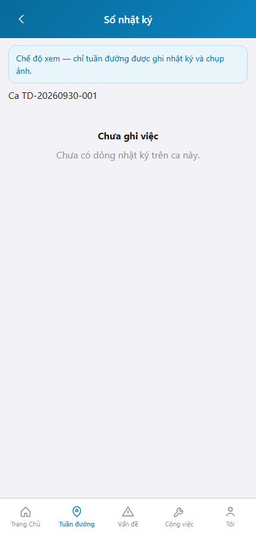
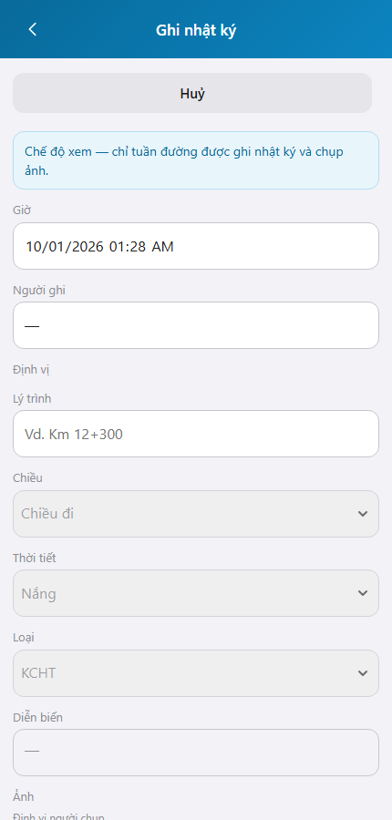

# QA — Scenarios — web-rmms-cam-journal

> Status: **PASS** · e2eQa=ON · task `task_ba0d4696` · 2026-10-01T01:30:00.000Z  
> Role: `qa` · packKind=`list` · changeScope=`edit_page`  
> runtimeUrl product=`/nhat-ky/:sessionId` · `/moi` · mfeStdUrl alias `/web-rmms-cam-journal` → `/nhat-ky`  
> Screens: `specs/web-rmms-cam-journal/qa/screens/{S0,S1,QA-20}.png` · `manifest.json` ok=true · method=`_capture_jl.mjs`

| | |
|--|--|
| Feature | `web-rmms-cam-journal` |
| Title | Camera nhật ký tuần đường |
| Role | `qa` |
| Runtime | docker compose (WebService) + Mobile `yarn start:std` :9301 · Playwright phone 430 |

## Environment

| Item | Value |
|------|-------|
| Docker | `D:/AI-QLBD/Linm.RMMS.WebService` · api `:5111` · bff `:5201` healthy · **cấm** kill worker |
| MFE | `D:/AI-QLBD/MFE-Source/Linm.Web.RMMS.Mobile` · existing `start:std` · `--skip-start` · **cấm** GAP-QA-E2E-KILL-01 |
| Session | live hub `cf7cea17-1b5f-4c12-8d8f-d01d0c5b1fb7` (TD-20260930-001) |
| Stock CLI | `yarn e2e-qa --url=…/web-rmms-cam-journal --skip-start` → **FAIL soft** (`GAP-QA-E2E-DUP-01` S1=S0 · alias→entry) |
| Custom | `_capture_jl.mjs` · SPA fulfill index · login `/dang-nhap`→`/m/trang-chu` · deep-link product · PNG S1≠S0 |
| Principal | E2E admin · `tuanDuong=false` → `camJournalAccess=view` (AC view / CTA ẩn) |

## Cases (T-QA-JL-01)

| Id | Zone | Steps | Expect | Result | Shot |
|----|------|-------|--------|--------|------|
| S0 | JL-02 · JL-02v | Login · hub session · goto `/nhat-ky/:id` · wait `JL-02` | List · `roleGateBanner` · **không** `jl-cta-create*` | **PASS** |  |
| S1 | JL-01 · JL-01v | Goto `/nhat-ky/:id/moi` · wait `JL-01` | Form view · banner · **không** `jl-btn-save` · fields RO | **PASS** |  |
| QA-20 | JL-02 · DES-LEAVE | Huỷ form → list | List view lại · PNG ≠ S1 · không crash | **PASS** |  |

## Observations

- Role matrix runtime: principal không `tuanDuong` → **view** path (`camJournalAccess`) — CTA/Lưu ẩn · banner view — AC PASS.
- Soft debt: write (tuần đường) cần `jobTitleCode=TUAN-DUONG` — không mutate self từ UI seed.
- Stock `mfeStdUrl` alias redirect `/nhat-ky` entry → stock DUP soft · deep-link + `_capture_jl.mjs` PASS.
- SHA: S1 distinct · S0≈QA-20 (cùng JL-02 list sau leave — intentional · ≠ GAP-QA-E2E-DUP-01 S1=S0).
- DES-GRID / filter Kind B: **WAIVE** phone.
- UTF-8 banner/title runtime OK · **cấm** ERP.*.

## T-QA-* checklist

| Task | Status |
|------|--------|
| T-QA-JL-01 | **PASS** · S0/S1/QA-20 + PNG · role-view AC |
| T-QA-JL-WRITE | **SOFT** · cần user TUAN-DUONG |
| T-QA-JL-CTA | **PASS** · CTA ẩn khi view |
| T-QA-FILTER-01/02 | **WAIVE** phone · Kind B N/A |
| T-QA-VI-ENC-01 | **PASS** · banner/title UTF-8 |

## Gate

| Gate | Status |
|------|--------|
| e2eQa runtime (not static-only) | **PASS** · `_capture_jl.mjs` |
| Screens per case | **PASS** |
| stock yarn e2e-qa | **FAIL soft** · DUP documented |
| phase≠done | kept · **cấm** phase=done |
| next | review pending (roleOnly HARD — không start review) |

## Notes

- Soft: write path chưa cover bởi E2E principal; view path cover đủ AC gate CTA/Lưu ẩn.
- HARD: **cấm** taskkill node/yarn · worker giữ sống.

## E2E screenshots

Viewer: `/api/qldb/artifact?id=&rel=qa/scenarios.md` rewrite `screens/{caseId}.png`.

CLI **PASS** = Playwright + PNG không đen + không overlay đỏ + S1 ≠ S0.

| Case | Scenario | Expect | Actual | Result | Evidence |
|------|----------|--------|--------|--------|----------|
| S0 | Cán bộ mở sổ (JL-02) | roleGateBanner · không CTA | Banner view · JL-02 | **PASS** |  |
| S1 | Cán bộ mở form ghi (JL-01) | Banner · không Lưu | JL-01 · form view | **PASS** |  |
| QA-20 | Huỷ về list | List ổn · không crash | JL-02 · banner | **PASS** |  |

## Version meta

| skillId | skillVersion | schemaVersion |
|---------|--------------|---------------|
| agent-qa | 2026.09.05.03 | 1 |
