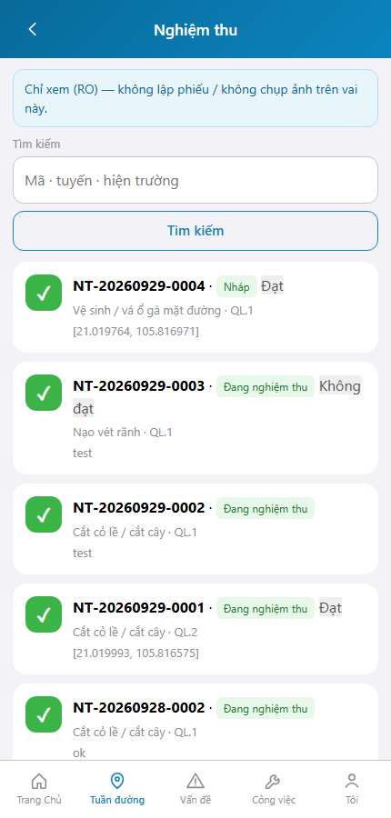
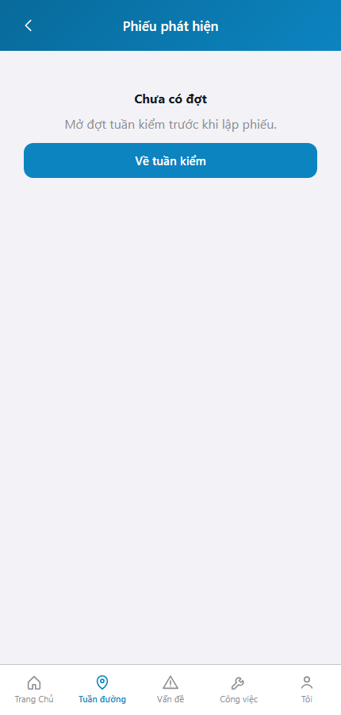
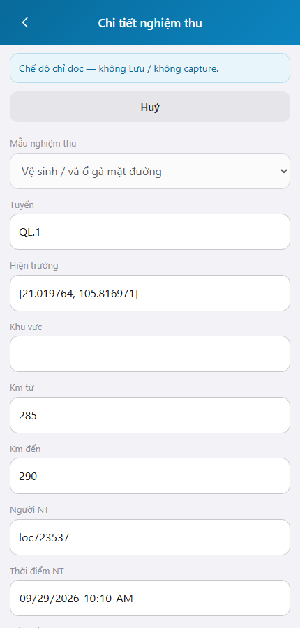

# QA — Scenarios — web-rmms-cam-nghiem-thu

> Status: **PASS** · e2eQa=ON · task `task_0324ce40` · 2026-10-01T02:45:00.000Z  
> Role: `qa` · packKind=`list` · changeScope=`edit_page`  
> runtimeUrl product=`/nghiem-thu` · `/nghiem-thu/moi` · `/nghiem-thu/:id` · mfeStdUrl alias `/web-rmms-cam-nghiem-thu` **404** (queue-only · SPA deep-link product)  
> Screens: `specs/web-rmms-cam-nghiem-thu/qa/screens/{S0,S1,QA-20}.png` · `manifest.json` ok=true · method=`_capture_cam_nghiem_thu.mjs`

| | |
|--|--|
| Feature | `web-rmms-cam-nghiem-thu` |
| Title | Camera phiếu nghiệm thu |
| Role | `qa` |
| Runtime | docker compose (WebService) + Mobile `yarn start:std` :9301 · Playwright phone 430 |

## Environment

| Item | Value |
|------|-------|
| Docker | `D:/AI-QLBD/Linm.RMMS.WebService` · api `:5111` · Mobile.Bff `:5202` healthy · **cấm** kill worker |
| MFE | `D:/AI-QLBD/MFE-Source/Linm.Web.RMMS.Mobile` · existing `start:std` · `--skip-start` · **cấm** GAP-QA-E2E-KILL-01 |
| Stock CLI | `yarn e2e-qa --url=…/web-rmms-cam-nghiem-thu` → **FAIL soft** (S1 `GAP-QA-E2E-BLANK-01` alias/mapLike) |
| Custom | `_capture_cam_nghiem_thu.mjs` · SPA fulfill index · login `/dang-nhap`→`/m/trang-chu` · PNG distinct |
| Principal | E2E admin · `roleCaps.nghiemThu=false` → `camNghiemThuAccess=view` (AC TK/QL_HAT RO) |

## Cases (T-QA-FORM-01 · T-QA-CRUD-01)

| Id | Zone | Steps | Expect | Result | Shot |
|----|------|-------|--------|--------|------|
| S0 | NT-L | Login · goto `/nghiem-thu` · wait feature NT-01 | List Live · `roleGateBanner` view · **không** `btnCreate` · `NT-RO-LINK` | **PASS** |  |
| S1 | NT-RO-LINK | Goto `/nghiem-thu/moi` (deny→list) · click `nt-ro-findings` | Create deny redirect · RO `/phat-hien?status=xong` · **không** create | **PASS** |  |
| QA-20 | NT-F · NT-11 | Click card `NT-03` → detail | NT-11 · `NT-F-banner` RO · **không** `save` · PNG ≠ S0/S1 | **PASS** |  |

## Observations

- Role matrix runtime: principal không có `nghiemThu` → **view** path (đúng `camNghiemThuAccess` · cấm suy write từ MANAGER).
- `nt-cta-create` / save CTA **ẩn** khi view — AC PASS (LIST-VIS · formView).
- Create `/moi` redirect list khi !write — sau đó RO findings deep-link PASS.
- Soft debt: write (NGHIEM-THU) / hidden (tuần đường only) cần account `jobTitle`/package tương ứng — không mutate self từ UI seed.
- Stock `mfeStdUrl` alias 404 · deep-link product + `_capture_cam_nghiem_thu.mjs` PASS.
- SHA PNG distinct · S0=`76e066129830` · S1=`3fa0a2a1ca5b` · QA-20=`d29f919b9641` · không GAP-QA-E2E-DUP-01 / BLANK / CRASH.
- DES-GRID / filter Kind B: **WAIVE** phone.

## T-QA-* checklist

| Task | Status |
|------|--------|
| T-QA-FORM-01 | **PASS** · S0/S1/QA-20 + PNG · role-view AC |
| T-QA-CRUD-01 | **PASS** · Live list cards · detail RO · create deny |
| T-QA-NT-WRITE | **SOFT** · cần user NGHIEM-THU (ngoài E2E principal hiện tại) |
| T-QA-NT-HIDDEN | **SOFT** · cần user TUAN-DUONG-only |
| T-QA-FILTER-01/02 | **WAIVE** phone · Kind B N/A |
| T-QA-VI-ENC-01 | **PASS** · banner/title UTF-8 trên runtime |

## Gate

| Gate | Status |
|------|--------|
| e2eQa runtime (not static-only) | **PASS** · `_capture_cam_nghiem_thu.mjs` |
| Screens per case | **PASS** |
| stock yarn e2e-qa alias | **FAIL soft** · documented |
| docker + start:std reuse | **PASS** · **cấm** kill |
| phase≠done | kept · **cấm** phase=done |
| next | review pending (roleOnly HARD — không start review) |

## Notes

- Soft: write/hidden path chưa cover bởi E2E principal; view/deny/RO path cover đủ AC gate.
- HARD: **cấm** taskkill node/yarn · worker giữ sống.

## E2E screenshots

Viewer: `/api/qldb/artifact?id=&rel=qa/scenarios.md` rewrite `screens/{caseId}.png`.

CLI **PASS** = Playwright + PNG không đen + không overlay đỏ + ảnh không trùng case.

| Case | Scenario | Expect | Actual | Result | Evidence |
|------|----------|--------|--------|--------|----------|
| S0 | Cán bộ mở danh sách NT (NT-L) | roleGateBanner · không Tạo · Live cards · RO links | Banner view · hasCreate=false · NT-03 · NT-RO-LINK | **PASS** |  |
| S1 | Create deny + RO findings | `/moi` deny · RO phat-hien | `/m/phat-hien?status=xong` · TK-02 | **PASS** |  |
| QA-20 | Chi tiết RO (NT-11) | formView banner · không Lưu | NT-F-banner · hasSave=false | **PASS** |  |

## Version meta

| skillId | skillVersion | schemaVersion |
|---------|--------------|---------------|
| agent-qa | 2026.09.05.03 | 1 |
