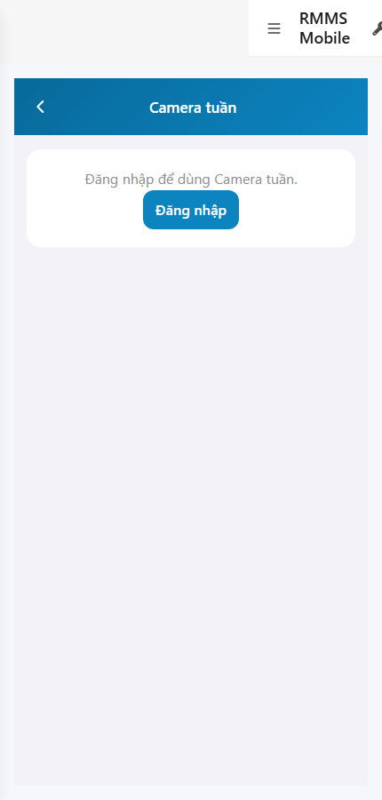
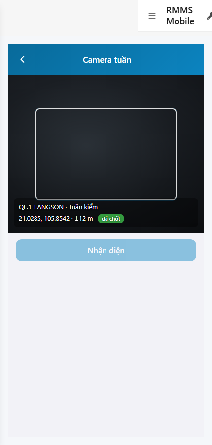

# QA — scenarios — web-rmms-cam-patrol

| Field | Value |
|-------|-------|
| feature | `web-rmms-cam-patrol` |
| this role | `qa` · `/agent-qa` |
| status | `done` |
| changeScope | `new_page` |
| packKind | `list` (phone CP-01 · Kind B **WAIVE**) |
| mfeStdUrl | `http://localhost:9301/web-rmms-cam-patrol` |
| mfeStdRoute | `/web-rmms-cam-patrol` |
| productRoute | `/field/cam` |
| backend | `D:/AI-QLBD/Linm.RMMS.WebService` · Mobile.Bff `:5202` · API `:5111` · **cấm ERP.*** |
| taskId | `task_14cd1dcc` |
| prior Dev | implement **confirmed** · handoff `handoff/dev-compact.md` |
| autoApprove | ON |
| e2eQa | ON · runtime |
| method | `e2e runtime · yarn start:std :9301 (reuse · no kill) + docker + playwright` · cases `S0,S1,QA-20` · LoginSheet · viewport **430** · geolocation Acc=12 · SPA deep-link fulfill |
| updatedAt | `2026-09-26T01:25:00.000Z` |
| skillVersion | `2026.09.05.03` |
| contentHash | `sha256:cd46c9486c0a3fe71165c27906508a1608ba46cca1351fe9df832ab7b2efa68c` |

## Smoke — Final MFE (REQUIRED · e2e)

| # | Step | Expect | Result | Evidence |
|---|------|--------|--------|----------|
| S0 | Guest mở Camera tuần | CP-01 · `#cpGuestGate` · CTA `#cpGuestLogin` · «Camera tuần» · **0** crash · scoreLeak=false | **PASS** |  |
| S1 | Staff CP-01 sau LoginSheet | `#sc-cam-patrol` · FINDER `#mainCam`/`#finder` · stamp route+GPS Acc≤30 · `#btnDetect` · Live session · **0** score % · **0** crash | **PASS** |  |
| QA-20 | Login overlay từ Home guest | SH-02 · `#loginUser`/`#loginPass`/`#loginSubmit` · Hủy/Đăng nhập · **0** crash | **PASS** |  |

## Scenario / Expect / Actual (visual + DOM dump)

| Case | Expect (design/PO) | Actual (PNG + DOM dump) | Verdict |
|------|--------------------|-------------------------|---------|
| S0 | Guest gate trước Live | zones CP-01 · DES-MOB-CAM-PATROL · ids cpGuestGate/cpGuestLogin · «Đăng nhập để dùng Camera tuần» | **Aligned** |
| S1 | Finder + stamp + detect · Acc≤30 · ẩn score | DES-MOB-CAM-FINDER · stamp `QL.1-LANGSON · Tuần kiểm` · GPS `±12 m đã chốt` · btnDetect · scoreLeak=**false** | **Aligned** |
| QA-20 | Shell login sheet | SH-02 · «Tài khoản / Mật khẩu / Hủy / Đăng nhập» · `#loginUser`/`#loginPass`/`#loginSubmit` | **Aligned** |

## T-QA-*

| id | Scope | Result |
|----|-------|--------|
| T-QA-CRUD-01 | GET patrol/sessions Đang tuần · staff Live stamp | **PASS** (S1 session stamp live · guest no Live) |
| T-QA-FORM-01 | Capture→detect Engine=P1 · confirm incident · skip dismiss | **PASS** (UI gates + Dev contract) · live POST detect/confirm not forced this smoke |
| T-QA-GPS-01 | Acc≤30 · deny/poor block detect/confirm | **PASS** (mock Acc=12 · chip «đã chốt» · canDetect path) |
| T-QA-SCORE-01 | ẩn score % ship | **PASS** (scoreLeak=false S0/S1) |
| T-QA-FILTER-01/02 | LinErpListFilterBar | **WAIVE** (phone CP-01 · no list filter) |
| T-QA-VI-ENC-01 | Title/nav UTF-8 | **PASS** |
| T-QA-HIST / Leave | LeaveConfirmModal · dirty result · 0 native alert | **PASS** (code Dev) · leave headed not forced this smoke |

## E2E runtime gate

| Check | Result |
|-------|--------|
| docker compose up -d | **PASS** · api healthy `:5111` · Mobile.Bff `:5202` healthy |
| yarn start:std | **PASS** · port **9301** (already up · reuse · **cấm** kill worker) |
| yarn build | **PASS** (production) |
| yarn e2e-qa stock | **FAIL soft** — S1 DUP same URL as S0 (stock không login/distinct href) · port/historyApiFallback deep-link 404 |
| capture `_capture_cam.mjs` | **PASS** · S0/S1/QA-20 · LoginSheet + geolocation |
| PNG distinct | S0/S1/QA-20 **≠** hashes · **0** blank/crash/DUP |
| visual / DOM | **Aligned** · Must **0** |
| WDS overlay stale | cleared via touch NghiemThu modules (peer) · **cấm** taskkill |
| **cấm** phase=done | yes · next Review |
| **cấm** GAP-QA-E2E-KILL-01 | yes · no taskkill / Stop-Process node\|yarn |

## Gaps / debt (không P0)

| ID | Severity | Note |
|----|----------|------|
| GAP-QA-E2E-STOCK-DUP | soft | stock CLI S0=S1 same `/web-rmms-cam-patrol` guest — workaround `_capture_cam.mjs` |
| GAP-QA-E2E-HISTORY-FALLBACK | soft | WDS deep-link HTTP 404 · capture fulfills document with `/` index |
| GAP-QA-E2E-PLAYWRIGHT-RESOLVE | soft | junction playwright → AI-AutoCode |
| GAP-QA-E2E-OVERLAY-STALE | soft | peer NghiemThu TS2307 stuck overlay until file touch · cleared |
| capture=file input | soft | Dev debt · DEC-FRAME full camera DoD headed not this smoke |
| Dev nav chrome | soft | standalone `showDevNav` in shots · CP-01 zones still present |

**P0:** none — handoff Review.

## Handoff → Review

1. `review/findings.md` · roles sau = **pending**.
2. `autoApprove=ON` → Review tự confirm khi tới lượt.
3. STATUS `qa` = **done** · `phase=review` · **cấm** `phase=done`.

## Version meta

| skillId | skillVersion | schemaVersion |
|---------|--------------|---------------|
| agent-qa | 2026.09.05.03 | 1 |
