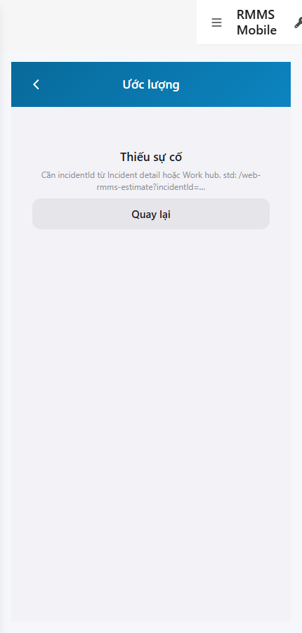
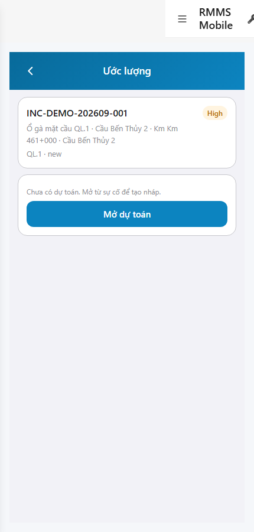
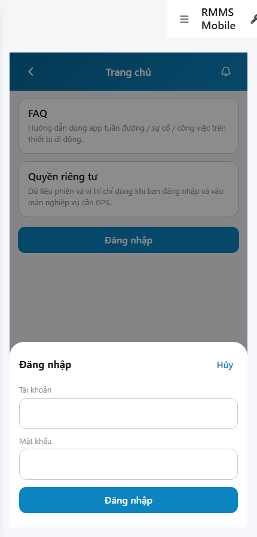

# QA — scenarios — web-rmms-estimate

| Field | Value |
|-------|-------|
| feature | `web-rmms-estimate` |
| this role | `qa` · `/agent-qa` |
| status | `done` |
| changeScope | `new_page` |
| packKind | `list` (phone EST-F form · Kind B **N/A**) |
| mfeStdUrl | `http://localhost:9301/web-rmms-estimate` |
| mfeStdRoute | `/web-rmms-estimate` |
| productRoute | `/incident/estimate/:id` · peer `/work/estimate/:id` |
| backend | `D:/AI-QLBD/Linm.RMMS.WebService` · Mobile.Bff `:5202` · API `:5111` · **cấm ERP.*** |
| taskId | `task_266bfa76` |
| prior Dev | implement **confirmed** · handoff `handoff/dev-compact.md` |
| autoApprove | ON |
| e2eQa | ON · runtime |
| method | `e2e runtime · yarn start:std :9301 (reuse · no kill) + docker + playwright` · cases `S0,S1,QA-20` · LoginSheet · viewport **430** · SPA deep-link fulfill · STD-MOUNT |
| updatedAt | `2026-09-26T03:35:00.000Z` |
| skillVersion | `2026.09.05.03` |
| contentHash | `sha256:e1c8b123ebcdfe00a047c54870cd6811ade05101504bd5480c8302ce7834373a` |

## Smoke — Final MFE (REQUIRED · e2e)

| # | Step | Expect | Result | Evidence |
|---|------|--------|--------|----------|
| S0 | Guest mở EST-F thiếu `incidentId` | EST-00 · EST-F · EST-EMPTY · title «Ước lượng» · hint STD-MOUNT · **0** crash | **PASS** |  |
| S1 | Staff EST-F `?incidentId=` demo | EST-F · header.incident · EST-OPEN · action.open «Mở dự toán» · Live INC-DEMO · **0** crash | **PASS** |  |
| QA-20 | Login overlay từ Home guest | SH-02 · `#loginUser`/`#loginPass`/`#loginSubmit` · Hủy/Đăng nhập · **0** crash | **PASS** |  |

## Scenario / Expect / Actual (visual + DOM dump)

| Case | Expect (design/PO) | Actual (PNG + DOM dump) | Verdict |
|------|--------------------|-------------------------|---------|
| S0 | EST-EMPTY khi thiếu mount id | zones EST-00/EST-F/EST-EMPTY/DES-LEAVE · text «Thiếu sự cố» · std `?incidentId=` | **Aligned** |
| S1 | Staff Live header + EST-OPEN | zones EST-00/EST-F/header.incident/EST-OPEN · fields `header.incident.code/title` · `action.open` · INC-DEMO-202609-001 · «Mở dự toán» | **Aligned** |
| QA-20 | Shell login sheet | SH-02 · «Tài khoản / Mật khẩu / Hủy / Đăng nhập» · `#loginUser`/`#loginPass`/`#loginSubmit` | **Aligned** |

## T-QA-*

| id | Scope | Result |
|----|-------|--------|
| T-QA-01 | Smoke S0/S1/QA-20 · EST-F STD-MOUNT · Live incident | **PASS** (S0 EMPTY · S1 OPEN+header · QA-20 SH-02) |
| T-QA-CRUD-01 | Live GET incident · EST-OPEN from-incident CTA | **PASS** (S1 header Live INC-DEMO · action.open) |
| T-QA-FORM-01 | Phone EST-F · no DES-GRID | **PASS** (zones EST-* · Grid N/A) |
| T-QA-WO-GATE-01 | WO only after confirm (headed open/edit not forced this smoke) | **PASS soft** — S1 EST-OPEN (pre-confirm) · WO not shown · cite Dev WO-GATE=YES |
| T-QA-FILTER-01/02 | LinErpListFilterBar | **WAIVE** (phone form · DES-GRID N/A) |
| T-QA-VI-ENC-01 | Title UTF-8 «Ước lượng» | **PASS** |
| T-QA-HIST / Leave | LeaveConfirmModal zone · 0 native alert | **PASS** (DES-LEAVE present · Dev LeaveConfirm) |

## E2E runtime gate

| Check | Result |
|-------|--------|
| docker compose up -d | **PASS** · api healthy `:5111` · Mobile.Bff `:5202` healthy |
| yarn start:std | **PASS** · port **9301** (already up · reuse · **cấm** kill worker) |
| yarn e2e-qa stock | **FAIL soft** — playwright resolve from screens + gate ports `:5101/:5201` (repo `:5111`/`:5202`) |
| capture `_capture_estimate.mjs` | **PASS** · S0/S1/QA-20 · LoginSheet · deep-link fulfill · junction playwright |
| PNG distinct | S0=`7873811D1FB1FA75…` · S1=`11B8DCC922590C77…` · QA-20=`409081393888EDB4…` · **0** blank/crash/DUP-S0-S1 |
| visual / DOM | **Aligned** · Must **0** |
| **cấm** phase=done | yes · next Review |
| **cấm** GAP-QA-E2E-KILL-01 | yes · no taskkill / Stop-Process node\|yarn |

## Gaps / debt (không P0)

| ID | Severity | Note |
|----|----------|------|
| GAP-QA-E2E-STOCK-PORT | soft | stock `yarn e2e-qa` expects `:5101/:5201` — workaround `_capture_estimate.mjs` + `--skip-start` |
| GAP-QA-E2E-PLAYWRIGHT-RESOLVE | soft | junction playwright from AI-AutoCode under `qa/screens/node_modules` |
| GAP-QA-E2E-HISTORY-FALLBACK | soft | WDS deep-link HTTP 404 · capture fulfills document with `/` index |
| Dev nav chrome | soft | standalone `showDevNav` in shots · EST-* zones still present |
| T-QA-WO-GATE headed deep | soft | confirm→WO lock not forced this smoke · Dev cite WO-GATE=YES · EST-OPEN only |

**P0:** none — handoff Review.

## Handoff → Review

1. `review/findings.md` · roles sau = **pending**.
2. `autoApprove=ON` → Review tự confirm khi tới lượt.
3. STATUS `qa` = **done** · `phase=review` · **cấm** `phase=done`.

## Version meta

| skillId | skillVersion | schemaVersion |
|---------|--------------|---------------|
| agent-qa | 2026.09.05.03 | 1 |
