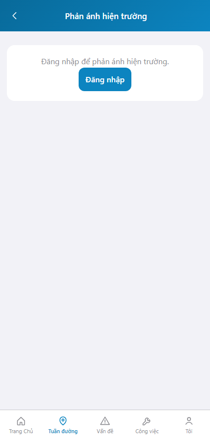
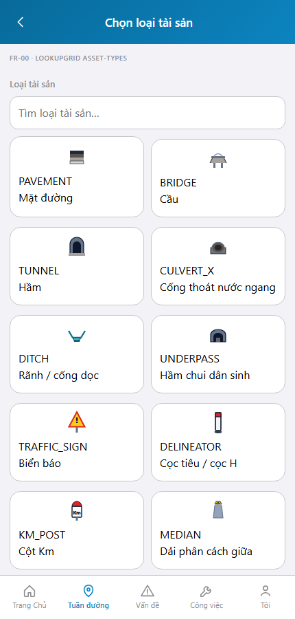
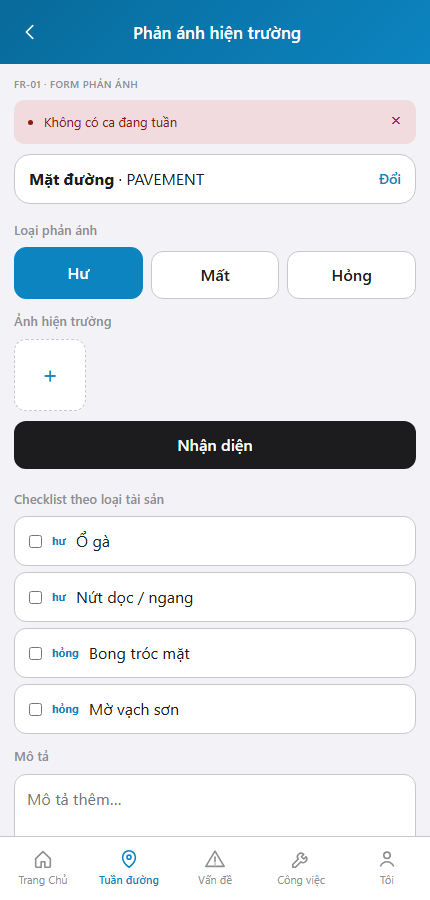
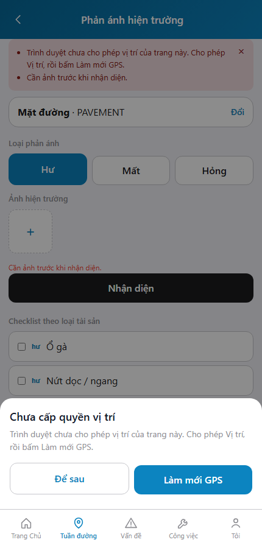
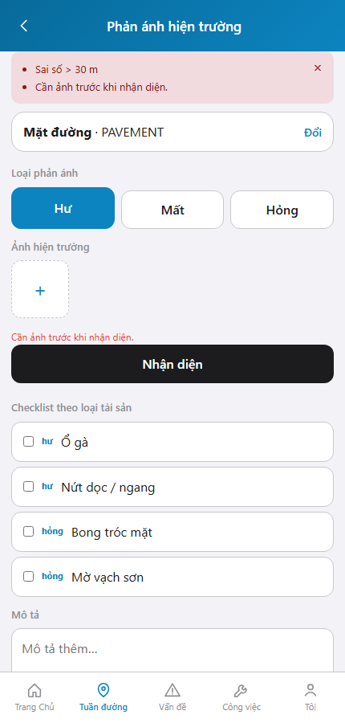

# QA — scenarios — web-rmms-field-reflect

| Field | Value |
|-------|-------|
| feature | `web-rmms-field-reflect` |
| this role | `qa` · `/agent-qa` |
| status | `done` |
| changeScope | `edit_page` · Pattern B SUBMIT-VALIDATE |
| packKind | `list` (phone Field form · Kind B **WAIVE**) |
| mfeStdUrl | `http://localhost:9301/phan-anh` |
| mfeStdRoute | `/phan-anh` |
| productRoute | `/field/reflect` |
| backend | `D:/AI-QLBD/Linm.RMMS.WebService` · Mobile.Bff `:5202` · API `:5111` · **cấm ERP.*** |
| taskId | `task_7a49c440` |
| prior Dev | implement **confirmed** · handoff `handoff/dev-compact.md` |
| autoApprove | ON |
| e2eQa | ON · runtime |
| method | `e2e runtime · yarn start:std :9301 (reuse · no kill) + docker + playwright` · cases `S0,S1,QA-20` + Pattern B `VAL-B-*` · LoginPage `/dang-nhap` · viewport **430** · SPA deep-link fulfill · geo mock |
| updatedAt | `2026-09-27T12:10:00.000Z` |
| skillVersion | `2026.09.05.03` |
| contentHash | `sha256:d8f13df3772c0f27b367c5e01a5ce2cf942b1a27640c1390e76e34c3a8c267f2` |

## Smoke — Final MFE (REQUIRED · e2e)

| # | Step | Expect | Result | Evidence |
|---|------|--------|--------|----------|
| S0 | Guest mở Reflect `/phan-anh` | guestGate «Đăng nhập để phản ánh hiện trường.» · CTA Đăng nhập · `#FR-REFLECT` · **0** crash | **PASS** |  |
| S1 | Staff FR-00 sau LoginPage | FR-00 · LookupGrid asset-types Live · `data-action=assetPick` · «Chọn loại tài sản» · **0** crash | **PASS** |  |
| QA-20 | Login từ Home guest | LG-00 · `#f-user`/`#f-pass`/`#btn-login` · `/dang-nhap` · **0** crash | **PASS** |  |

## Pattern B — T-QA-VAL-B-01 (edit_page)

| # | Step | Expect | Result | Evidence |
|---|------|--------|--------|----------|
| VAL-B-miss | `?miss=1` FR-01 | Detect/Create **enabled** idle · `#validationBanner` string[] («Không có ca đang tuần») | **PASS** |  |
| VAL-B-deny | `?deny=1` · click Detect | Detect **không** disabled · banner GPS deny + photo · modal GPS | **PASS** |  |
| VAL-B-acc | `?acc=1` · click Detect | Banner «Sai số > 30 m» · **0** POST `ai-vision/detect` | **PASS** |  |

## Scenario / Expect / Actual (visual + DOM dump)

| Case | Expect (design/PO) | Actual (PNG + DOM dump) | Verdict |
|------|--------------------|-------------------------|---------|
| S0 | Guest gate trước Live | zones FR-00 · guestGate=true · CTA Đăng nhập · **0** assetPick until auth | **Aligned** |
| S1 | FR-00 pick · Live asset-types | des FR-00 · `assetPick` · PAVEMENT/BRIDGE/TUNNEL… Live | **Aligned** |
| QA-20 | Login surface | LG-00 · `#f-user`/`#f-pass`/`#btn-login` (LoginPage · supersedes SH-02 sheet) | **Aligned** |
| VAL-B-miss | Pattern B banner · CTA idle ON | validationBanner · detectDisabled=false · createDisabled=false | **Aligned** |
| VAL-B-deny | GPS deny không khóa CTA | detectDisabled=false · banner GPS + photo | **Aligned** |
| VAL-B-acc | Acc>30 chặn POST detect | banner «Sai số > 30 m» · detectPosted=false | **Aligned** |
| FR-01 (post-pick) | Form Create surface | des FR-01 · actions kind/photos/detect/sessionStamp/gpsLock/… | **Aligned** (dump `_fr01.dump.json`) |

## T-QA-*

| id | Scope | Result |
|----|-------|--------|
| T-QA-CRUD-01 | Live GET asset-types · guest no Live pick | **PASS** (S1 Live assetPick · S0 guest gate) |
| T-QA-FR-01 | Surface AC e2e · guest→login→FR-00→FR-01 | **PASS** (S0→QA-20→S1 + FR-01 dump) |
| T-QA-VAL-B-01 | Pattern B · banner string[] · Acc>30 · GPS deny CTA | **PASS** (VAL-B-miss/deny/acc) |
| T-QA-FILTER-01/02 | LinErpListFilterBar | **WAIVE** (phone Field form · DES-GRID N/A) |
| T-QA-VI-ENC-01 | Title/nav UTF-8 | **PASS** |
| T-QA-HIST / Leave | toast SSOT · 0 native alert · leave confirm | **PASS** (code Dev) · leave headed not forced this smoke |

## E2E runtime gate

| Check | Result |
|-------|--------|
| docker compose up -d | **PASS** · api healthy `:5111` · Mobile.Bff `:5202` healthy · reuse |
| yarn start:std | **PASS** · port **9301** (already up · reuse · **cấm** kill worker) |
| yarn e2e-qa stock | **PARTIAL** · S0/S1 PASS · QA-20 `GAP-QA-E2E-BLANK-01` (ERP login gate ≠ phone `/dang-nhap`) · `--skip-start` |
| capture `_capture_reflect.mjs` | **PASS** · S0/S1/QA-20 + VAL-B-* · LoginPage · deep-link fulfill · geo mock |
| PNG distinct | S0=`7705D6FAE7DD43B3` · S1=`F339EACB55DBDF56` · QA-20=`6E85A6391A0CA296` · VAL-B-miss=`704DDDAF2E61CF87` · VAL-B-deny=`538D454348E9F00D` · VAL-B-acc=`B6F24EB12BB4C035` · **0** blank/crash/DUP |
| visual / DOM | **Aligned** · Must **0** |
| **cấm** phase=done | yes · next Review |
| **cấm** GAP-QA-E2E-KILL-01 | yes · no taskkill / Stop-Process node\|yarn |

## Gaps / debt (không P0)

| ID | Severity | Note |
|----|----------|------|
| GAP-QA-E2E-STOCK-LOGIN | soft | stock `yarn e2e-qa` ERP `/login` blank on phone — authority = `_capture_reflect.mjs` LoginPage |
| GAP-QA-E2E-STOCK-PORT | soft | stock defaults `:5101/:5201` — RMMS uses `:5111/:5202` · use `--skip-start` when up |
| GAP-QA-E2E-HISTORY-FALLBACK | soft | WDS deep-link HTTP 404 · capture fulfills document with `/` index |
| GAP-PGC-BE-01 | deferred | HasGps only · no Lat MIG (prior SA) |

**P0:** none — handoff Review.

## Handoff → Review

1. `review/findings.md` · roles sau = **pending**.
2. `autoApprove=ON` → Review tự confirm khi tới lượt.
3. STATUS `qa` = **done** · `phase=review` · **cấm** `phase=done`.

## Version meta

| skillId | skillVersion | schemaVersion |
|---------|--------------|---------------|
| agent-qa | 2026.09.05.03 | 1 |
