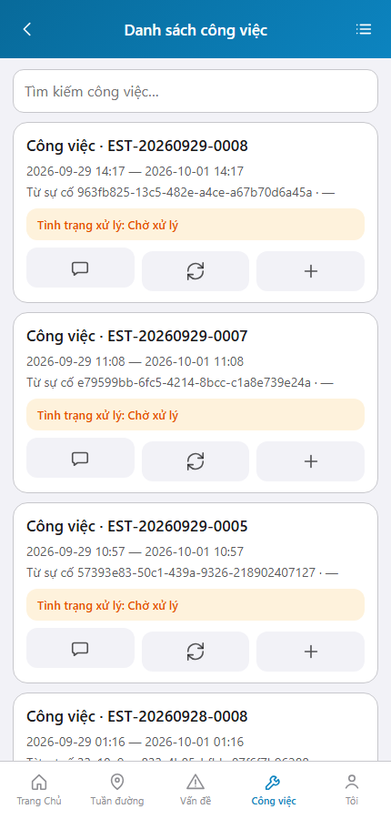
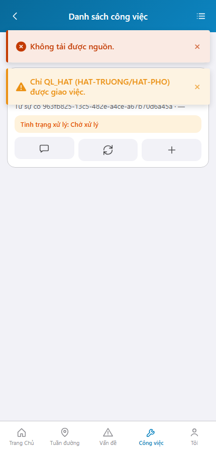

# QA — Scenarios — web-rmms-giao-viec-ql-hat

> Status: **PASS** · e2eQa=ON · task `task_e3fe4893` · 2026-10-01T03:50:00.000Z  
> Role: `qa` · packKind=`list` (phone · Kind B **WAIVE**) · changeScope=`edit_page`  
> runtimeUrl=`http://localhost:9301/web-rmms-giao-viec-ql-hat` → product `/cong-viec`  
> Screens: `specs/web-rmms-giao-viec-ql-hat/qa/screens/{S0,S1,QA-20}.png` · `manifest.json` ok=true

| | |
|--|--|
| Feature | `web-rmms-giao-viec-ql-hat` |
| Title | Giao việc chỉ QL_HAT |
| Role | `qa` |
| Runtime | docker compose (WebService) + Mobile `yarn start:std` :9301 · Playwright · **cấm** kill worker |

## Environment

| Item | Value |
|------|-------|
| Docker | `D:/AI-QLBD/Linm.RMMS.WebService` · `docker compose up -d` · api `:5111` healthy · bff `:5201` · Mobile.Bff `:5202` |
| MFE | `D:/AI-QLBD/MFE-Source/Linm.Web.RMMS.Mobile` · existing `start:std` :9301 · reuse · **cấm** kill |
| Build | `yarn build` **PASS** (warnings size only) |
| E2E stock | `yarn e2e-qa --skip-start … --cases=S0,S1,QA-20` → S0/QA-20 PASS · **S1 GAP-QA-E2E-DUP-01** (same goto) |
| E2E capture | `_capture_gv.mjs` · SPA fulfill · Login `/dang-nhap` · viewport **430** · cases S0/S1/QA-20 **PASS** |
| Cred | `rmms-admin` · `roleCaps=other` (không qlHat) |

## Cases (T-QA-GV-01)

| Id | Zone | Steps | Expect | Result | Shot |
|----|------|-------|--------|--------|------|
| S0 | GV-00 · WORK-L · GV-W | Login · goto alias → `/cong-viec` | WORK-L live CardList · search · **0** assignCta khi `cap=other` · unscoped list · 0 crash | **PASS** |  |
| S1 | GV-F gate · WORK-L | goto `?incidentId=…&mode=assign` · non-qlHat deny toast · redirect list · search filter | Toast «Chỉ QL_HAT…» · cardCount filtered · PNG ≠ S0 | **PASS** |  |
| QA-20 | LG-00 | Goto `/dang-nhap` | Login form · Đăng nhập · 0 crash | **PASS** |  |

## Observations

- Alias `/web-rmms-giao-viec-ql-hat` → `/m/cong-viec` · DES `sc-mnt-list` · zones WORK-L/GV-W.
- Live GET work-orders · S0 **cardCount=17** · không creator filter (PO list unscoped).
- `rmms-admin` **cap=other** · `assignCta` ẩn · `mode=assign` bị deny + redirect (AC qlHat gate) — toast trên S1.
- Soft: GV-F form (hangMuc TT41 / DueAt) **không** headed với user e2e hiện tại — cần tài khoản HAT-TRUONG/HAT-PHO · debt soft.
- PNG SHA distinct · S0=`354990cf7850e3a2` · S1=`edce90065f0269e8` · QA-20=`b8b0e1461439bbfe` · **0** blank/crash/DUP.
- DES-GRID / LinErpListFilterBar Kind B: **WAIVE** phone.

## T-QA-* checklist

| Task | Status |
|------|--------|
| T-QA-GV-01 | **PASS** · S0/S1/QA-20 + PNG · gate + list runtime |
| T-QA-FILTER-01/02 | **WAIVE** phone · Kind B N/A · search client OK |
| T-QA-CRUD-01 | **PASS** soft · live list GET · assign POST not headed (no qlHat) |
| T-QA-VI-ENC-01 | **PASS** · title/nav UTF-8 «Danh sách công việc» / «Đăng nhập» |
| T-QA-LEAVE | **WAIVE** this smoke · LeaveConfirmModal code Dev · no dirty form headed |

## Gate

| Gate | Status |
|------|--------|
| e2eQa runtime (not static-only) | **PASS** |
| Screens per case | **PASS** |
| yarn build | **PASS** |
| phase≠done | kept · **cấm** phase=done |
| GAP-QA-E2E-KILL-01 | **PASS** · no taskkill / Stop-Process node\|yarn |
| next | review pending (roleOnly HARD — không start review) |

## Notes

- Soft: stock `yarn e2e-qa` S1 DUP · workaround `_capture_gv.mjs` (cùng pattern work/cam-home).
- Soft: WDS deep-link HTTP 404 · capture fulfills document với `/` index.
- Soft: API listen `:5111` (stock gate default `:5101`) · dùng `--skip-start` + docker đã up.
- Soft: GV-F TT41 / DueAt headed cần user qlHat — queue debt / Review.

## E2E screenshots

Viewer: `/api/qldb/artifact?id=&rel=qa/scenarios.md` rewrite `screens/{caseId}.png`.

CLI **PASS** = Playwright + PNG không đen + không overlay đỏ + ảnh không trùng case.

| Case | Scenario | Expect | Actual | Result | Evidence |
|------|----------|--------|--------|--------|----------|
| S0 | Cán bộ mở list công việc qua alias giao việc | WORK-L live · unscoped · CTA ẩn nếu không qlHat | 17 cards · cap=other · 0 assignCta | **PASS** |  |
| S1 | Non-qlHat mở mode=assign | Deny toast · không GV-F · list an toàn | Toast QL_HAT · filter 1 card | **PASS** |  |
| QA-20 | Cán bộ mở đăng nhập | LG-00 login | Đăng nhập · tín hiệu | **PASS** |  |

## Version meta

| skillId | skillVersion | schemaVersion |
|---------|--------------|---------------|
| agent-qa | 2026.09.05.03 | 1 |
