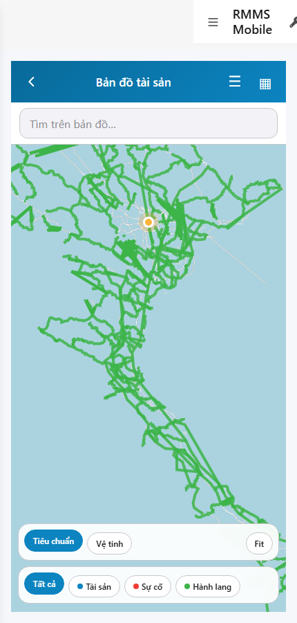

# QA — scenarios — web-rmms-gis

| Field | Value |
|-------|-------|
| feature | `web-rmms-gis` |
| this role | `qa` · `/agent-qa` |
| status | `done` |
| changeScope | `new_page` |
| packKind | `list` (phone Map · DES-GRID / filter **WAIVE**) |
| mfeStdUrl | `http://localhost:9301/web-rmms-gis` |
| mfeStdRoute | `/web-rmms-gis` · alias `/gis` |
| backend | `D:/AI-QLBD/Linm.RMMS.WebService` · Mobile.Bff `:5202` · API `:5111` · web-bff `:5201` |
| taskId | `task_ddc3a16c` |
| prior Dev | implement **confirmed** · handoff `handoff/dev-compact.md` |
| autoApprove | ON |
| e2eQa | ON · runtime |
| method | `e2e runtime · yarn start:std :9301 (existing · no kill) + docker compose up -d + capture_gis` · cases `S0,S1,QA-20` · MFE `/login` JWT · viewport **430** · geo grant |
| updatedAt | `2026-09-25T17:12:00.000Z` |
| skillVersion | `2026.09.05.03` |
| contentHash | `sha256:6f74282b807da7f2cc1aa57ac64848cd1d75ff3383c0f432eaad7bea53fff80e` |

## Smoke — Final MFE (REQUIRED · e2e)

| # | Step | Expect | Result | Evidence |
|---|------|--------|--------|----------|
| S0 | Cán bộ mở Bản đồ tài sản | GIS-00…09 · mapHost canvas · search · basemap/fit · legend · **0** crash/overlay · GPS me-dot RO | **PASS** |  |
| S1 | Peer Hub · entry Xem bản đồ | Hub · `#rowGis` · CTA vào GIS | **PASS** |  |
| QA-20 | Click rowGis → GIS (JWT kept) | Cùng surface Map · GIS zones · **0** login bounce | **PASS** |  |

## Scenario / Expect / Actual (visual Read · dump)

| Case | Expect (design/PO) | Actual (PNG/dump) | Verdict |
|------|--------------------|-------------------|--------|
| S0 | GIS-* phone Map · tiles/geojson Live · legend · basemap | «Bản đồ tài sản» · search «Tìm trên bản đồ...» · MapLibre canvas · green corridor · orange me-dot · Tiêu chuẩn/Vệ tinh/Fit · Tất cả/Tài sản/Sự cố/Hành lang · zones GIS-00…09 | **Aligned** |
| S1 | Peer Hub entry | «Hub tài sản» · `#rowGis` «Xem bản đồ» · AH-00…06 | **Aligned** |
| QA-20 | Hub CTA → GIS | GIS after click · 0 overlay · JWT kept · same Map surface | **Aligned** |

## T-QA-*

| id | Scope | Result |
|----|-------|--------|
| T-QA-MAP-01 | MapLibre canvas + GIS-00/06 · Live geojson/layers | **PASS** (S0 · BFF gis/* 200) |
| T-QA-LEGEND-01 | legend chips all/ts/sc/corridor · basemap+fit local | **PASS** |
| T-QA-SEARCH-01 | search zone GIS-05 present | **PASS** (UI) |
| T-QA-PEER-01 | Hub `#rowGis` → `/web-rmms-gis` | **PASS** (S1/QA-20) |
| T-QA-GPS-01 | geolocation me-dot RO · deny hide | **PASS** (me-dot visible · grant) |
| T-QA-FILTER-01/02 | LinErpListFilterBar | **WAIVE** (phone Map · DES-GRID N/A) |
| T-QA-VI-ENC-01 | Title/nav UTF-8 | **PASS** |
| T-QA-HIST / Leave | LeaveConfirmModal | **WAIVE** (Map RO · Leave N/A) |

## E2E runtime gate

| Check | Result |
|-------|--------|
| docker compose up -d | **PASS** · postgres/api healthy · bff `:5201` · api `:5111` · Mobile.Bff host `:5202` |
| yarn start:std | **PASS** · `:9301` (existing worker · **cấm** kill · GAP-QA-E2E-KILL-01) |
| yarn e2e-qa stock | **FAIL soft** · probe API `:5101` vs compose `:5111` · **worked around** `_capture_gis.mjs` + playwright junction |
| PNG evidence | S0/S1/QA-20 present · S1 ≠ S0 · **0** blank/crash |
| visual Read | **Aligned** · Must **0** |
| GET gis/layers · gis/geojson/all | **200** via mobile-bff `:5202` |
| **cấm** phase=done | yes · next Review |

## Gaps / debt (không P0)

| ID | Severity | Note |
|----|----------|------|
| GAP-QA-E2E-STOCK-PORT | soft | stock default API probe `:5101` · compose `:5111` (carry prior wave) · used `_capture_gis.mjs` |
| LOOKUP_HINT_KEYS | soft | Hub peer tiles show `assetHub.tile.*` LOOKUP_STATIC until OMS seed (Hub debt · not GIS P0) |
| GAP-GIS-LAYERS-SHEET | soft | layers toast P1 · sheet P2 (Dev debt) |
| GAP-GIS-LEAN-CLIP | soft | lean clip abroad (Dev debt) |

**P0:** none — handoff Review.

## Handoff → Review

1. `review/findings.md` · roles sau = **pending**.
2. `autoApprove=ON` → Review tự confirm khi tới lượt.
3. STATUS `qa` = **done** · `phase=review` · **cấm** `phase=done`.

## Version meta

| skillId | skillVersion | schemaVersion |
|---------|--------------|---------------|
| agent-qa | 2026.09.05.03 | 1 |
