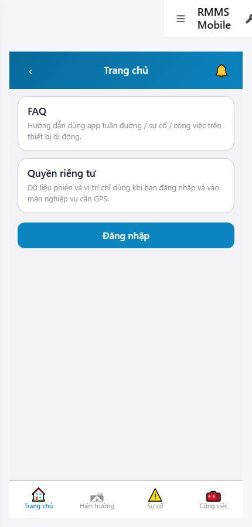
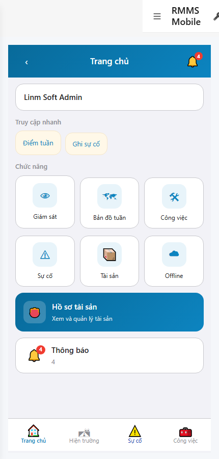

# QA — scenarios — web-rmms-home

| Field | Value |
|-------|-------|
| feature | `web-rmms-home` |
| this role | `qa` · `/agent-qa` |
| status | `done` |
| changeScope | `new_page` |
| packKind | `list` (phone Home ≠ Kind B) |
| mfeStdUrl | `http://localhost:9301/web-rmms-home` |
| mfeStdRoute | `/web-rmms-home` |
| backend | `D:/AI-QLBD/Linm.RMMS.WebService` · Mobile.Bff `:5202` · API `:5111` · **cấm ERP.*** |
| taskId | `task_a2f83080` |
| prior Dev | implement **confirmed** · handoff `handoff/dev-compact.md` |
| autoApprove | ON |
| e2eQa | ON · runtime |
| method | `e2e runtime · yarn start:std :9301 (reuse) + docker + playwright` · cases `S0,S1,QA-20` · LoginSheet · viewport **430** · stock e2e-qa port-gate fail → junction + `_capture_home.mjs` |
| updatedAt | `2026-09-25T19:25:00.000Z` |
| skillVersion | `2026.09.05.03` |
| contentHash | `sha256:6f74282b807da7f2cc1aa57ac64848cd1d75ff3383c0f432eaad7bea53fff80e` |

## Smoke — Final MFE (REQUIRED · e2e)

| # | Step | Expect | Result | Evidence |
|---|------|--------|--------|----------|
| S0 | Guest mở Home | HM-00 · HM-01 FAQ/privacy · HM-02 `#guestLogin` · VI UTF-8 · **0** crash | **PASS** |  |
| S1 | Staff Home sau LoginSheet | HM-03 quick · HM-04 grid×6 · HM-05 wallet+badge · HM-06 profile · Live overview/profile · **0** crash | **PASS** |  |
| QA-20 | Login overlay từ guest CTA | SH-02 · `#loginUser`/`#loginPass` · Hủy/Đăng nhập · **0** crash | **PASS** |  |

## Scenario / Expect / Actual (visual + DOM dump)

| Case | Expect (design/PO) | Actual (PNG + DOM dump) | Verdict |
|------|--------------------|-------------------------|---------|
| S0 | Guest FAQ/privacy/login | zones HM-00/01/02 · fields guestFaq/guestPrivacy/guestLoginCta · «FAQ / Quyền riêng tư / Đăng nhập» | **Aligned** |
| S1 | Staff quick+grid6+wallet+badge+profile | zones HM-00/03/04/05/06 · fields qa* · grid* · walletAsset · notifyBadge · profileName · Live GET overview+profile 200 | **Aligned** |
| QA-20 | Shell login sheet | SH-02 · «Tài khoản / Mật khẩu / Hủy / Đăng nhập» · `#loginUser`/`#loginPass`/`#loginSubmit` | **Aligned** |

## T-QA-*

| id | Scope | Result |
|----|-------|--------|
| T-QA-CRUD-01 | GET auth/profile · GET notification/overview · guest no Live until login | **PASS** (S1 Live 200 · S0 guest no overview) |
| T-QA-HOME-01 | Guest FAQ/privacy/login · staff quick+grid6+wallet+badge+profile · no me* · phone 430 | **PASS** (S0/S1/QA-20) |
| T-QA-FILTER-01/02 | LinErpListFilterBar | **WAIVE** (phone Home tiles · no list filter) |
| T-QA-VI-ENC-01 | Title/nav UTF-8 | **PASS** |
| T-QA-FORM / Leave | SH-02 LeaveConfirmModal path | **PASS** (overlay live) · leave headed not forced this smoke |

## E2E runtime gate

| Check | Result |
|-------|--------|
| docker compose up -d | **PASS** (api healthy `:5111` · postgres · mediamtx) · Mobile.Bff `:5202` healthy |
| yarn start:std | **PASS** · port **9301** (already up · reuse · **cấm** kill worker) |
| yarn e2e-qa stock | **FAIL soft** — stock gate `API:5101 / BFF:5201` (repo uses `:5111` / Mobile.Bff `:5202`) |
| capture `_capture_home.mjs` | **PASS** · S0/S1/QA-20 |
| PNG distinct | S0/S1/QA-20 **≠** hashes · **0** blank/crash/DUP |
| visual / DOM | **Aligned** · Must **0** |
| yarn typecheck | **PASS** (auth_token align fix) |
| **cấm** phase=done | yes · next Review |
| **cấm** GAP-QA-E2E-KILL-01 | yes · no taskkill / Stop-Process node\|yarn |

## Gaps / debt (không P0)

| ID | Severity | Note |
|----|----------|------|
| GAP-QA-E2E-STOCK-PORT | soft | stock `yarn e2e-qa` expects `:5101/:5201` — workaround `_capture_home.mjs` |
| GAP-QA-E2E-PLAYWRIGHT-RESOLVE | soft | junction playwright from AI-AutoCode (peer shell) |
| GAP-QA-E2E-WEB-BFF | soft | compose `linm-rmms-bff` restart loop — Home uses Mobile.Bff `:5202` |
| GAP-QA-AUTH-TOKEN-KEY | fixed | `setAuthTokens` → `auth_token` · `hasAccessToken` missed key — patched `services/shell/chrome.ts` |
| forms/init-data 404 | soft | LOOKUP_STATIC fallback until OMS seed |
| Dev nav chrome | soft | standalone `showDevNav` in shots — HM-* zones still present |

**P0:** none — handoff Review.

## Handoff → Review

1. `review/findings.md` · roles sau = **pending**.
2. `autoApprove=ON` → Review tự confirm khi tới lượt.
3. STATUS `qa` = **done** · `phase=review` · **cấm** `phase=done`.

## Version meta

| skillId | skillVersion | schemaVersion |
|---------|--------------|---------------|
| agent-qa | 2026.09.05.03 | 1 |
