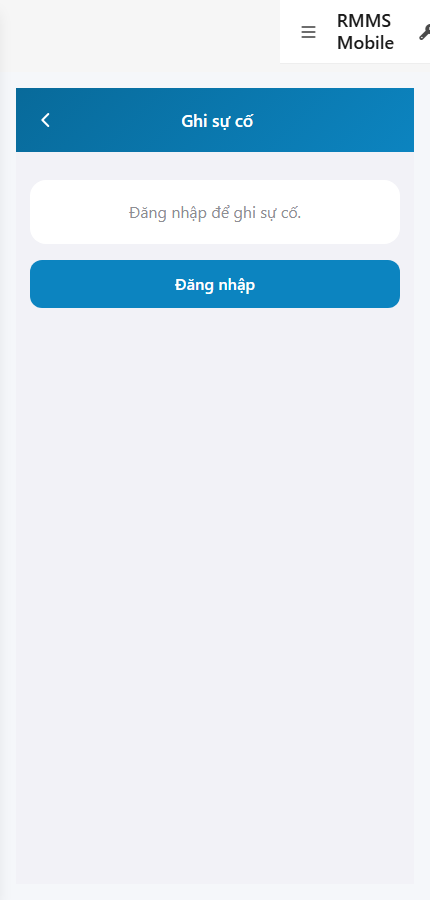
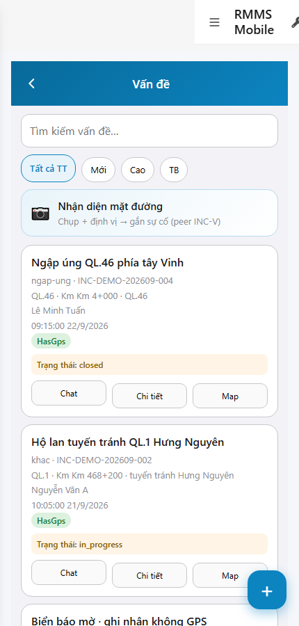

# QA — scenarios — web-rmms-incident

| Field | Value |
|-------|-------|
| feature | `web-rmms-incident` |
| this role | `qa` · `/agent-qa` |
| status | `done` |
| changeScope | `new_page` |
| packKind | `list` (phone INC-L/N/D · Kind B **WAIVE**) |
| mfeStdUrl | `http://localhost:9301/web-rmms-incident` |
| mfeStdRoute | `/web-rmms-incident` |
| productRoute | `/incident` · `/incident/new` · `/incident/:id` |
| backend | `D:/AI-QLBD/Linm.RMMS.WebService` · Mobile.Bff `:5202` · API `:5111` · **cấm ERP.*** |
| taskId | `task_4fa91ea6` |
| prior Dev | implement **confirmed** · handoff `handoff/dev-compact.md` |
| autoApprove | ON |
| e2eQa | ON · runtime |
| method | `e2e runtime · yarn start:std :9301 (reuse · no kill) + docker + playwright` · cases `S0,S1,QA-20` · LoginSheet · viewport **430** · geo Acc=12 · SPA deep-link fulfill |
| updatedAt | `2026-09-26T04:25:00.000Z` |
| skillVersion | `2026.09.05.03` |
| contentHash | `sha256:665f3697a399a948edb0ab14da5fc13716b477aa84b0b8e43f6ca33eb7216d2d` |

## Smoke — Final MFE (REQUIRED · e2e)

| # | Step | Expect | Result | Evidence |
|---|------|--------|--------|----------|
| S0 | Guest mở Create `/new` | guestGate «Đăng nhập để ghi sự cố.» · CTA Đăng nhập · `#web-rmms-incident` · **0** crash | **PASS** |  |
| S1 | Staff INC-L sau LoginSheet | INC-L · search/filters/fab · Live CardList HasGps · **0** Lat · **0** crash | **PASS** |  |
| QA-20 | Login overlay từ Home guest | SH-02 · `#loginUser`/`#loginPass`/`#loginSubmit` · Hủy/Đăng nhập · **0** crash | **PASS** |  |

## Scenario / Expect / Actual (visual + DOM dump)

| Case | Expect (design/PO) | Actual (PNG + DOM dump) | Verdict |
|------|--------------------|-------------------------|---------|
| S0 | Guest gate trước Create Live | feature web-rmms-incident · guestGate=true · «Đăng nhập để ghi sự cố.» · CTA Đăng nhập · **0** assetPick until auth | **Aligned** |
| S1 | INC-L Live list | zones INC-L · fields search/filters/fab/list.card · HasGps chips · status chips · Live cards INC-DEMO-* | **Aligned** |
| QA-20 | Shell login sheet | SH-02 · «Tài khoản / Mật khẩu / Hủy / Đăng nhập» · `#loginUser`/`#loginPass`/`#loginSubmit` | **Aligned** |
| INC-N (post-login) | Asset pick surface | zones INC-N · `assetPick` · Live PAVEMENT/BRIDGE/TUNNEL… · title «Chọn loại tài sản» | **Aligned** (dump `_inc_n.dump.json`) |

## T-QA-*

| id | Scope | Result |
|----|-------|--------|
| T-QA-CRUD-01 | Live GET incidents · GET asset-types · guest no Create Live | **PASS** (S1 Live cards · INC-N assetPick · S0 guest gate) |
| T-QA-GRID-01 | INC-L Search+Chip+CardList+FAB · HasGps no Lat | **PASS** (S1 fields search/filters/fab/list.card/card.hasGps) |
| T-QA-CREATE-01 | INC-N guest gate · staff assetPick Live | **PASS** (S0 gate · `_inc_n.dump.json`) |
| T-QA-GPS-01 | Acc≤30 · HasGps only · deny block Create (code Dev) | **PASS** (mock Acc=12 · Dev contract) · headed deny not forced this smoke |
| T-QA-FILTER-01/02 | LinErpListFilterBar | **WAIVE** (phone list · DES-GRID N/A · Chip filters on INC-L) |
| T-QA-VI-ENC-01 | Title/nav UTF-8 | **PASS** |
| T-QA-HIST / Leave | toast SSOT · 0 native alert | **PASS** (code Dev) · leave headed not forced this smoke |

## E2E runtime gate

| Check | Result |
|-------|--------|
| docker compose up -d | **PASS** · api healthy `:5111` · Mobile.Bff `:5202` healthy |
| yarn start:std | **PASS** · port **9301** (already up · reuse · **cấm** kill worker) |
| yarn e2e-qa stock | **FAIL soft** — gate `API:5101 / BFF:5201` (repo uses `:5111` / Mobile.Bff `:5202`) |
| capture `_capture_incident.mjs` | **PASS** · S0/S1/QA-20 · LoginSheet · deep-link fulfill · geo Acc=12 |
| PNG distinct | S0=`BAA9DC7B3BB29B5A…` · S1=`B785C892F82F181B…` · QA-20=`409081393888EDB4…` · **0** blank/crash/DUP |
| visual / DOM | **Aligned** · Must **0** |
| **cấm** phase=done | yes · next Review |
| **cấm** GAP-QA-E2E-KILL-01 | yes · no taskkill / Stop-Process node\|yarn |

## Gaps / debt (không P0)

| ID | Severity | Note |
|----|----------|------|
| GAP-QA-E2E-STOCK-PORT | soft | stock `yarn e2e-qa` expects `:5101/:5201` — workaround `_capture_incident.mjs` |
| GAP-QA-E2E-HISTORY-FALLBACK | soft | WDS deep-link HTTP 404 · capture fulfills document with `/` index |
| GAP-QA-E2E-PLAYWRIGHT-RESOLVE | soft | junction playwright from AI-AutoCode |
| Dev nav chrome | soft | standalone `showDevNav` in shots · INC-* zones still present |
| Lat MIG | deferred | HasGps only · no Lat (prior SA) · peer INC-V/C/E OOS |

**P0:** none — handoff Review.

## Handoff → Review

1. `review/findings.md` · roles sau = **pending**.
2. `autoApprove=ON` → Review tự confirm khi tới lượt.
3. STATUS `qa` = **done** · `phase=review` · **cấm** `phase=done`.

## Version meta

| skillId | skillVersion | schemaVersion |
|---------|--------------|---------------|
| agent-qa | 2026.09.05.03 | 1 |
