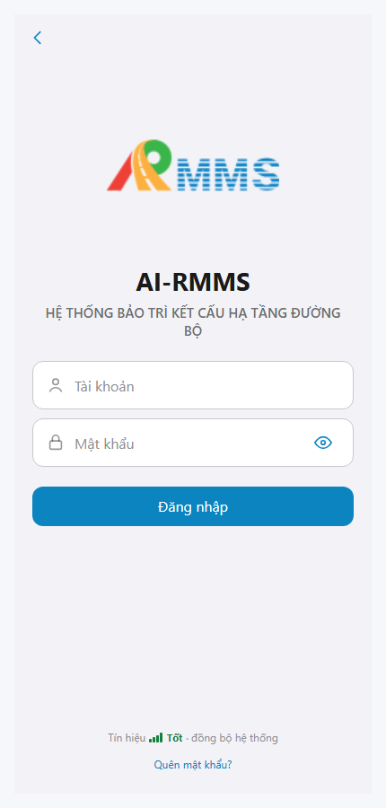
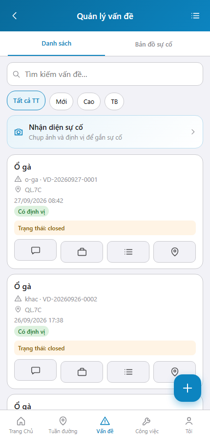
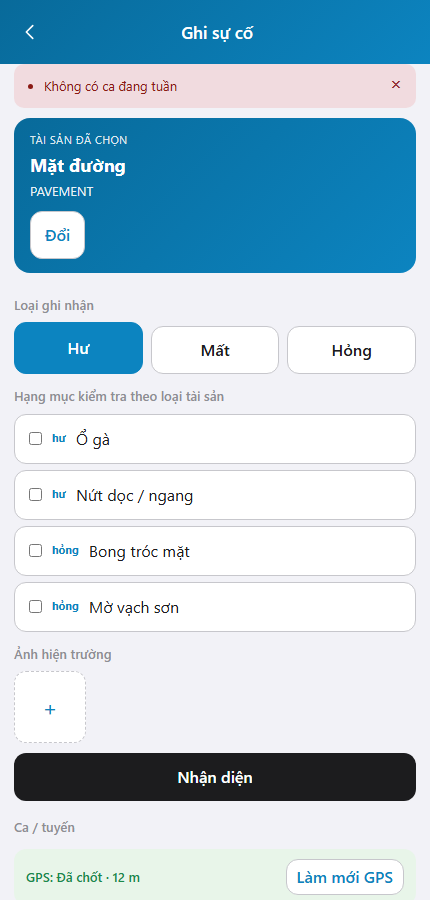
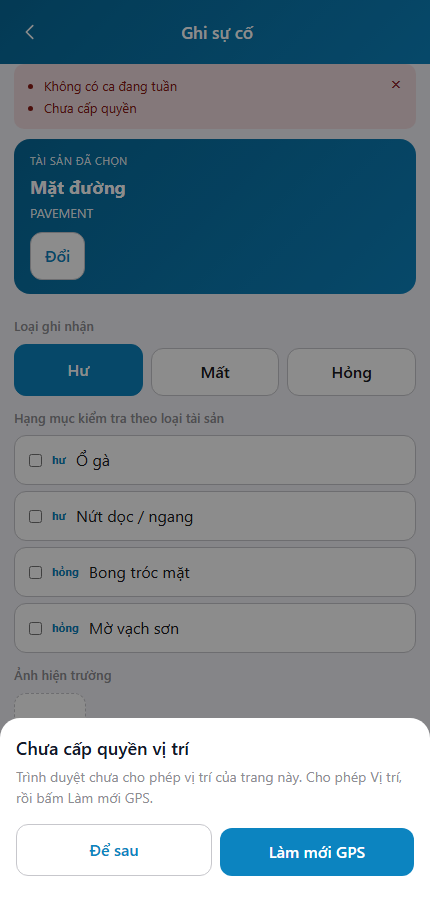

# QA — scenarios — web-rmms-incident

| Field | Value |
|-------|-------|
| feature | `web-rmms-incident` |
| this role | `qa` · `/agent-qa` |
| status | `done` |
| changeScope | `edit_page` |
| packKind | `list` (phone INC-L/N/D · Pattern B SUBMIT-VALIDATE · Kind B **WAIVE**) |
| mfeStdUrl | `http://localhost:9301/m/van-de/moi` |
| mfeStdRoute | `/van-de` · `/van-de/moi` · `/van-de/:id` (basename `/m`) |
| productRoute | `/incident` · `/incident/new` · `/incident/:id` |
| backend | `D:/AI-QLBD/Linm.RMMS.WebService` · Mobile.Bff `:5202` · API `:5111` · **cấm ERP.*** |
| taskId | `task_e56fa3bd` |
| prior Dev | implement **confirmed** · handoff `handoff/dev-compact.md` |
| autoApprove | ON |
| e2eQa | ON · runtime |
| method | `e2e runtime · yarn start:std :9301 (reuse · no kill) + docker + playwright capture` · cases `S0,S1,QA-20,PB-01,PB-GPS` · LoginPage LG-00 · viewport **430** · geo Acc=12 · SPA deep-link fulfill |
| updatedAt | `2026-09-27T12:48:31.287Z` |
| skillVersion | `2026.09.05.03` |
| contentHash | `sha256:d753df685c7334cda81339c1c6daccaa3463c4e8c6350eaff5562a6e41584015` |

## Smoke — Final MFE (REQUIRED · e2e)

| # | Step | Expect | Result | Evidence |
|---|------|--------|--------|----------|
| S0 | Guest mở Create `/m/van-de/moi` | auth gate → `/m/dang-nhap` LG-00 · `#f-user`/`#f-pass`/`#btn-login` · **0** crash | **PASS** |  |
| S1 | Staff INC-L sau LoginPage | INC-L · search/filters/fab · Live CardList HasGps · **0** Lat · **0** crash | **PASS** |  |
| QA-20 | Login từ Home guest CTA | `#guestLogin` → LG-00 · `#f-user`/`#f-pass`/`#btn-login` · **0** crash | **PASS** |  |
| PB-01 | Pattern B empty submit | create `disabled=false` · `validate.banner` · session.empty · **0** Pattern A lock | **PASS** |  |
| PB-GPS | `?gps=deny` on-submit | create still enabled · banner + `gps.deny.modal` · **0** crash | **PASS** |  |

## Scenario / Expect / Actual (visual + DOM dump)

| Case | Expect (design/PO) | Actual (PNG + DOM dump) | Verdict |
|------|--------------------|-------------------------|---------|
| S0 | Guest Create bị chặn auth | redirect `/m/dang-nhap` · LG-00 · guestGate=true | **Aligned** |
| S1 | INC-L Live list | zones INC-L · fields search/filters/fab/list.card · HasGps · Live VD-* | **Aligned** |
| QA-20 | Home → LoginPage | `#guestLogin` → LG-00 · f-user/f-pass/btn-login | **Aligned** |
| PB-01 | AC-PB-01/03/04 | createAlwaysOn · validate.banner «Không có ca đang tuần» · gpsLock | **Aligned** |
| PB-GPS | AC-PB + GPS on-submit | createDisabled=false · banner GPS · gps.deny.modal | **Aligned** |

## T-QA-*

| id | Scope | Result |
|----|-------|--------|
| T-QA-VAL-B-01 | Pattern B create always-on · banner string[] · GPS deny on-submit | **PASS** (PB-01 · PB-GPS) |
| T-QA-CRUD-01 | Live GET incidents · GET asset-types · guest no Create Live | **PASS** (S1 Live · S0 gate) |
| T-QA-GRID-01 | INC-L Search+Chip+CardList+FAB · HasGps no Lat | **PASS** (S1) |
| T-QA-CREATE-01 | INC-N staff assetPick → form | **PASS** (PB-01 dump) |
| T-QA-GPS-01 | Acc≤30 mock · deny on-submit · cấm khóa nút | **PASS** (PB-GPS · Acc=12) |
| T-QA-FILTER-01/02 | LinErpListFilterBar | **WAIVE** (phone · DES-GRID N/A) |
| T-QA-VI-ENC-01 | Title/nav UTF-8 | **PASS** |
| T-QA-HIST / Leave | toast SSOT · 0 native alert | **PASS** (code Dev) · leave headed not forced |

## E2E runtime gate

| Check | Result |
|-------|--------|
| docker compose up -d | **PASS** · api healthy `:5111` · Mobile.Bff `:5202` · postgres healthy |
| yarn start:std | **PASS** · port **9301** (already up · reuse · **cấm** kill worker) |
| yarn e2e-qa stock | **FAIL soft** — gate `API:5101 / BFF:5201` (repo `:5111` / `:5202`) |
| capture `_capture_incident.mjs` | **PASS** · S0/S1/QA-20/PB-01/PB-GPS · LoginPage · deep-link fulfill · geo Acc=12 |
| PNG distinct | S0=`b8b0e146…` · S1=`f61fabba…` · QA-20=`6e85a639…` · PB-01=`066cfc44…` · PB-GPS=`e2f1c4b8…` · **0** blank/crash/DUP |
| visual / DOM | **Aligned** · Must **0** |
| **cấm** phase=done | yes · next Review |
| **cấm** GAP-QA-E2E-KILL-01 | yes · no taskkill / Stop-Process node\|yarn |

## Gaps / debt (không P0)

| ID | Severity | Note |
|----|----------|------|
| GAP-QA-E2E-STOCK-PORT | soft | stock `yarn e2e-qa` expects `:5101/:5201` — workaround `_capture_incident.mjs` |
| GAP-QA-E2E-HISTORY-FALLBACK | soft | WDS deep-link HTTP 404 · capture fulfills document with `/` index |
| GAP-QA-LOGIN-IDS | soft | LoginPage dùng `#f-user`/`#f-pass`/`#btn-login` (không còn LoginSheet `#loginUser`) |
| Lat MIG | deferred | HasGps only · no Lat (prior SA) · peer INC-V/C/E OOS |

**P0:** none — handoff Review.

## Handoff → Review

1. `review/findings.md` · roles sau = **pending**.
2. `autoApprove=ON` → Review tự confirm khi tới lượt.
3. STATUS `qa` = **done** · `phase=review` · **cấm** `phase=done`.

## Version meta

| skillId | skillVersion | schemaVersion |
|---------|--------------|---------------|
| agent-qa | 2026.09.05.03 | 1 |
