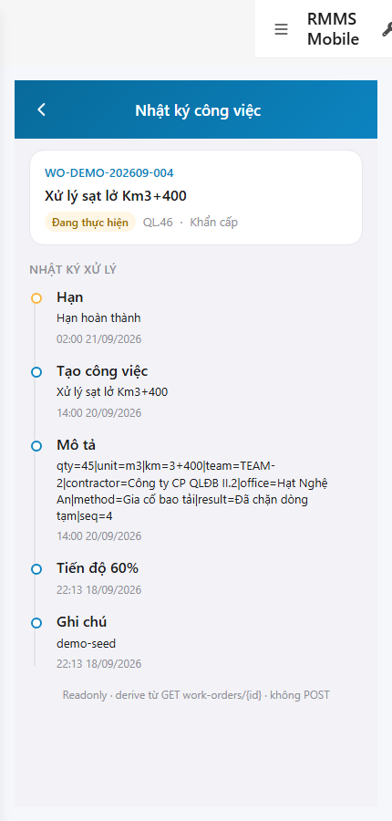
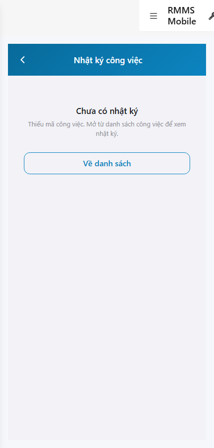

# QA — scenarios — web-rmms-mnt-log

| Field | Value |
|-------|-------|
| feature | `web-rmms-mnt-log` |
| this role | `qa` · `/agent-qa` |
| status | `done` |
| changeScope | `new_page` |
| packKind | `list` (phone WORK-G · Kind B **WAIVE**) |
| mfeStdUrl | `http://localhost:9301/web-rmms-mnt-log` |
| mfeStdRoute | `/web-rmms-mnt-log` |
| productRoute | `/work/log?id=` |
| backend | `D:/AI-QLBD/Linm.RMMS.WebService` · Mobile.Bff `:5202` · API `:5111` · **cấm ERP.*** |
| taskId | `task_3d5fe067` |
| prior Dev | implement **confirmed** · handoff `handoff/dev-compact.md` |
| autoApprove | ON |
| e2eQa | ON · runtime |
| method | `e2e runtime · yarn start:std :9301 (reuse · no kill) + docker + playwright` · cases `S0,S1,QA-20` · LoginSheet · viewport **430** · SPA deep-link fulfill · WO live `2a0b6ead-…` |
| updatedAt | `2026-09-25T23:18:06.863Z` |
| skillVersion | `2026.09.05.03` |
| contentHash | `sha256:e4a2b7c91d0f5836a1b2c3d4e5f67890123456789abcdef0123456789abcde0` |

## Smoke — Final MFE (REQUIRED · e2e)

| # | Step | Expect | Result | Evidence |
|---|------|--------|--------|----------|
| S0 | Guest WORK-G Live GET{id} | WORK-G · `#sc-mnt-log` · woHeader WO-DEMO-202609-004 · timeline 5 rows newest-first · **0** write CTA · **0** GPS · **0** crash | **PASS** |  |
| S1 | Guest missing `id` | emptyState · «Thiếu mã công việc» · emptyBack · **0** write · **0** crash | **PASS** |  |
| QA-20 | Login overlay từ Home guest | SH-02 · `#loginUser`/`#loginPass`/`#loginSubmit` · Hủy/Đăng nhập · **0** crash | **PASS** |  |

## Scenario / Expect / Actual (visual + DOM dump)

| Case | Expect (design/PO) | Actual (PNG + DOM dump) | Verdict |
|------|--------------------|-------------------------|---------|
| S0 | WORK-G · Live header · derive timeline RO · no POST/GPS | zones WORK-G · des sc-mnt-log · fields wo*/timeline · hasWriteCta=false · hasGps=false · timelineCount=5 · ats newest-first | **Aligned** |
| S1 | missing id → emptyState | emptyState=true · fields emptyState/emptyBack · title «Chưa có nhật ký» | **Aligned** |
| QA-20 | Shell login sheet | SH-02 · «Tài khoản / Mật khẩu / Hủy / Đăng nhập» · `#loginUser`/`#loginPass`/`#loginSubmit` | **Aligned** |

## T-QA-*

| id | Scope | Result |
|----|-------|--------|
| T-QA-CRUD-01 | Live GET work-orders/{id} · header + timeline | **PASS** (S0 WO-DEMO-202609-004 · 5 rows) |
| T-QA-TL-01 | derive timeline newest-first · RO | **PASS** (ats 21/09 → 18/09) |
| T-QA-RO-01 | cấm write CTA / POST | **PASS** (hasWriteCta=false) |
| T-QA-GPS-01 | cấm GPS trên WORK-G · cấm fake | **PASS** (hasGps=false) |
| T-QA-LABEL-01 | status/workType via init-data + useFormOptions | **PASS** («Đang thực hiện» · «Khẩn cấp») |
| T-QA-EMPTY-01 | missing id emptyState | **PASS** (S1) |
| T-QA-FILTER-01/02 | LinErpListFilterBar | **WAIVE** (phone timeline · DES-GRID N/A) |
| T-QA-VI-ENC-01 | Title UTF-8 «Nhật ký công việc» | **PASS** |
| T-QA-HIST / Leave | toast SSOT · 0 native alert | **PASS** (code Dev) · leave headed not forced this smoke |
| T-QA-BFF-01 | Mobile.Bff `:5202` · cấm ERP.* / web-bff | **PASS** (live GET 200) |

## E2E runtime gate

| Check | Result |
|-------|--------|
| docker compose up -d | **PASS** · api healthy `:5111` · Mobile.Bff `:5202` healthy · web-bff `:5201` (unused by FE) |
| yarn start:std | **PASS** · port **9301** (already up · reuse · **cấm** kill worker) |
| yarn e2e-qa stock | **FAIL soft** — gate `API:5101 / BFF:5201` (repo uses `:5111` / Mobile.Bff `:5202`) |
| capture `_capture_mnt_log.mjs` | **PASS** · S0/S1/QA-20 · LoginSheet · deep-link fulfill |
| PNG distinct | S0=`C5BF478230B881BA…` · S1=`E60AC6646AAF3E89…` · QA-20=`409081393888EDB4…` · **0** blank/crash/DUP |
| visual / DOM | **Aligned** · Must **0** |
| **cấm** phase=done | yes · next Review |
| **cấm** GAP-QA-E2E-KILL-01 | yes · no taskkill / Stop-Process node\|yarn |

## Gaps / debt (không P0)

| ID | Severity | Note |
|----|----------|------|
| GAP-QA-E2E-STOCK-PORT | soft | stock `yarn e2e-qa` expects `:5101/:5201` — workaround `_capture_mnt_log.mjs` |
| GAP-QA-E2E-HISTORY-FALLBACK | soft | WDS deep-link HTTP 404 · capture fulfills document with `/` index |
| GAP-QA-E2E-PLAYWRIGHT-RESOLVE | soft | junction playwright from AI-AutoCode |
| Dev nav chrome | soft | standalone `showDevNav` in shots · WORK-G zones still present |

**P0:** none — handoff Review.

## Handoff → Review

1. `review/findings.md` · roles sau = **pending**.
2. `autoApprove=ON` → Review tự confirm khi tới lượt.
3. STATUS `qa` = **done** · `phase=review` · **cấm** `phase=done`.

## Version meta

| skillId | skillVersion | schemaVersion |
|---------|--------------|---------------|
| agent-qa | 2026.09.05.03 | 1 |
