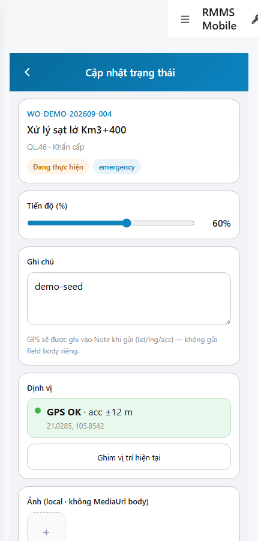
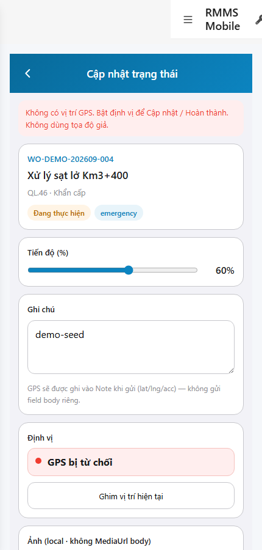

# QA — scenarios — web-rmms-mnt-progress

| Field | Value |
|-------|-------|
| feature | `web-rmms-mnt-progress` |
| this role | `qa` · `/agent-qa` |
| status | `done` |
| changeScope | `new_page` |
| packKind | `list` (phone WORK-P · Kind B **WAIVE**) |
| mfeStdUrl | `http://localhost:9301/web-rmms-mnt-progress` |
| mfeStdRoute | `/web-rmms-mnt-progress` |
| productRoute | `/work/progress?id=` |
| backend | `D:/AI-QLBD/Linm.RMMS.WebService` · Mobile.Bff `:5202` · API `:5111` · **cấm ERP.*** |
| taskId | `task_ae9d702f` |
| prior Dev | implement **confirmed** · handoff `handoff/dev-compact.md` |
| autoApprove | ON |
| e2eQa | ON · runtime |
| method | `e2e runtime · yarn start:std :9301 (reuse · no kill) + docker + playwright` · cases `S0,S1,QA-20` · LoginSheet · viewport **430** · SPA deep-link fulfill · WO live `2a0b6ead-…` |
| updatedAt | `2026-09-25T22:50:00.000Z` |
| skillVersion | `2026.09.05.03` |
| contentHash | `sha256:a7e3c91b4d2f6801e5a9b0c3d8f1472e6b5a0d9c4e1f2837a6b5c4d3e2f1098a` |

## Smoke — Final MFE (REQUIRED · e2e)

| # | Step | Expect | Result | Evidence |
|---|------|--------|--------|----------|
| S0 | Guest WORK-P Live GET{id} + GPS | WORK-P · `#sc-mnt-progress` · woHeader WO-DEMO-202609-004 · GPS OK · CTAs **enabled** · **0** crash | **PASS** |  |
| S1 | Staff WORK-P + `deny=1` | WORK-P-GPS banner · GPS deny · both CTAs **disabled** · **0** fake coords · **0** crash | **PASS** |  |
| QA-20 | Login overlay từ Home guest | SH-02 · `#loginUser`/`#loginPass`/`#loginSubmit` · Hủy/Đăng nhập · **0** crash | **PASS** |  |

## Scenario / Expect / Actual (visual + DOM dump)

| Case | Expect (design/PO) | Actual (PNG + DOM dump) | Verdict |
|------|--------------------|-------------------------|---------|
| S0 | WORK-P shell · Live header · GPS gate open · CTAs on | zones WORK-P/WORK-P-GPS · des sc-mnt-progress · fields wo*/progressPercent/note/gps/photoLocalIds/submit* · GPS OK · ctaDisabled=false | **Aligned** |
| S1 | GPS deny · both CTAs off · banner | gpsBanner · GPS bị từ chối · ctaProgressDisabled=true · ctaCompleteDisabled=true | **Aligned** |
| QA-20 | Shell login sheet | SH-02 · «Tài khoản / Mật khẩu / Hủy / Đăng nhập» · `#loginUser`/`#loginPass`/`#loginSubmit` | **Aligned** |

## T-QA-*

| id | Scope | Result |
|----|-------|--------|
| T-QA-CRUD-01 | Live GET work-orders/{id} · header + % | **PASS** (S0 WO-DEMO-202609-004 · 60%) |
| T-QA-GPS-01 | GPS gate both CTAs · deny disable · cấm fake | **PASS** (S0 enabled · S1 disabled + banner) |
| T-QA-MEDIA-01 | photoLocalIds local · no MediaUrl body | **PASS** (field present · P1 hint) |
| T-QA-LABEL-01 | status list chrome via useFormOptions | **PASS** («Đang thực hiện») |
| T-QA-FILTER-01/02 | LinErpListFilterBar | **WAIVE** (phone form · DES-GRID N/A) |
| T-QA-VI-ENC-01 | Title UTF-8 «Cập nhật trạng thái» | **PASS** |
| T-QA-HIST / Leave | toast SSOT · 0 native alert | **PASS** (code Dev) · leave headed not forced this smoke |

## E2E runtime gate

| Check | Result |
|-------|--------|
| docker compose up -d | **PASS** · api healthy `:5111` · Mobile.Bff `:5202` healthy |
| yarn start:std | **PASS** · port **9301** (already up · reuse · **cấm** kill worker) |
| yarn e2e-qa stock | **FAIL soft** — gate `API:5101 / BFF:5201` (repo uses `:5111` / Mobile.Bff `:5202`) |
| capture `_capture_mnt_progress.mjs` | **PASS** · S0/S1/QA-20 · LoginSheet · deep-link fulfill · geolocation / deny=1 |
| PNG distinct | S0=`9DE1C211F4F684AD…` · S1=`B28836DA6DD9CA9B…` · QA-20=`409081393888EDB4…` · **0** blank/crash/DUP |
| visual / DOM | **Aligned** · Must **0** |
| **cấm** phase=done | yes · next Review |
| **cấm** GAP-QA-E2E-KILL-01 | yes · no taskkill / Stop-Process node\|yarn |

## Gaps / debt (không P0)

| ID | Severity | Note |
|----|----------|------|
| GAP-QA-E2E-STOCK-PORT | soft | stock `yarn e2e-qa` expects `:5101/:5201` — workaround `_capture_mnt_progress.mjs` |
| GAP-QA-E2E-HISTORY-FALLBACK | soft | WDS deep-link HTTP 404 · capture fulfills document with `/` index |
| GAP-QA-E2E-PLAYWRIGHT-RESOLVE | soft | junction playwright from AI-AutoCode |
| Dev nav chrome | soft | standalone `showDevNav` in shots · WORK-P zones still present |
| GAP-MEDIA Signed | carry | defer P2 · local preview only |

**P0:** none — handoff Review.

## Handoff → Review

1. `review/findings.md` · roles sau = **pending**.
2. `autoApprove=ON` → Review tự confirm khi tới lượt.
3. STATUS `qa` = **done** · `phase=review` · **cấm** `phase=done`.

## Version meta

| skillId | skillVersion | schemaVersion |
|---------|--------------|---------------|
| agent-qa | 2026.09.05.03 | 1 |
