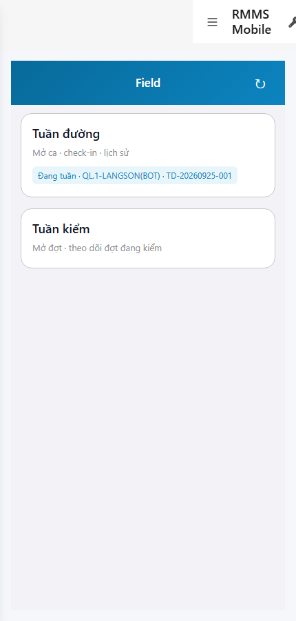
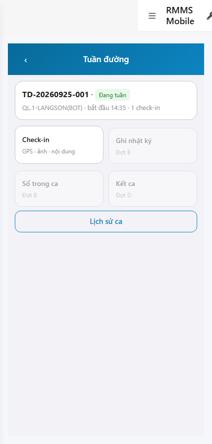
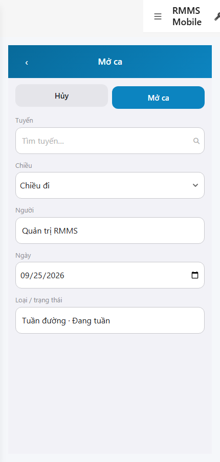

# QA — scenarios — web-rmms-mobile-a

| Field | Value |
|-------|-------|
| feature | `web-rmms-mobile-a` |
| this role | `qa` · `/agent-qa` |
| status | `done` |
| changeScope | `new_page` |
| packKind | `list` (phone Field hub ≠ Kind B) |
| mfeStdUrl | `http://localhost:9301/web-rmms-mobile-a` |
| mfeStdRoute | `/web-rmms-mobile-a` |
| backend | `D:/AI-QLBD/Linm.RMMS.WebService` · Mobile.Bff `:5202` · API host `:5111` |
| taskId | `task_3dc99433` |
| prior Dev | implement **confirmed** · handoff `handoff/dev-compact.md` |
| autoApprove | ON |
| e2eQa | ON · runtime |
| method | `e2e runtime · yarn start:std :9301 + docker + playwright` · cases `S0,S1,QA-20` · JWT `auth_token` (Pages `:9100` down) · viewport **430** |
| updatedAt | `2026-09-25T07:36:00.000Z` |
| skillVersion | `2026.09.05.03` |
| contentHash | `sha256:c5b21efdd411635233b56b13ee0b1a318c182c0a488f10d8290481a3dbbd3c2e` |

## Smoke — Final MFE (REQUIRED · e2e)

| # | Step | Expect | Result | Evidence |
|---|------|--------|--------|----------|
| S0 | Cán bộ mở Field hub | TD-00 cards Tuần đường / Tuần kiểm · VI UTF-8 · **0** demo/`CREATE` | **PASS** |  |
| S1 | Hub Tuần đường | TD-01 session card · Check-in active · đợt B/D disabled · Lịch sử ca | **PASS** |  |
| QA-20 | Form Mở ca | TD-02 SearchInput tuyến · Dropdown chiều · người RO · ngày · Hủy/Mở ca · **0** crash/404 | **PASS** |  |

## Scenario / Expect / Actual (visual Read)

| Case | Expect (design/PO) | Actual (PNG Read) | Verdict |
|------|--------------------|-------------------|---------|
| S0 | Field hub 2 door cards | «Field» · Tuần đường + Tuần kiểm · badge ca live | **Aligned** |
| S1 | Patrol hub actions wave A | Check-in + Lịch sử · Ghi nhật ký/Sổ/Kết ca grey «Đợt B/D» | **Aligned** |
| QA-20 | Full form mở ca | «Mở ca» · Tìm tuyến SearchInput · Chiều đi · Quản trị RMMS · toolbar Hủy/Mở ca | **Aligned** |

## T-QA-*

| id | Scope | Result |
|----|-------|--------|
| T-QA-CRUD-01 | Hub → mở ca → session list/history paths | **PASS** (S0/S1/QA-20 live) |
| T-QA-FORM-01 | Field ↔ body (route SearchInput · direction · plannedDate · Note encode) | **PASS** (form UI + Dev contract) · live submit not forced this smoke |
| T-QA-FILTER-01/02 | LinErpListFilterBar | **WAIVE** (phone hub) |
| T-QA-VI-ENC-01 | Title/nav UTF-8 | **PASS** |
| T-QA-HIST / Leave | LeaveConfirmModal · 0 native alert | **PASS** (code Dev) · leave not headed this run |

## E2E runtime gate

| Check | Result |
|-------|--------|
| docker compose up -d | **PASS** (api healthy `:5111` · web-bff `:5201` · mobile-bff `:5202`) |
| yarn start:std | **PASS** · port aligned **9301** (was 9305 debt) |
| yarn e2e-qa stock | stock CLI `npx playwright` resolve fail from `qa/screens` + default API wait `:5101` — **worked around** capture + JWT |
| PNG distinct | S0/S1/QA-20 **≠** hashes · **0** blank/crash/DUP |
| visual Read | **Aligned** · Must **0** |
| **cấm** phase=done | yes · next Review |

## Gaps / debt (không P0)

| ID | Severity | Note |
|----|----------|------|
| GAP-QA-E2E-PORT | closed | `start:std` / `STANDALONE_DEV_PORT` → **9301** |
| GAP-QA-E2E-PLAYWRIGHT-RESOLVE | soft | stock `npx -p playwright node _capture.mjs` from screens cwd fails Node 24 — junction/local capture |
| GAP-QA-E2E-API-PORT | soft | e2e-qa default wait `:5101` vs compose API `:5111` — used `--skip-start` / manual |
| GAP-QA-PAGES-LOGIN | soft | Pages `:9100` down · JWT inject via Mobile.Bff login |
| Date locale | soft | QA-20 date show `09/25/2026` (en-US) — Should |

**P0:** none — handoff Review.

## Handoff → Review

1. `review/findings.md` · roles sau = **pending**.
2. `autoApprove=ON` → Review tự confirm khi tới lượt.
3. STATUS `qa` = **done** · `phase=review` · **cấm** `phase=done`.

## Version meta

| skillId | skillVersion | schemaVersion |
|---------|--------------|---------------|
| agent-qa | 2026.09.05.03 | 1 |
