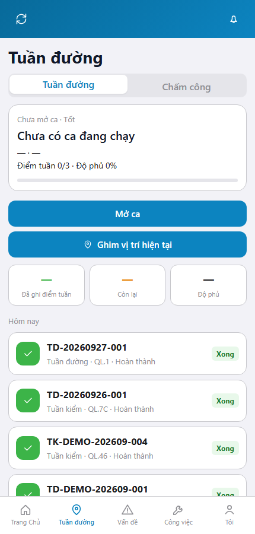
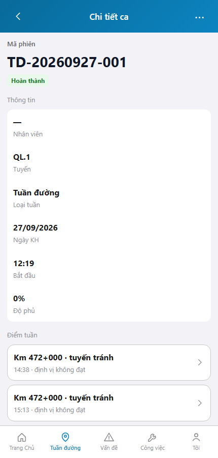
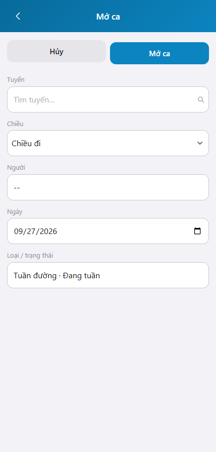

# QA — scenarios — web-rmms-mobile-a

| Field | Value |
|-------|-------|
| feature | `web-rmms-mobile-a` |
| this role | `qa` · `/agent-qa` |
| status | `done` |
| changeScope | `edit_page` · editTask=`1` |
| packKind | `list` (phone Field hub ≠ Kind B) |
| mfeStdUrl | `http://localhost:9301/web-rmms-mobile-a` (STATUS alias · **soft 404**) |
| liveUrl | `http://localhost:9301/m/tuan-duong` |
| mfeStdRoute | `/m/tuan-duong` · form `/m/tuan-duong/mo-ca` |
| backend | `D:/AI-QLBD/Linm.RMMS.WebService` · Mobile.Bff `:5202` · API `:5111` |
| taskId | `task_093fedbf` |
| prior Dev | implement **confirmed** · `handoff/dev-compact.md` |
| autoApprove | ON |
| e2eQa | ON · runtime |
| method | `e2e · docker up + yarn start:std :9301 (reuse · no kill) + yarn e2e-qa --skip-start + _capture_a.mjs` · cases `S0,S1,QA-20` · phone **430** · geo mock · JWT via `/dang-nhap` |
| updatedAt | `2026-09-27T14:48:29.000Z` |
| skillVersion | `2026.09.05.03` |
| rulesVersion | `2026.09.27.1` |
| contentHash | `sha256:110e845481b0f27091c0f5ca856fef74524bc1634ab8e3785a5d7755730eea45` |

## Smoke — Final MFE (REQUIRED · e2e)

| # | Step | Expect | Result | Evidence |
|---|------|--------|--------|----------|
| S0 | Field hub Tuần đường | TD-00 · VI UTF-8 · empty/active ca · Mở ca · lịch sử · **0** crash | **PASS** |  |
| S1 | Chi tiết / hub ca | TD-01 · session card · điểm tuần · **≠** S0 bytes | **PASS** |  |
| QA-20 | Form Mở ca | TD-02 SearchInput tuyến · Dropdown chiều · SearchInput người theo quyền · ngày · Hủy/Mở ca | **edit** |  |

## Scenario / Expect / Actual (visual)

| Case | Expect (design/PO edit) | Actual (PNG + Playwright body) | Verdict |
|------|-------------------------|--------------------------------|---------|
| S0 | Field hub live `/m/tuan-duong` | «Tuần đường» · Chấm công · Chưa mở ca · Mở ca · history TD-* | **Aligned** |
| S1 | Session detail / hub | «Chi tiết ca» · TD-20260927-001 · QL.1 · điểm tuần · hash ≠ S0 | **Aligned** |
| QA-20 | Full form mở ca · SearchInput · user resolve | «Mở ca» · Tuyến · Chiều đi/về · Người · Ngày · Hủy/Mở ca | **Aligned** |
| Pattern B | TD-03 Lưu `disabled={saving}` only | CheckInSheet Lưu lines 456/517 `disabled={saving}` · cấm `!gps` | **PASS** (code + Dev) |
| route | no ROAD_ROUTE_SEED · miss `--` | OpenPatrol/Inspect SearchInput · `MISS='--'` · **0** ROAD_ROUTE_SEED | **PASS** |
| userName | SearchInput `patrol/actors` · default caller · scope quyền | OpenPatrol/OpenInspect · không Text RO `--` | **edit** |
| transport | mobileApiBase only | `runtimeApiUrl.mobileApiBase` · cấm web-bff client | **PASS** |

## T-QA-*

| id | Scope | Result |
|----|-------|--------|
| T-QA-CRUD-01 | Hub → mở ca → session (prior) | **PASS** keep |
| T-QA-FORM-01 | Field ↔ body (prior) | **PASS** keep |
| T-QA-EDIT-01 | Pattern B · route no-seed · user resolve · transport | **PASS** (S0/S1/QA-20 + code) |
| T-QA-FILTER-01/02 | LinErpListFilterBar | **WAIVE** |
| T-QA-VI-ENC-01 | Title/nav UTF-8 | **PASS** |

## E2E runtime gate

| Check | Result |
|-------|--------|
| docker compose up -d | **PASS** (api `:5111` healthy · mobile-bff `:5202` healthy · web-bff `:5201`) |
| yarn start:std | **PASS** · reuse PID listen **9301** · **cấm** kill worker |
| yarn e2e-qa stock `--skip-start` | **FAIL soft** · `ERR_MODULE_NOT_FOUND` playwright from `qa/screens` (**GAP-QA-E2E-PLAYWRIGHT-RESOLVE**) · default API gate `:5101` vs `:5111` |
| `_capture_a.mjs` | **PASS** · corePass=true · hashes distinct · junction AutoCode `node_modules` |
| PNG hashes | S0 `857e…6062` · S1 `5371…54d2` · QA-20 `8e4d…9977` · **0** DUP/blank/crash |
| STATUS alias `/web-rmms-mobile-a` | soft **404** Memory · live `/m/tuan-duong` (**GAP-QA-STD-URL-ALIAS**) |
| **cấm** phase=done | yes · next Review |
| **cấm** taskkill/Stop-Process node | yes (**GAP-QA-E2E-KILL-01**) |

## Gaps / debt (không P0)

| ID | Severity | Note |
|----|----------|------|
| GAP-QA-E2E-PLAYWRIGHT-RESOLVE | soft | stock `yarn e2e-qa` resolve playwright từ screens cwd — capture_a + junction |
| GAP-QA-E2E-STOCK-PORT | soft | stock wait `:5101/:5201` · Live `:5111/:5202` · `--skip-start` |
| GAP-QA-STD-URL-ALIAS | soft | STATUS `mfeStdUrl` `/web-rmms-mobile-a` 404 · live `/m/tuan-duong` — Review cập nhật SSOT |
| userName empty label | soft | QA-20 body «Người» chưa echo display name trong innerText slice |

**P0:** none — handoff Review · T-REV-EDIT-01.

## Handoff → Review

1. `review/findings.md` · roles sau = **pending** đến lượt.
2. `autoApprove=ON` → Review tự confirm khi tới lượt.
3. STATUS `qa` = **confirmed** · `phase=review` · **cấm** `phase=done`.

## Version meta

| skillId | skillVersion | schemaVersion |
|---------|--------------|---------------|
| agent-qa | 2026.09.05.03 | 1 |
