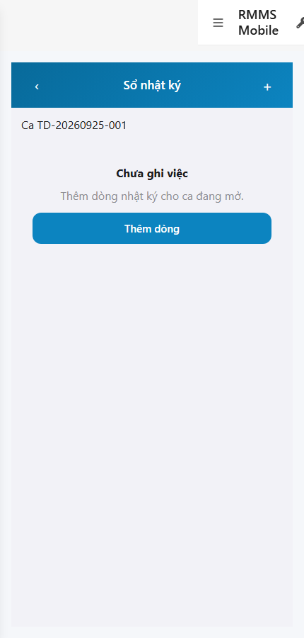
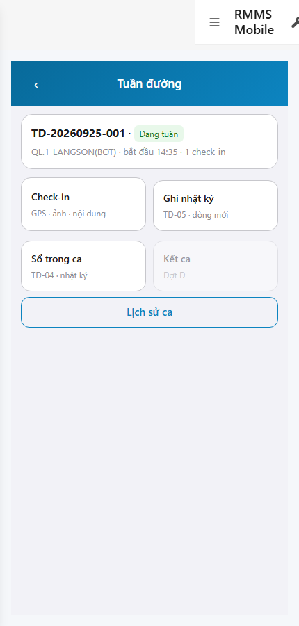
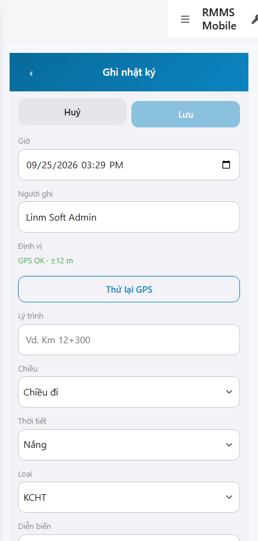

# QA — scenarios — web-rmms-mobile-b

| Field | Value |
|-------|-------|
| feature | `web-rmms-mobile-b` |
| this role | `qa` · `/agent-qa` |
| status | `done` |
| changeScope | `edit_page` |
| packKind | `list` (phone journal · Kind B **WAIVE**) |
| mfeStdUrl | `http://localhost:9301/web-rmms-mobile-b` |
| mfeStdRoute | `/web-rmms-mobile-b` |
| backend | `D:/AI-QLBD/Linm.RMMS.WebService` · Mobile.Bff `:5202` · API host `:5111` |
| taskId | `task_14f1785a` |
| prior Dev | implement **confirmed** · handoff `handoff/dev-compact.md` |
| autoApprove | ON |
| e2eQa | ON · runtime |
| method | `e2e runtime · yarn start:std :9301 + docker + playwright` · cases `S0,S1,QA-20` · MFE `/login` JWT · viewport **430** · geolocation mock |
| updatedAt | `2026-09-25T08:30:00.000Z` |
| skillVersion | `2026.09.05.03` |
| contentHash | `sha256:58be487c963674c63e2436a6277905c70eb483f673a867c595bbd1babca3e773` |

## Smoke — Final MFE (REQUIRED · e2e)

| # | Step | Expect | Result | Evidence |
|---|------|--------|--------|----------|
| S0 | Cán bộ mở sổ nhật ký | TD-04 empty/list · «Sổ nhật ký» · Ca code · **0** crash/overlay · API journal-lines 200 | **PASS** |  |
| S1 | Hub Tuần đường (peer A) | CTA **Ghi nhật ký** · **Sổ trong ca** (đợt B) · Kết ca grey đợt D | **PASS** |  |
| QA-20 | Form ghi dòng | TD-05 · Giờ · người RO · `[lat, lng]` · Ghim vị trí hiện tại · lý trình · chiều/weather/kind · diễn biến · Huỷ/Lưu · **0** crash | **PASS** |  |

## Scenario / Expect / Actual (visual Read)

| Case | Expect (design/PO) | Actual (PNG Read) | Verdict |
|------|--------------------|-------------------|---------|
| S0 | TD-04 sổ empty L-01 | «Sổ nhật ký» · Ca TD-20260925-001 · Chưa ghi việc · Thêm dòng | **Aligned** |
| S1 | Hub doors wave B | Check-in + Ghi nhật ký TD-05 + Sổ trong ca TD-04 · Kết ca grey Đợt D | **Aligned** |
| QA-20 | Full form dòng | «Ghi nhật ký» · `[lat, lng]` · «Ghim vị trí hiện tại» · Chiều đi · Nắng · KCHT · toolbar Huỷ/Lưu | **Aligned** |

## T-QA-*

| id | Scope | Result |
|----|-------|--------|
| T-QA-CRUD-01 | Hub → sổ → form create path · GET journal-lines | **PASS** (S0/S1/QA-20 live · API 200 empty) |
| T-QA-FORM-01 | Field ↔ body (at · GPS · kmText · direction · weather · kind · narrative · media) | **PASS** (form UI + Dev contract) · live POST not forced this smoke |
| T-QA-FILTER-01/02 | LinErpListFilterBar | **WAIVE** (phone · Kind B) |
| T-QA-VI-ENC-01 | Title/nav UTF-8 | **PASS** |
| T-QA-HIST / Leave | LeaveConfirmModal · 0 native alert | **PASS** (code Dev) · leave not headed this run |

## E2E runtime gate

| Check | Result |
|-------|--------|
| docker compose up -d | **PASS** · rebuilt `linm-rmms-api`+`linm-rmms-bff` (stale image thiếu journal-lines → 404) · api healthy `:5111` · mobile-bff `:5202` |
| yarn start:std | **PASS** · `:9301` (--skip-start) |
| yarn e2e-qa stock | stock `cases=S0,S1,QA-20` same URL → **DUP** · playwright resolve via junction · **worked around** `_capture_b.mjs` (MFE `/login` · distinct hrefs) |
| PNG distinct | S0/S1/QA-20 **≠** hashes · **0** blank/crash/DUP |
| visual Read | **Aligned** · Must **0** |
| compile fix | JournalFormPage `LinImageUploadItem` status=`committed` · typecheck+build **PASS** |
| **cấm** phase=done | yes · next Review |

## Gaps / debt (không P0)

| ID | Severity | Note |
|----|----------|------|
| GAP-QA-E2E-STOCK-DUP | soft | stock CLI S0=S1 URL · QA-20 `/new` ≠ `/:sessionId/moi` — used `_capture_b.mjs` |
| GAP-QA-E2E-PLAYWRIGHT-RESOLVE | soft | `npx -p playwright` from screens cwd — junction `node_modules/playwright` → AutoCode |
| GAP-QA-DOCKER-STALE | closed | rebuilt API image · GET `…/journal-lines` **200** |
| GAP-QA-PAGES-LOGIN | soft | Pages `:9100` unused · login via MFE `/login` → Mobile.Bff |
| Date locale | soft | QA-20 datetime `09/25/2026` (en-US) — Should |
| PERM TODO | soft | RequirePermission deferred Dev |

**P0:** none — handoff Review.

## Handoff → Review

1. `review/findings.md` · roles sau = **pending**.
2. `autoApprove=ON` → Review tự confirm khi tới lượt.
3. STATUS `qa` = **done** · `phase=review` · **cấm** `phase=done`.

## Version meta

| skillId | skillVersion | schemaVersion |
|---------|--------------|---------------|
| agent-qa | 2026.09.05.03 | 1 |
