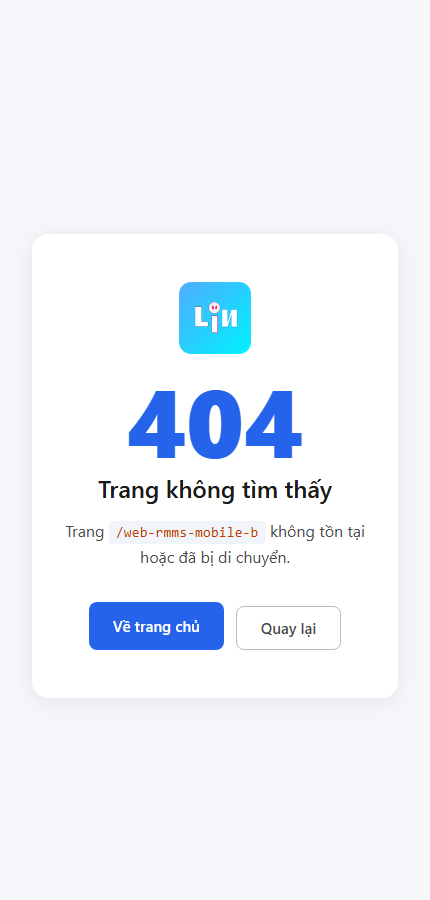
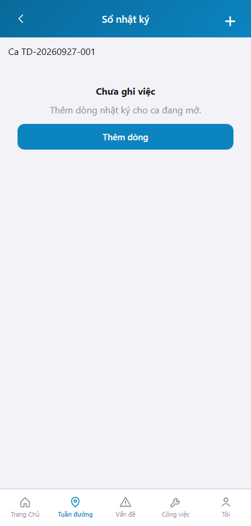
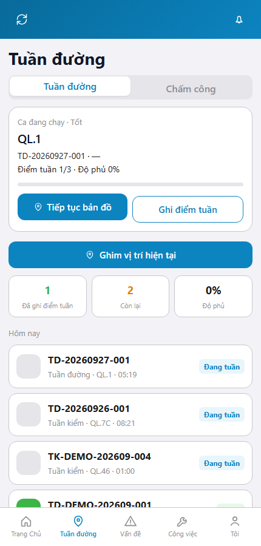
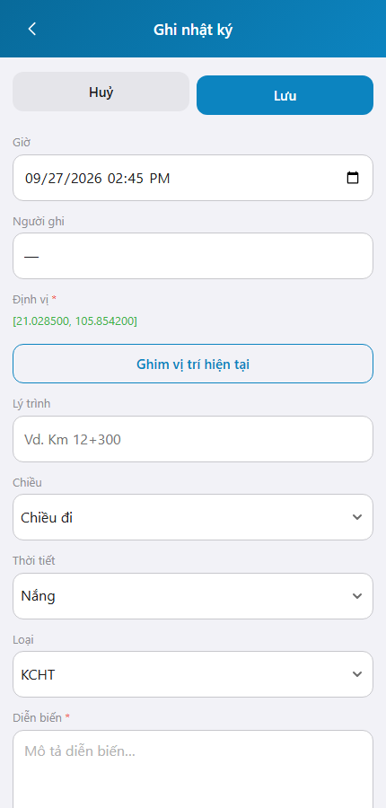

# QA — scenarios — web-rmms-mobile-b

| Field | Value |
|-------|-------|
| feature | `web-rmms-mobile-b` |
| this role | `qa` · `/agent-qa` |
| status | **failed** |
| changeScope | `edit_page` · editTask=1 · § Delta Pattern B / capture / BFF / align |
| packKind | `list` (phone journal · Kind B **WAIVE**) |
| mfeStdUrl | `http://localhost:9301/web-rmms-mobile-b` → **404** |
| liveUrl | `http://localhost:9301/nhat-ky` (code `paths.BASE`) |
| mfeStdRoute STATUS | `/web-rmms-mobile-b` · code route `/nhat-ky` |
| backend | `D:/AI-QLBD/Linm.RMMS.WebService` · API `:5111` · Mobile.Bff `:5202` |
| taskId | `task_8be1a3ec` |
| prior Dev | implement **confirmed** · `handoff/dev-compact.md` |
| autoApprove | ON |
| e2eQa | ON · runtime |
| method | `e2e runtime · start:std :9301 + docker compose + yarn e2e-qa` · stock DUP S0=S1 → `_capture_b.mjs` (MFE `/login` · phone **430** · geo mock) |
| updatedAt | `2026-09-27T07:50:00.000Z` |
| skillVersion | `2026.09.05.03` |
| contentHash | `sha256:fe3ccad04e66ee08b65a65aead0fbef9f46328e5c2a3b828b3bee12969bbf72e` |
| verdict | **FAIL** · Must ≥1 · **cấm** completed · queue **failed** → `qa_fail_rollback` |

## Smoke — Final MFE (REQUIRED · e2e)

| # | Step | Expect | Result | Evidence |
|---|------|--------|--------|----------|
| S0-std | STATUS `mfeStdUrl` | List TD-04, 0 crash | **FAIL** · 404 `/web-rmms-mobile-b` |  |
| S0 | Live `/nhat-ky` sổ | TD-04 empty/list · «Sổ nhật ký» · Ca · 0 crash | **PASS** (live only) |  |
| S1 | Hub Tuần đường peer A | CTA **Ghi nhật ký** · **Sổ trong ca** (đợt B) | **FAIL** · hub không CTA nhật ký (viewport + source) |  |
| QA-20 | Form ghi dòng live | TD-05 · GPS · chiều/weather/kind · diễn biến · Huỷ/Lưu Pattern B | **PASS** (live `/nhat-ky/.../moi`) |  |

## Scenario / Expect / Actual (visual Read)

| Case | Expect (design/PO) | Actual (PNG Read) | Verdict |
|------|--------------------|-------------------|---------|
| S0-std | STATUS URL mở TD-04 | 404 «Trang `/web-rmms-mobile-b` không tồn tại» | **Mismatch** · **GAP-QA-STD-01** |
| S0 | TD-04 sổ empty L-01 | «Sổ nhật ký» · Ca TD-20260927-001 · Chưa ghi việc · Thêm dòng | **Aligned** (live `/nhat-ky`) |
| S1 | Hub doors wave B | Map/check-in only · **0** «Ghi nhật ký» / «Sổ trong ca» | **Mismatch** · **GAP-QA-FEAT-01** |
| QA-20 | Full form · Pattern B Lưu | «Ghi nhật ký» · Huỷ/Lưu (Lưu enabled) · GPS mock · Chiều đi · Nắng · KCHT · Diễn biến * | **Aligned** (live) · soft: Người ghi `—` |

## T-QA-*

| id | Scope | Result |
|----|-------|--------|
| T-QA-CRUD-01 | Hub → sổ → form · GET journal-lines | **FAIL** · hub CTA missing · STATUS URL 404 · live list/form OK |
| T-QA-FORM-01 | Field ↔ body · Pattern B · capture | **PASS** (UI live TD-05 · Lưu not pre-disabled · GPS+narrative *) · POST not forced this smoke |
| T-QA-FILTER-01/02 | LinErpListFilterBar | **WAIVE** (phone · Kind B) |
| T-QA-VI-ENC-01 | Title/nav UTF-8 | **PASS** (live) |
| T-QA-HIST / Leave | LeaveConfirmModal | not headed this run · Dev KEEP |

## E2E runtime gate

| Check | Result |
|-------|--------|
| docker compose up -d | **PASS** · postgres/api/bff healthy · `:5111` · `:5202` |
| yarn start:std | **PASS** · `:9301` already listen (--skip-start) |
| yarn e2e-qa stock | S0 PASS · S1 **DUP** · QA-20 PASS · exit 1 (**GAP-QA-E2E-DUP-01** stock) |
| `_capture_b.mjs` | live S0/S1/QA-20 distinct hashes · STATUS URL FAIL 404 |
| PNG distinct | S0/S1/QA-20 **≠** · 0 blank |
| visual Read | S0/QA-20 Aligned live · S0-std + S1 **Must FAIL** |
| **cấm** phase=done | yes |
| **cấm** kill worker | yes · no taskkill |

## Gaps (Must → rollback)

| ID | Severity | Note |
|----|----------|------|
| **GAP-QA-STD-01** | **Must** | STATUS/`route_confirm` `mfeStdUrl=/web-rmms-mobile-b` → **404** · code SSOT `paths.BASE=/nhat-ky` (ui-align rename) · thiếu alias Navigate |
| **GAP-QA-FEAT-01** | **Must** | Peer hub `/tuan-duong/:sessionId` **0** CTA «Ghi nhật ký» / «Sổ trong ca» (grep MobileA empty) · enduser door đợt B |
| GAP-QA-E2E-DUP-01 | soft | stock e2e-qa S0=S1 same URL bytes · worked around `_capture_b` |
| Người ghi RO | soft | QA-20 value `—` (auth/profile) |
| Date locale | soft | `09/27/2026` en-US |
| PERM TODO | soft | RequirePermission deferred Dev |

**P0:** GAP-QA-STD-01 · GAP-QA-FEAT-01 — **không** handoff Review.

## Handoff → qa_fail_rollback

1. STATUS `qa` = **failed** · `phase=qa` · `status=blocked` · **cấm** `phase=done` / `phase=review`.
2. Queue `task_8be1a3ec` → **failed** · board **`qa_fail_rollback`**.
3. Dev fix options (không tự sửa trong QA): alias `web-rmms-mobile-b`→`/nhat-ky` **hoặc** update STATUS/context `mfeStdRoute=/nhat-ky` + hub CTA doors.
4. roles sau = **pending**.

## Version meta

| skillId | skillVersion | schemaVersion |
|---------|--------------|---------------|
| agent-qa | 2026.09.05.03 | 1 |
