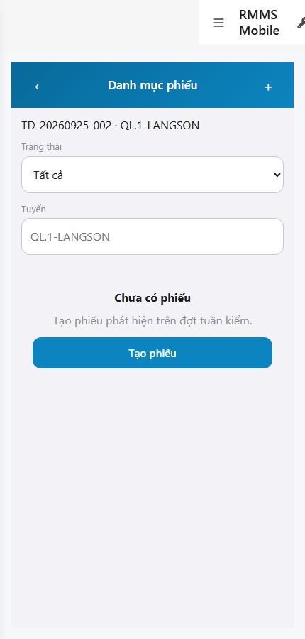
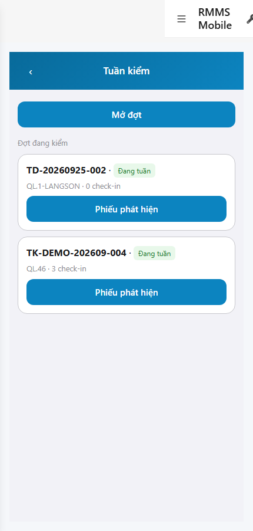
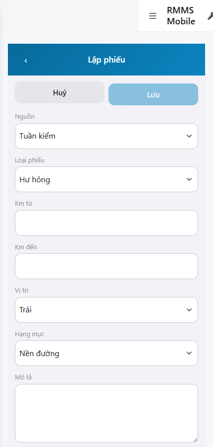

# QA — scenarios — web-rmms-mobile-c

| Field | Value |
|-------|-------|
| feature | `web-rmms-mobile-c` |
| this role | `qa` · `/agent-qa` |
| status | `done` |
| changeScope | `edit_page` |
| packKind | `list` (phone findings · Kind B **WAIVE**) |
| mfeStdUrl | `http://localhost:9301/web-rmms-mobile-c` |
| mfeStdRoute | `/web-rmms-mobile-c` |
| backend | `D:/AI-QLBD/Linm.RMMS.WebService` · Mobile.Bff `:5202` · API host `:5111` |
| taskId | `task_14bf16aa` |
| prior Dev | implement **confirmed** · handoff `handoff/dev-compact.md` |
| autoApprove | ON |
| e2eQa | ON · runtime |
| method | `e2e runtime · yarn start:std :9301 + docker rebuild API/BFF + capture_c` · cases `S0,S1,QA-20` · MFE `/login` JWT · viewport **430** · geolocation mock |
| updatedAt | `2026-09-25T09:25:00.000Z` |
| skillVersion | `2026.09.05.03` |
| contentHash | `sha256:0654e7b6359dfa34767872c7ea3a74f94605bd1b73fd125e241d6c95592133a4` |

## Smoke — Final MFE (REQUIRED · e2e)

| # | Step | Expect | Result | Evidence |
|---|------|--------|--------|----------|
| S0 | Cán bộ mở danh mục phiếu | TK-02 empty/list · «Danh mục phiếu» · Ca code · **0** crash/overlay · API findings 200 | **PASS** |  |
| S1 | Hub Tuần kiểm (peer A) | CTA **Phiếu phát hiện** · Mở đợt · Đợt đang kiểm | **PASS** |  |
| QA-20 | Form lập phiếu | TK-03 · Nguồn/Loại/Km/Vị trí/Hạng mục/Mô tả · Huỷ/Lưu · **0** crash | **PASS** |  |

## Scenario / Expect / Actual (visual Read)

| Case | Expect (design/PO) | Actual (PNG Read) | Verdict |
|------|--------------------|-------------------|---------|
| S0 | TK-02 empty L-01 | «Danh mục phiếu» · TD-20260925-002 · QL.1-LANGSON · Chưa có phiếu · Tạo phiếu | **Aligned** |
| S1 | Hub doors wave C | Mở đợt · Đợt đang kiểm · CTA **Phiếu phát hiện** trên card | **Aligned** |
| QA-20 | Full form phiếu | «Lập phiếu» · Nguồn Tuần kiểm · Loại Hư hỏng · Hạng mục Nền đường · Huỷ/Lưu | **Aligned** |

## T-QA-*

| id | Scope | Result |
|----|-------|--------|
| T-QA-CRUD-01 | Hub → list → form create path · GET findings | **PASS** (S0/S1/QA-20 live · API 200 empty) |
| T-QA-FORM-01 | Field ↔ body (source · findingKind · km · side · hangMuc · description · GPS · media) | **PASS** (form UI + Dev contract) · live POST not forced this smoke |
| T-QA-FILTER-01/02 | LinErpListFilterBar | **WAIVE** (phone · Kind B) |
| T-QA-VI-ENC-01 | Title/nav UTF-8 | **PASS** |
| T-QA-HIST / Leave | LeaveConfirmModal · 0 native alert | **PASS** (code Dev) · leave not headed this run |

## E2E runtime gate

| Check | Result |
|-------|--------|
| docker compose up -d | **PASS** · rebuilt `linm-rmms-api`+`linm-rmms-bff` (stale image thiếu findings → 404) · api healthy `:5111` · mobile-bff `:5202` |
| yarn start:std | **PASS** · `:9301` (existing worker · **cấm** kill) |
| yarn e2e-qa stock | stock gate expect API `:5101` → **FAIL** «Docker chưa listen API:5101» · **worked around** `_capture_c.mjs` |
| PNG distinct | S0/S1/QA-20 **≠** hashes · **0** blank/crash/DUP |
| visual Read | **Aligned** · Must **0** |
| compile fix | `LinImageUpload` `api`→`client` + `product="rmms"` · typecheck+build **PASS** |
| **cấm** phase=done | yes · next Review |

## Gaps / debt (không P0)

| ID | Severity | Note |
|----|----------|------|
| GAP-QA-E2E-STOCK-PORT | soft | stock CLI hard-check API `:5101` · RMMS host `:5111` — used `_capture_c.mjs` |
| GAP-QA-E2E-PLAYWRIGHT-RESOLVE | soft | junction `node_modules/playwright` → AutoCode |
| GAP-QA-DOCKER-STALE | closed | rebuilt API+BFF · GET findings?sessionId **200** |
| GAP-QA-S1-ROUTE | closed | S1 = `/web-rmms-mobile-a/tuan-kiem` (no `/:sessionId`) |
| PUT findings edit | soft | N/A wave C · Dev debt |
| PERM TODO | soft | RequirePermission stub deferred Dev |

**P0:** none — handoff Review.

## Handoff → Review

1. `review/findings.md` · roles sau = **pending**.
2. `autoApprove=ON` → Review tự confirm khi tới lượt.
3. STATUS `qa` = **done** · `phase=review` · **cấm** `phase=done`.

## Version meta

| skillId | skillVersion | schemaVersion |
|---------|--------------|---------------|
| agent-qa | 2026.09.05.03 | 1 |
