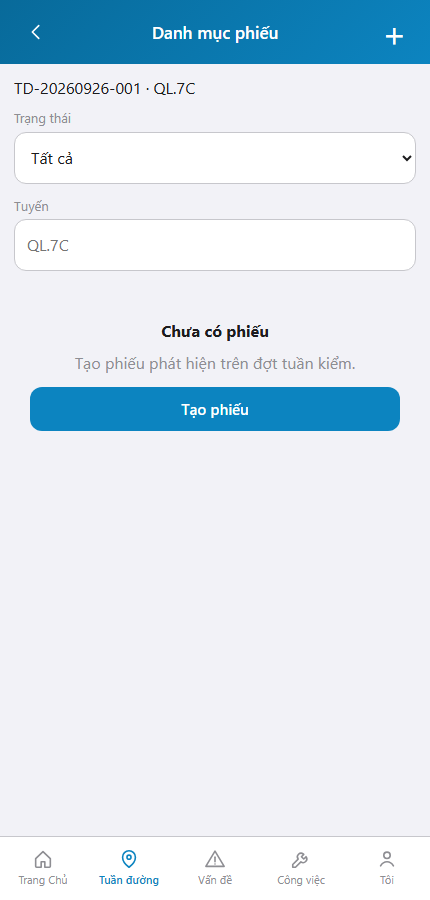
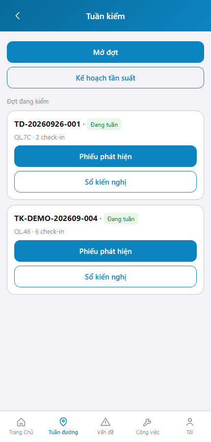
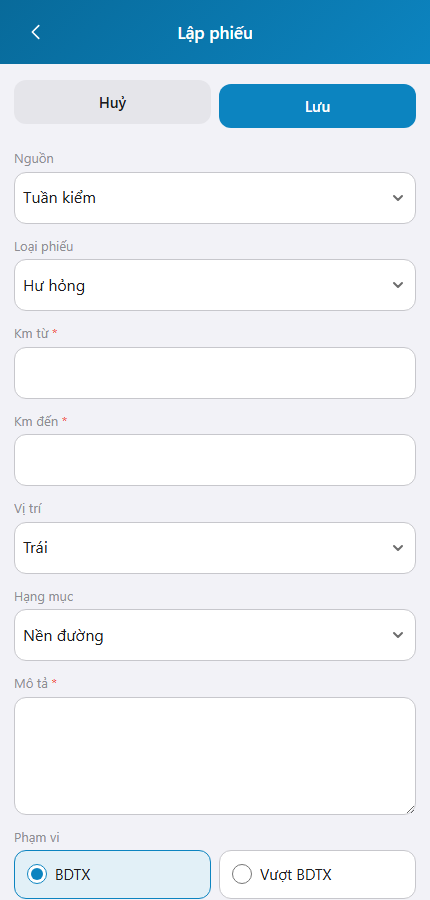

# QA — scenarios — web-rmms-mobile-c

| Field | Value |
|-------|-------|
| feature | `web-rmms-mobile-c` |
| this role | `qa` · `/agent-qa` |
| status | `done` |
| changeScope | `edit_page` · § Delta Pattern B + capture |
| packKind | `list` (phone findings · Kind B **WAIVE**) |
| mfeStdUrl | `http://localhost:9301/phat-hien` |
| mfeStdRoute | `/phat-hien` |
| backend | `D:/AI-QLBD/Linm.RMMS.WebService` · API `:5111` · Mobile.Bff `:5202` · web-bff `:5201` |
| taskId | `task_23b7939d` |
| prior Dev | implement **confirmed** · handoff `handoff/dev-compact.md` |
| autoApprove | ON |
| e2eQa | ON · runtime |
| method | `e2e runtime · yarn start:std :9301 (existing) + docker compose up -d + yarn e2e-qa --skip-start + capture_c /phat-hien` · cases `S0,S1,QA-20` · MFE `/login` JWT · viewport **430** · geolocation mock |
| updatedAt | `2026-09-27T08:30:00.000Z` |
| skillVersion | `2026.09.05.03` |
| contentHash | `sha256:4a38b53861c732cbbde7208c21d766f1b8b2c8decc007d2dc24ea34a4793339c` |

## Smoke — Final MFE (REQUIRED · e2e)

| # | Step | Expect | Result | Evidence |
|---|------|--------|--------|----------|
| S0 | Cán bộ mở danh mục phiếu | TK-02 empty/list · «Danh mục phiếu» · Ca code · **0** crash/overlay · Tạo phiếu | **PASS** |  |
| S1 | Hub Tuần kiểm (peer A) | CTA **Phiếu phát hiện** · Mở đợt · Đợt đang kiểm | **PASS** |  |
| QA-20 | Form lập phiếu | TK-03 · Nguồn/Loại/Km/Vị trí/Hạng mục/Mô tả · Huỷ/**Lưu** enabled (Pattern B) · **0** crash | **PASS** |  |

## Scenario / Expect / Actual (visual Read)

| Case | Expect (design/PO) | Actual (PNG Read) | Verdict |
|------|--------------------|-------------------|--------|
| S0 | TK-02 empty L-01 | «Danh mục phiếu» · TD-20260926-001 · QL.7C · Chưa có phiếu · Tạo phiếu | **Aligned** |
| S1 | Hub doors wave C | Mở đợt · Đợt đang kiểm · CTA **Phiếu phát hiện** trên card | **Aligned** |
| QA-20 | Full form + PB CTA | «Lập phiếu» · Nguồn Tuần kiểm · Loại Hư hỏng · Hạng mục Nền đường · Huỷ + **Lưu** (blue/enabled) | **Aligned** |

## T-QA-*

| id | Scope | Result |
|----|-------|--------|
| T-QA-CRUD-01 | Hub → list → form create path · GET findings | **PASS** (S0/S1/QA-20 live · href `/m/phat-hien/{session}/moi`) |
| T-QA-FORM-01 | Field ↔ body + Pattern B CTA (PB-01..10 smoke) | **PASS** (form UI · Lưu enabled · Dev contract) · live POST not forced this smoke |
| T-QA-FILTER-01/02 | LinErpListFilterBar | **WAIVE** (phone · Kind B) |
| T-QA-VI-ENC-01 | Title/nav UTF-8 | **PASS** |
| T-QA-HIST / Leave | LeaveConfirmModal · 0 native alert | **PASS** (code Dev) · leave not headed this run |

## E2E runtime gate

| Check | Result |
|-------|--------|
| docker compose up -d | **PASS** · api healthy `:5111` · mobile-bff `:5202` · web-bff `:5201` |
| yarn start:std | **PASS** · `:9301` (existing worker · **cấm** kill · GAP-QA-E2E-KILL-01) |
| yarn e2e-qa stock | **partial** · `--skip-start` · S0/S1 **PASS** · QA-20 **FAIL** `GAP-QA-E2E-DUP-01` (stock appends `/new` ≠ `/:sessionId/moi`) |
| capture_c workaround | **PASS** · S0/S1/QA-20 · distinct SHA256 · **0** blank/crash/DUP |
| PNG sizes | S0=29566 · S1=40020 · QA-20=31118 |
| visual Read | **Aligned** · Must **0** |
| **cấm** phase=done | yes · next Review |

## Gaps / debt (không P0)

| ID | Severity | Note |
|----|----------|------|
| GAP-QA-E2E-STOCK-NEW | soft | stock CLI QA-20 → `/new` · app route `/phat-hien/{sessionId}/moi` — used `_capture_c.mjs` |
| GAP-QA-E2E-STOCK-PORT | soft | stock default API `:5101` · RMMS `:5111` — `--skip-start` bypassed port gate |
| PERM TODO | soft | RequirePermission stub deferred Dev |
| capture LinImageUpload prop | soft | local input · gallery no capture prop (Dev debt) |

**P0:** none — handoff Review.

## Handoff → Review

1. `review/findings.md` · roles sau = **pending**.
2. `autoApprove=ON` → Review tự confirm khi tới lượt.
3. STATUS `qa` = **done** · `phase=review` · **cấm** `phase=done`.

## Version meta

| skillId | skillVersion | schemaVersion |
|---------|--------------|---------------|
| agent-qa | 2026.09.05.03 | 1 |
