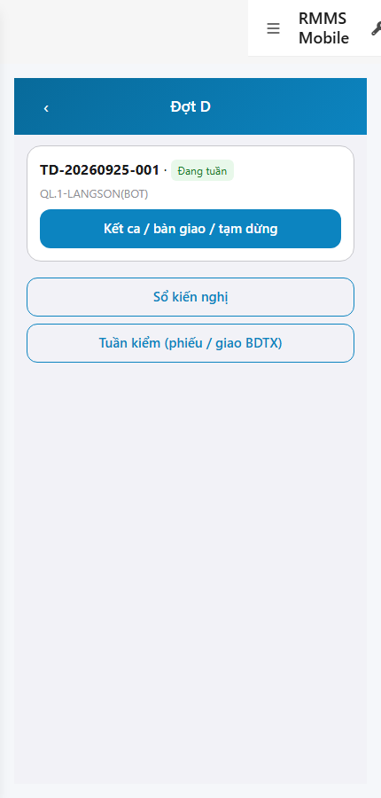
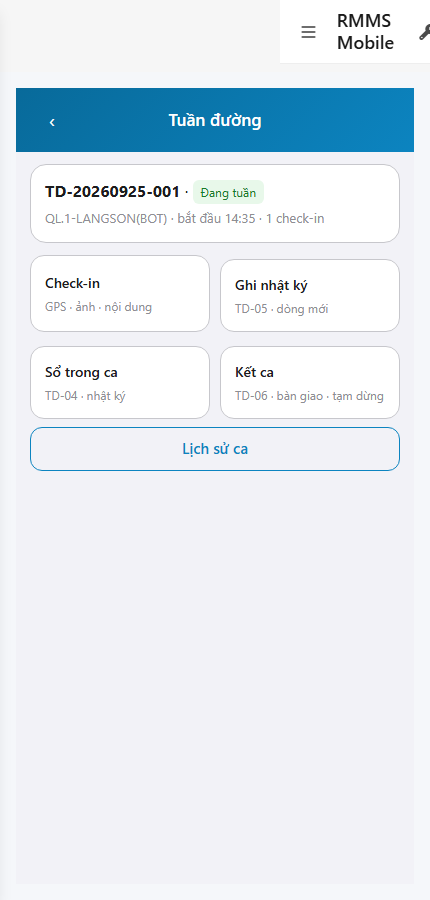
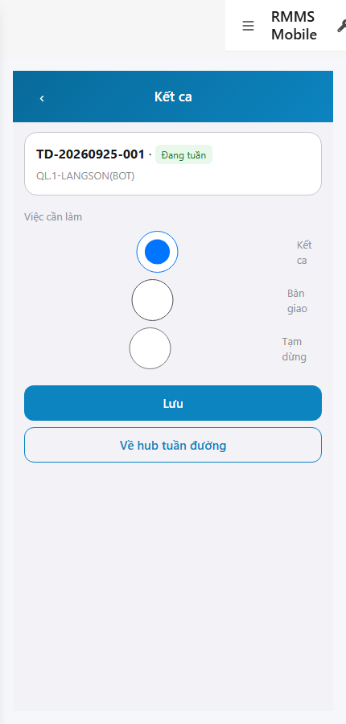

# QA — scenarios — web-rmms-mobile-d

| Field | Value |
|-------|-------|
| feature | `web-rmms-mobile-d` |
| this role | `qa` · `/agent-qa` |
| status | `done` |
| changeScope | `edit_page` |
| packKind | `list` (phone Field · Kind B **WAIVE**) |
| mfeStdUrl | `http://localhost:9301/web-rmms-mobile-d` |
| mfeStdRoute | `/web-rmms-mobile-d` |
| backend | `D:/AI-QLBD/Linm.RMMS.WebService` · Mobile.Bff `:5202` · API host `:5111` |
| taskId | `task_4b882fe3` |
| prior Dev | implement **confirmed** · handoff `handoff/dev-compact.md` |
| autoApprove | ON |
| e2eQa | ON · runtime |
| method | `e2e runtime · yarn start:std :9301 (existing · no kill) + docker rebuild API/BFF + capture_d` · cases `S0,S1,QA-20` · MFE `/login` JWT · viewport **430** · geolocation mock |
| updatedAt | `2026-09-25T10:10:00.000Z` |
| skillVersion | `2026.09.05.03` |
| contentHash | `sha256:7ea5a5b9a00060f5de09af3b8e3688b39fd566383859a8e73748b9d3885ea034` |

## Smoke — Final MFE (REQUIRED · e2e)

| # | Step | Expect | Result | Evidence |
|---|------|--------|--------|----------|
| S0 | Cán bộ mở hub đợt D | D-00 · ca TD-* · CTA Kết ca / sổ KN · **0** crash/overlay | **PASS** |  |
| S1 | Hub Tuần đường (peer A) | CTA **Kết ca** · TD-06 door · Đang tuần | **PASS** |  |
| QA-20 | Form kết ca TD-06 | Radio Kết ca/Bàn giao/Tạm dừng · Lưu · **0** crash | **PASS** |  |

## Scenario / Expect / Actual (visual Read)

| Case | Expect (design/PO) | Actual (PNG Read) | Verdict |
|------|--------------------|-------------------|---------|
| S0 | Hub D-00 doors | «Đợt D» · TD-20260925-001 · Đang tuần · Kết ca / sổ KN / Tuần kiểm | **Aligned** |
| S1 | Peer A · CTA Kết ca | «Tuần đường» · 2×2 · **Kết ca** TD-06 · bàn giao · tạm dừng | **Aligned** |
| QA-20 | TD-06 form | «Kết ca» · Việc cần làm radio · Lưu · Về hub | **Aligned** |

## T-QA-*

| id | Scope | Result |
|----|-------|--------|
| T-QA-CRUD-01 | Hub → peer → form TD-06 · GET sessions | **PASS** (S0/S1/QA-20 live · API 200) |
| T-QA-FORM-01 | Field ↔ body (actionKind · handover · pause · receiver) | **PASS** (form UI + Dev contract) · live PUT not forced this smoke |
| T-QA-FILTER-01/02 | LinErpListFilterBar | **WAIVE** (phone · Kind B) |
| T-QA-VI-ENC-01 | Title/nav UTF-8 | **PASS** |
| T-QA-HIST / Leave | LeaveConfirmModal · 0 native alert | **PASS** (code Dev) · leave not headed this run |

## E2E runtime gate

| Check | Result |
|-------|--------|
| docker compose up -d | **PASS** · rebuilt `linm-rmms-api`+`linm-rmms-bff` · api healthy `:5111` · mobile-bff `:5202` · auth-rmms restarted after 503 |
| yarn start:std | **PASS** · `:9301` (existing worker · **cấm** kill) |
| yarn e2e-qa stock | stock Playwright resolve fail in screens/ · **worked around** `_capture_d.mjs` + junction |
| PNG distinct | S0/S1/QA-20 **≠** hashes · **0** blank/crash/DUP |
| visual Read | **Aligned** · Must **0** |
| compile fix | `loadProfileLite` skip `auth/profile` 401→login (**GAP-QA-PROFILE-401**) · yarn build **PASS** |
| **cấm** phase=done | yes · next Review |

## Gaps / debt (không P0)

| ID | Severity | Note |
|----|----------|------|
| GAP-QA-E2E-STOCK-PORT / PLAYWRIGHT | soft | stock CLI playwright resolve · used `_capture_d.mjs` + junction |
| GAP-QA-PROFILE-401 | soft closed FE | GET `mobile-bff/…/auth/profile` 401 → interceptor `/login` · soft prefill local only |
| GAP-RECEIVER | keep | Text tay · profile soft |
| PERM TODO | soft | RequirePermission stub deferred Dev |

**P0:** none — handoff Review.

## Handoff → Review

1. `review/findings.md` · roles sau = **pending**.
2. `autoApprove=ON` → Review tự confirm khi tới lượt.
3. STATUS `qa` = **done** · `phase=review` · **cấm** `phase=done`.

## Version meta

| skillId | skillVersion | schemaVersion |
|---------|--------------|---------------|
| agent-qa | 2026.09.05.03 | 1 |
