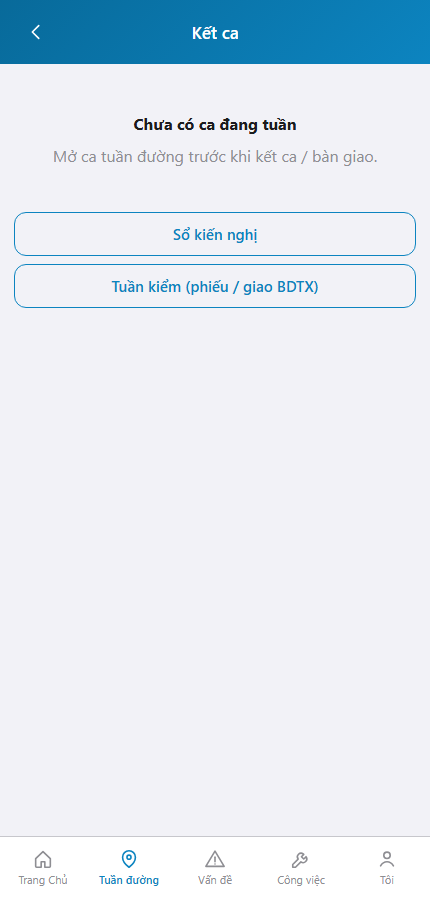
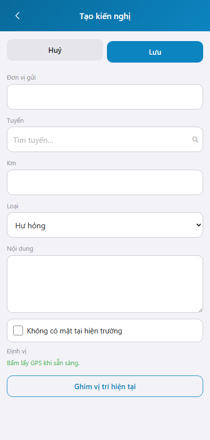
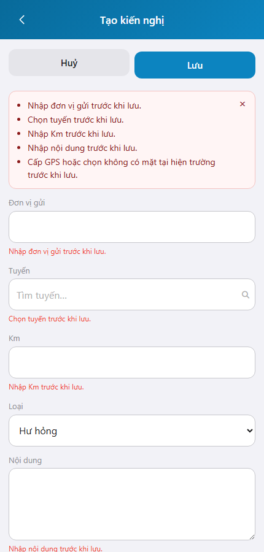

# QA — scenarios — web-rmms-mobile-d

| Field | Value |
|-------|-------|
| feature | `web-rmms-mobile-d` |
| this role | `qa` · `/agent-qa` |
| status | `done` |
| changeScope | `edit_page` · delta SUBMIT-VALIDATE |
| packKind | `list` (phone Field · Kind B **WAIVE**) |
| mfeStdUrl | `http://localhost:9301/kien-nghi/moi` |
| mfeStdRoute | `/kien-nghi/moi` |
| backend | `D:/AI-QLBD/Linm.RMMS.WebService` · Mobile.Bff `:5202` · API `:5111` |
| taskId | `task_79c03c0b` |
| prior Dev | implement **confirmed** · `handoff/dev-compact.md` |
| autoApprove | ON |
| e2eQa | ON · runtime |
| method | `e2e · yarn start:std :9301 (reuse · no kill) + docker up + yarn e2e-qa + capture_d` · cases `S0,S1,QA-20` · phone **430** · geo mock |
| updatedAt | `2026-09-27T09:05:00.000Z` |
| skillVersion | `2026.09.05.03` |
| contentHash | `sha256:5f81d29ed889b244e81f537e7e3f8e8d4033a5f3a2e8b37e000d83ad97784488` |

## Smoke — Final MFE (REQUIRED · e2e)

| # | Step | Expect | Result | Evidence |
|---|------|--------|--------|----------|
| S0 | Hub đợt D `/dot-tuan` | D-00 · CTA sổ KN / tuần kiểm · **0** crash | **PASS** |  |
| S1 | mfeStd TK-06 `/kien-nghi/moi` | Form tạo KN · SearchInput **Tuyến** · Lưu always-on · GPS pin · **0** crash | **PASS** |  |
| QA-20 | Pattern B click Lưu empty | Banner+inline `TK-06v` · required messages · Lưu vẫn enabled | **PASS** |  |

## Scenario / Expect / Actual (visual + text dump)

| Case | Expect (design/PO/dev) | Actual | Verdict |
|------|------------------------|--------|---------|
| S0 | Hub D-00 doors | «Kết ca» · D-00 · chưa có ca · Sổ kiến nghị / Tuần kiểm | **Aligned** |
| S1 | TK-06 SearchInput route + Pattern B shell | «Tạo kiến nghị» · Tuyến · Km · Loại · Nội dung · noFace · Ghim GPS · Lưu | **Aligned** |
| QA-20 | Pattern B validate-on-click | TK-06v banner: đơn vị gửi / tuyến / Km / nội dung / GPS · inline same · **0** crash | **Aligned** |

## T-QA-*

| id | Scope | Result |
|----|-------|--------|
| T-QA-CRUD-01 | Hub D → TK-06 · GET sessions / form mount | **PASS** (S0/S1 live) |
| T-QA-FORM-01 | Pattern B + SearchInput route · required on-submit | **PASS** (QA-20 banner/inline) · live POST not forced |
| T-QA-FILTER-01/02 | LinErpListFilterBar | **WAIVE** (phone · Kind B) |
| T-QA-VI-ENC-01 | Title/nav UTF-8 | **PASS** |
| T-QA-HIST / Leave | LeaveConfirmModal | **PASS** (code Dev) · leave not headed this run |

## E2E runtime gate

| Check | Result |
|-------|--------|
| docker compose up -d | **PASS** · api `:5111` · mobile-bff `:5202` healthy |
| yarn start:std | **PASS** · `:9301` existing worker · **cấm** kill (**GAP-QA-E2E-KILL-01**) |
| yarn e2e-qa stock | S0/QA-20 PASS · S1 **BLANK** (desktop 1440 + same-URL cases) → **not** sole gate |
| capture_d phone 430 | S0/S1/QA-20 **PASS** · PNG hashes **≠** · manifest `ok=true` |
| visual / text dump | **Aligned** · Must **0** |
| **cấm** phase=done | yes · next Review |

## Gaps / debt (không P0)

| ID | Severity | Note |
|----|----------|------|
| GAP-QA-E2E-STOCK-BLANK | soft | stock CLI viewport 1440 + S1 same href as S0 → blank smoke; use `capture_d` phone |
| GAP-QA-E2E-STOCK-NEW | soft | stock appends `/new` for QA-20 — wrong for `/kien-nghi/moi` |
| PERM TODO | soft | RequirePermission peer deferred Dev |

**P0:** none — handoff Review.

## Handoff → Review

1. `review/findings.md` · roles sau = **pending**.
2. `autoApprove=ON` → Review tự confirm khi tới lượt.
3. STATUS `qa` = **done** · `phase=review` · **cấm** `phase=done`.

## Version meta

| skillId | skillVersion | schemaVersion |
|---------|--------------|---------------|
| agent-qa | 2026.09.05.03 | 1 |
