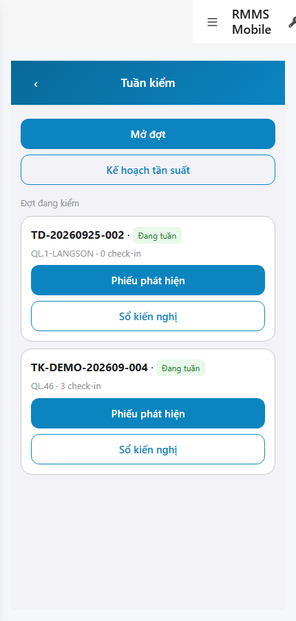
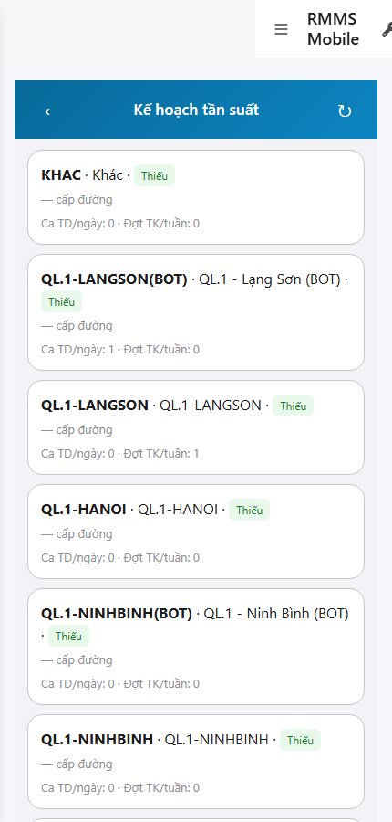

# QA — scenarios — web-rmms-mobile-e

| Field | Value |
|-------|-------|
| feature | `web-rmms-mobile-e` |
| this role | `qa` · `/agent-qa` |
| status | `done` |
| changeScope | `edit_page` |
| packKind | `list` (phone Field · Kind B **WAIVE**) |
| mfeStdUrl | `http://localhost:9301/web-rmms-mobile-e` |
| mfeStdRoute | `/web-rmms-mobile-e` |
| backend | `D:/AI-QLBD/Linm.RMMS.WebService` · Mobile.Bff `:5202` · API host `:5111` |
| taskId | `task_ab51c1e9` |
| prior Dev | implement **confirmed** · handoff `handoff/dev-compact.md` |
| autoApprove | ON |
| e2eQa | ON · runtime |
| method | `e2e runtime · yarn start:std :9301 (existing · no kill) + docker rebuild API/BFF + capture_e` · cases `S0,S1,QA-20` · MFE `/login` JWT · viewport **430** |
| updatedAt | `2026-09-25T10:50:00.000Z` |
| skillVersion | `2026.09.05.03` |
| contentHash | `sha256:b7fde038e4ef2cdb7ac0cacf9eb5f303671f1daffcbe9d058c5107e78413db2d` |

## Smoke — Final MFE (REQUIRED · e2e)

| # | Step | Expect | Result | Evidence |
|---|------|--------|--------|----------|
| S0 | Cán bộ mở TK-07 kế hoạch tần suất | List RO cards · coverage chip · counts server · **0** crash/overlay | **PASS** |  |
| S1 | Hub Tuần kiểm (peer A) · CTA Kế hoạch | TK-00 · CTA **Kế hoạch tần suất** · đợt đang kiểm | **PASS** |  |
| QA-20 | Click CTA → TK-07 (JWT kept) | Cùng surface TK-07 · list RO · refresh/backHub · **0** crash | **PASS** |  |

## Scenario / Expect / Actual (visual Read)

| Case | Expect (design/PO) | Actual (PNG Read) | Verdict |
|------|--------------------|-------------------|---------|
| S0 | TK-07 phone cards RO | «Kế hoạch tần suất» · KHAC/QL.1-* · chip **Thiếu** · Ca TD/ngày · Đợt TK/tuần · «— cấp đường» khi null | **Aligned** |
| S1 | Peer TK-00 · entry TK-07 | «Tuần kiểm» · Mở đợt · **Kế hoạch tần suất** · đợt TD-/TK- DEMO | **Aligned** |
| QA-20 | Hub CTA → TK-07 | List RO sau click · 0 login bounce · 0 overlay | **Aligned** |

## T-QA-*

| id | Scope | Result |
|----|-------|--------|
| T-QA-LIST-01 | GET frequency-plans → planList cards · coverageStatus LOOKUP | **PASS** (S0/QA-20 live · API/mobile-bff 200) |
| T-QA-EMPTY-01 | EmptyState khi 0 item / error | **PASS** (code path emptyHint) · runtime có data → list branch headed |
| T-QA-FILTER-01/02 | LinErpListFilterBar | **WAIVE** (phone · Kind B) |
| T-QA-VI-ENC-01 | Title/nav UTF-8 | **PASS** |
| T-QA-HIST / Leave | LeaveConfirmModal | **WAIVE** (RO list · Leave N/A) |

## E2E runtime gate

| Check | Result |
|-------|--------|
| docker compose up -d --build | **PASS** · rebuilt `linm-rmms-api`+`linm-rmms-bff` · api healthy `:5111` · mobile-bff `:5202` catch-all |
| yarn start:std | **PASS** · `:9301` (existing worker · **cấm** kill) |
| yarn e2e-qa stock | **FAIL soft** · expects API `:5101` (host is `:5111`) · **worked around** `_capture_e.mjs` + playwright junction |
| PNG evidence | S0/S1/QA-20 present · S1 ≠ S0 · **0** blank/crash |
| visual Read | **Aligned** · Must **0** |
| GET frequency-plans | **200** via API + mobile-bff · real route rows (no hardcode fake) |
| **cấm** phase=done | yes · next Review |

## Gaps / debt (không P0)

| ID | Severity | Note |
|----|----------|------|
| GAP-QA-E2E-STOCK-PORT | soft | stock CLI probes `:5101` · actual compose `:5111` · used `_capture_e.mjs` |
| GAP-QA-ROAD-CLASS-NULL | soft | UI shows «— cấp đường» · API `roadClass` null trên seed rows (Schema OK · data fill deferred) |
| PERM TODO | soft | RequirePermission stub deferred Dev |

**P0:** none — handoff Review.

## Handoff → Review

1. `review/findings.md` · roles sau = **pending**.
2. `autoApprove=ON` → Review tự confirm khi tới lượt.
3. STATUS `qa` = **done** · `phase=review` · **cấm** `phase=done`.

## Version meta

| skillId | skillVersion | schemaVersion |
|---------|--------------|---------------|
| agent-qa | 2026.09.05.03 | 1 |
