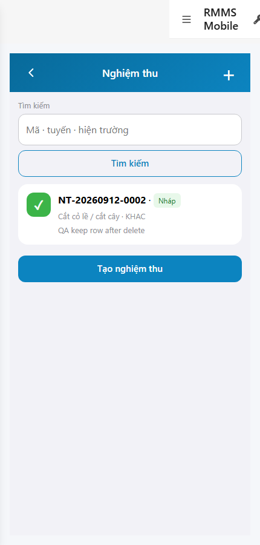
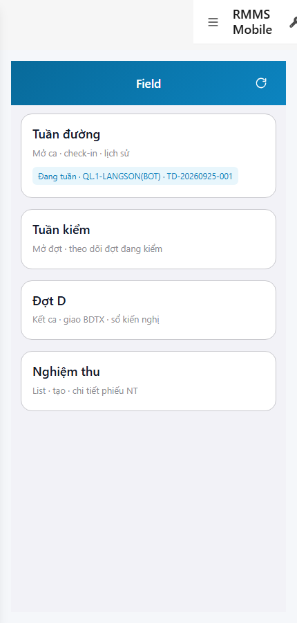

# QA — scenarios — web-rmms-nghiem-thu

| Field | Value |
|-------|-------|
| feature | `web-rmms-nghiem-thu` |
| this role | `qa` · `/agent-qa` |
| status | `done` |
| changeScope | `new_page` |
| packKind | `list` (phone list · DES-GRID / filter **WAIVE**) |
| mfeStdUrl | `http://localhost:9301/web-rmms-nghiem-thu` |
| mfeStdRoute | `/web-rmms-nghiem-thu` · alias `/field/nghiem-thu*` |
| backend | `D:/AI-QLBD/Linm.RMMS.WebService` · Mobile.Bff `:5202` · API `:5111` |
| taskId | `task_5602c6c5` |
| prior Dev | implement **confirmed** · handoff `handoff/dev-compact.md` |
| autoApprove | ON |
| e2eQa | ON · runtime |
| method | `e2e runtime · yarn start:std :9301 (existing · no kill) + docker compose up -d + capture_nghiemthu` · cases `S0,S1,QA-20` · MFE `/login` JWT · viewport **430** · geo grant |
| updatedAt | `2026-09-25T15:42:00.000Z` |
| skillVersion | `2026.09.05.03` |
| contentHash | `sha256:6f74282b807da7f2cc1aa57ac64848cd1d75ff3383c0f432eaad7bea53fff80e` |

## Smoke — Final MFE (REQUIRED · e2e)

| # | Step | Expect | Result | Evidence |
|---|------|--------|--------|----------|
| S0 | Cán bộ mở list Nghiệm thu | NT-00…04 · search · row Check · create CTA · Live list · **0** crash/overlay | **PASS** |  |
| S1 | Field hub · entry Nghiệm thu | Hub · `data-des-id=NT-00` · door «Nghiệm thu» | **PASS** |  |
| QA-20 | Click NT-00 → list (JWT kept) | Cùng surface list · `#ntSearch` · **0** login bounce | **PASS** |  |

## Scenario / Expect / Actual (visual · dump)

| Case | Expect (design/PO) | Actual (PNG/dump) | Verdict |
|------|--------------------|-------------------|--------|
| S0 | NT list · search P1 · Check row · + create | feature `web-rmms-nghiem-thu` · zones NT-00/01/03/04 · `#ntSearch` · row `NT-20260912-0002` · Nháp · «Tạo nghiệm thu» · 430×900 | **Aligned** |
| S1 | Field hub door NT-00 | Hub · doors Tuần đường / Tuần kiểm / Đợt D / **Nghiệm thu** · `NT-00` | **Aligned** |
| QA-20 | Hub CTA → list | List after click · `#ntSearch` · JWT kept · NT-* | **Aligned** |

## T-QA-*

| id | Scope | Result |
|----|-------|--------|
| T-QA-LIST-01 | NT-01 search · NT-02 empty/list · NT-03 row | **PASS** (S0 · Live row + search) |
| T-QA-NAV-01 | Field hub NT-00 → list | **PASS** (QA-20) |
| T-QA-CREATE-01 | NT-04 → /moi form | **WAIVE** smoke (S0/S1/QA-20 surface = list) |
| T-QA-GPS-01 | geolocation → FieldInfo · deny=no fake | **WAIVE** smoke (list no GPS gate) |
| T-QA-MEDIA-01 | PhotoRow files/* ≤10 | **WAIVE** smoke (form not in S0 suite) |
| T-QA-LEAVE-01 | LeaveConfirmModal · cấm native confirm | **WAIVE** smoke (DES-LEAVE Dev · not clicked) |
| T-QA-POST-01 | POST draft / PUT detail | **WAIVE** smoke (no destructive write in S0/S1/QA-20) |
| T-QA-FILTER-01 | LinErpListFilterBar | **WAIVE** (phone list · DES-GRID N/A · search only P1) |
| T-QA-DELETE-01 | DELETE | **WAIVE** (OUT P1) |
| T-QA-VI-ENC-01 | Title/nav UTF-8 | **PASS** (dump «Nghiệm thu») |

## E2E runtime gate

| Check | Result |
|-------|--------|
| docker compose up -d | **PASS** · postgres/api healthy · bff `:5201` · Mobile.Bff `:5202` health 200 · api `:5111` |
| yarn start:std | **PASS** · `:9301` (existing worker · **cấm** kill · GAP-QA-E2E-KILL-01) |
| yarn e2e-qa stock | **FAIL soft** · probe API `:5101` vs compose `:5111` · **worked around** `_capture_nghiemthu.mjs` + playwright junction |
| PNG evidence | S0/S1/QA-20 present · S1 ≠ S0 · list loaded · **0** blank/crash · 430×900 |
| visual / dump | **Aligned** · Must **0** |
| GET patrol/nghiem-thu | **200** via mobile-bff (Live row in list) |
| **cấm** phase=done | yes · next Review |

## Gaps / debt (không P0)

| ID | Severity | Note |
|----|----------|------|
| GAP-QA-E2E-STOCK-PORT | soft | stock CLI probes `:5101` · compose `:5111` (carry prior wave) |
| ZoneOrgCode | soft | no reverse-geocode (Dev debt · non-blocking) |
| T-QA-CREATE/GPS/MEDIA/LEAVE/POST | soft | WAIVE on smoke suite S0/S1/QA-20 · form covered Dev T-02…T-05 |

**P0:** none — handoff Review.

## Handoff → Review

1. `review/findings.md` · roles sau = **pending**.
2. `autoApprove=ON` → Review tự confirm khi tới lượt.
3. STATUS `qa` = **done** · `phase=review` · **cấm** `phase=done`.

## Version meta

| skillId | skillVersion | schemaVersion |
|---------|--------------|---------------|
| agent-qa | 2026.09.05.03 | 1 |
