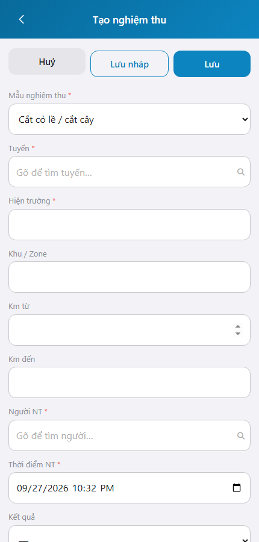
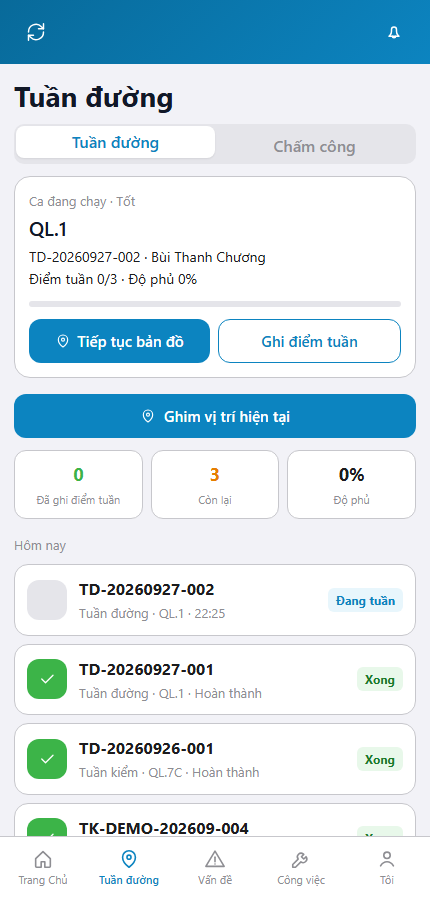
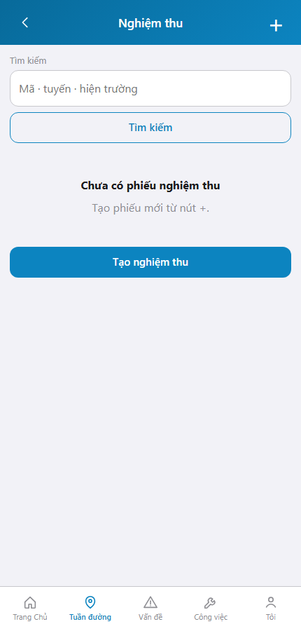

# QA — scenarios — web-rmms-nghiem-thu

| Field | Value |
|-------|-------|
| feature | `web-rmms-nghiem-thu` |
| this role | `qa` · `/agent-qa` |
| status | `done` |
| changeScope | `edit_page` |
| packKind | `list` (phone · DES-GRID / filter **WAIVE**) |
| mfeStdUrl | `http://localhost:9301/nghiem-thu/moi` |
| mfeStdRoute | `/nghiem-thu/moi` · alias `/field/nghiem-thu*` |
| backend | `D:/AI-QLBD/Linm.RMMS.WebService` · Mobile.Bff `:5202` · API `:5111` |
| taskId | `task_5ba3b008` |
| prior Dev | implement **confirmed** · handoff `handoff/dev-compact.md` |
| autoApprove | ON |
| e2eQa | ON · runtime |
| method | `e2e runtime · yarn start:std :9301 (existing · no kill) + docker compose up -d + capture_nghiemthu` · cases `S0,S1,QA-20` · MFE `/login` JWT · viewport **430** · geo grant · stock `yarn e2e-qa` FAIL soft BLANK → capture workaround |
| updatedAt | `2026-09-27T15:40:00.000Z` |
| skillVersion | `2026.09.05.03` |
| contentHash | `sha256:b8f3ce70ff3e80073c39d2dac6a01d2fed2e98232877ef6979881eef8e37acb4` |
| citeDelta | `docs/plan/web-rmms-mobile/SUBMIT-VALIDATE.md` |

## Smoke — Final MFE (REQUIRED · e2e)

| # | Step | Expect | Result | Evidence |
|---|------|--------|--------|----------|
| S0 | Cán bộ mở form tạo `/nghiem-thu/moi` | NT-05…10 · Pattern B CTA always-on · SearchInput route+assignee · **0** crash/overlay · UTF-8 | **PASS** |  |
| S1 | Field hub Tuần đường · entry Nghiệm thu | Hub `/tuan-duong` · «Công tác nghiệm thu» | **PASS** |  |
| QA-20 | Hub entry → list (JWT kept) | List `#ntSearch` · NT-01/02/04 · **0** login bounce | **PASS** |  |

## Scenario / Expect / Actual (visual · dump)

| Case | Expect (design/PO · edit_page Delta) | Actual (PNG/dump) | Verdict |
|------|--------------------------------------|-------------------|--------|
| S0 | Form Pattern B · CTA Huỷ/Lưu nháp/Lưu not `disabled={!canSave}` · SearchInput Tuyến + Người NT · zones NT-06/06b/10 | Title «Tạo nghiệm thu» · Lưu nháp+Lưu enabled · Tuyến/Người NT search icon · `saveDisabled=false` · 430×900 | **Aligned** |
| S1 | Field hub door/entry NT | Tuần đường hub · quick «Công tác nghiệm thu» · live ca TD-* | **Aligned** |
| QA-20 | Hub → list · search P1 | List empty-state · `#ntSearch` · «Tạo nghiệm thu» · JWT kept · NT-00/01/02/04 | **Aligned** |

## T-QA-*

| id | Scope | Result |
|----|-------|--------|
| T-QA-FORM-01 | Pattern B CTA + banner path · SearchInput route/assignee · required marks | **PASS** (S0 · always-on CTA · LKP search fields) |
| T-QA-CRUD-01 | POST draft / PUT detail → list row | **WAIVE** smoke (S0/S1/QA-20 no write · list empty-state soft) |
| T-QA-LIST-01 | NT-01 search · NT-02 empty/list · NT-03 row | **PASS** soft (QA-20 empty NT-02 · search present) |
| T-QA-NAV-01 | Field hub → list / form | **PASS** (S1→QA-20 · S0 std form) |
| T-QA-GPS-01 | geolocation · deny=no fake | **PASS** soft (S0 dump GPS pin granted · deny path Dev) |
| T-QA-MEDIA-01 | PhotoRow files/* ≤10 · capture=environment | **WAIVE** smoke (zone NT-08 present · no shutter click) |
| T-QA-LEAVE-01 | LeaveConfirmModal · cấm native confirm | **WAIVE** smoke (DES-LEAVE Dev · not clicked) |
| T-QA-FILTER-01 | LinErpListFilterBar | **WAIVE** (phone · DES-GRID N/A) |
| T-QA-DELETE-01 | DELETE | **WAIVE** (OUT P1) |
| T-QA-VI-ENC-01 | Title/nav UTF-8 | **PASS** (S0/S1/QA-20 «Nghiệm thu» / «Tạo nghiệm thu») |

## E2E runtime gate

| Check | Result |
|-------|--------|
| docker compose up -d | **PASS** · postgres/api/bff healthy · api `:5111` · web-bff `:5201` · Mobile.Bff `:5202` listen |
| yarn start:std | **PASS** · `:9301` (existing worker · **cấm** kill · GAP-QA-E2E-KILL-01) |
| yarn e2e-qa stock | **FAIL soft** · S0/S1 `GAP-QA-E2E-BLANK-01` (generic probe) · **worked around** `_capture_nghiemthu.mjs` |
| PNG evidence | S0/S1/QA-20 present · distinct · form/hub/list · **0** blank/crash · 430×900 |
| visual / dump | **Aligned** · Must **0** |
| Pattern B | S0 `saveDisabled=false` · CTA Lưu nháp+Lưu visible |
| SearchInput | S0 Tuyến + Người NT search · zones NT-06 / NT-06b |
| **cấm** phase=done | yes · next Review |

## Gaps / debt (không P0)

| ID | Severity | Note |
|----|----------|------|
| GAP-QA-E2E-STOCK-BLANK | soft | stock CLI BLANK S0/S1 · capture feature-aware PASS |
| GAP-QA-CRUD-EMPTY-01 | soft | list empty-state · CRUD write not in S0/S1/QA-20 suite · carry |
| ZoneOrgCode | soft | no reverse-geocode (Dev debt · non-blocking) |
| T-QA-MEDIA/LEAVE/CRUD write | soft | WAIVE smoke · form covered S0 Pattern B+LKP |

**P0:** none — handoff Review.

## Handoff → Review

1. `review/findings.md` · roles sau = **pending**.
2. `autoApprove=ON` → Review tự confirm khi tới lượt.
3. STATUS `qa` = **done** · `phase=review` · **cấm** `phase=done`.

## Screens path

`D:/AI-QLBD/Linm.RMMS.Data/specs/web-rmms-nghiem-thu/qa/screens/{S0,S1,QA-20}.png`
