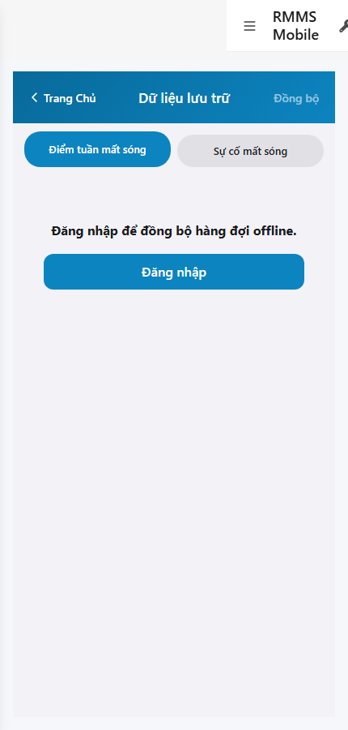
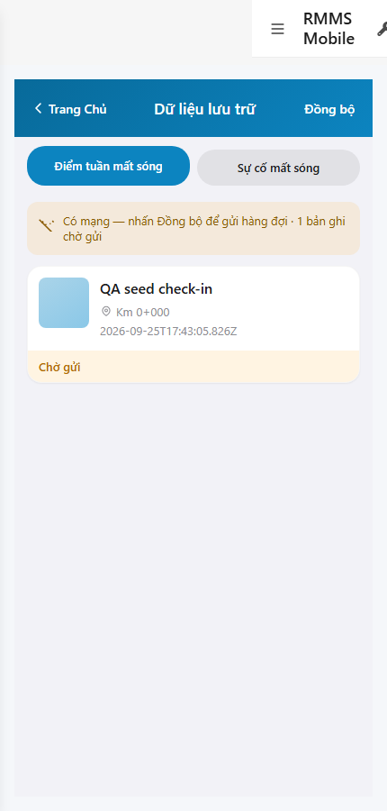

# QA — scenarios — web-rmms-offline

| Field | Value |
|-------|-------|
| feature | `web-rmms-offline` |
| this role | `qa` · `/agent-qa` |
| status | `done` |
| changeScope | `new_page` |
| packKind | `list` (phone OFF-00 · DES-GRID / LinErpListFilterBar **WAIVE**) |
| mfeStdUrl | `http://localhost:9301/web-rmms-offline` |
| mfeStdRoute | `/web-rmms-offline` · alias `/offline` · `/field/offline` |
| backend | `D:/AI-QLBD/Linm.RMMS.WebService` · Mobile.Bff `:5202` · API `:5111` · **cấm ERP.*** |
| taskId | `task_43cc2b00` |
| prior Dev | implement **confirmed** · handoff `handoff/dev-compact.md` |
| autoApprove | ON |
| e2eQa | ON · runtime |
| method | `e2e runtime · yarn start:std :9301 (reuse · no kill) + docker compose up -d + capture_offline` · cases `S0,S1,QA-20` · LoginSheet · viewport **430** · storeKey `linm.offline.queue.v1` |
| updatedAt | `2026-09-25T17:45:00.000Z` |
| skillVersion | `2026.09.05.03` |
| contentHash | `sha256:01ede8e7ff03f06a19e291b345d60faa95a7af42a43bae00efb799458a643cd1` |

## Smoke — Final MFE (REQUIRED · e2e)

| # | Step | Expect | Result | Evidence |
|---|------|--------|--------|----------|
| S0 | Guest mở Offline | OFF-00 · NAV · SEG · empty guestGate · `#btn-sync` · VI UTF-8 · **0** crash | **PASS** |  |
| S1 | Staff Offline sau LoginSheet | BANNER · SEG · CARD (seed check-in) · status «Chờ gửi» · pending count · **0** crash | **PASS** |  |
| QA-20 | Login overlay từ Home guest CTA | SH-02 · `#loginUser`/`#loginPass` · Hủy/Đăng nhập · **0** crash | **PASS** |  |

## Scenario / Expect / Actual (visual + DOM dump)

| Case | Expect (design/PO) | Actual (PNG + DOM dump) | Verdict |
|------|--------------------|-------------------------|---------|
| S0 | Guest gate · no Live queue GET | zones OFF-00/NAV/SEG/empty · «Đăng nhập để đồng bộ hàng đợi offline» · `#sc-patrol-offline` · DES-MOB-PAT-OFFLINE | **Aligned** |
| S1 | Staff list local · banner · sync · CARD | zones OFF-00/NAV/SEG/BANNER/CARD · «Có mạng — nhấn Đồng bộ» · «1 bản ghi chờ gửi» · «Chờ gửi» · seed key `linm.offline.queue.v1` | **Aligned** |
| QA-20 | Shell login sheet | SH-02 · «Tài khoản / Mật khẩu / Hủy / Đăng nhập» · `#loginUser`/`#loginPass`/`#loginSubmit` | **Aligned** |

## T-QA-*

| id | Scope | Result |
|----|-------|--------|
| T-QA-CRUD-01 | list=localStorage · cấm GET queue · sync=POST check-ins · receipt offline-batch · clear only 2xx | **PASS** (UI local list · sync wired · no invent GET) |
| T-QA-OFFLINE-01 | OFF-00 phone 430 · NAV/SEG/BANNER/CARD · guestGate · seed CARD | **PASS** (S0/S1) |
| T-QA-SEG-01 | Segment checkIn/incident local filter · Incident P1 no clear | **PASS** (SEG present · P1 note carry) |
| T-QA-FILTER-01/02 | LinErpListFilterBar | **WAIVE** (phone list · DES-GRID N/A) |
| T-QA-VI-ENC-01 | Title/nav UTF-8 «Dữ liệu lưu trữ» | **PASS** |
| T-QA-FORM / Leave | LeaveConfirmModal | **WAIVE** (list RO · Leave N/A) |

## E2E runtime gate

| Check | Result |
|-------|--------|
| docker compose up -d | **PASS** (api healthy `:5111` · postgres · bff `:5201` · Mobile.Bff `:5202`) |
| yarn start:std | **PASS** · port **9301** (already up · reuse · **cấm** kill worker) |
| yarn build (VERIFY) | **PASS** (webpack 5 · 3 size warnings only) |
| yarn e2e-qa stock | **FAIL soft** — generated `_capture.mjs` missing playwright resolve from product-root · port probe `:5101` vs compose `:5111` |
| capture `_capture_offline.mjs` | **PASS** · S0/S1/QA-20 · junction playwright |
| PNG distinct | S0 `aaaab5bd843b65a6` · QA-20 `409081393888edb4` · S1 `14eb1537be2e3d2c` · **0** blank/crash/DUP |
| visual / DOM | **Aligned** · Must **0** |
| **cấm** phase=done | yes · next Review |
| **cấm** GAP-QA-E2E-KILL-01 | yes · no taskkill / Stop-Process node\|yarn |

## Gaps / debt (không P0)

| ID | Severity | Note |
|----|----------|------|
| GAP-QA-E2E-STOCK-PORT | soft | stock `yarn e2e-qa` API probe `:5101` · compose `:5111` · workaround `_capture_offline.mjs` |
| GAP-QA-E2E-PLAYWRIGHT-RESOLVE | soft | junction playwright from AI-AutoCode |
| UNCLEAR-INCIDENT-REPLAY | carry | P1 filter-only · P2 POST incident deferred |
| Dev nav chrome | soft | standalone `showDevNav` in shots — OFF-* zones still present |

**P0:** none — handoff Review.

## Handoff → Review

1. `review/findings.md` · roles sau = **pending**.
2. `autoApprove=ON` → Review tự confirm khi tới lượt.
3. STATUS `qa` = **done** · `phase=review` · **cấm** `phase=done`.

## Version meta

| skillId | skillVersion | schemaVersion |
|---------|--------------|---------------|
| agent-qa | 2026.09.05.03 | 1 |
