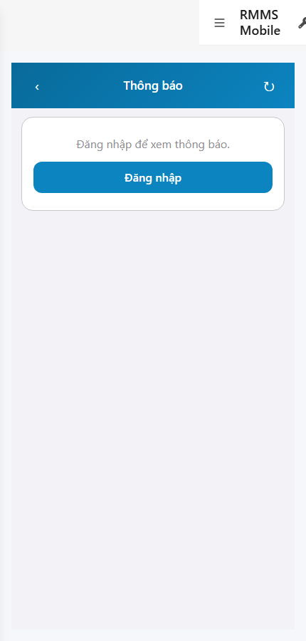
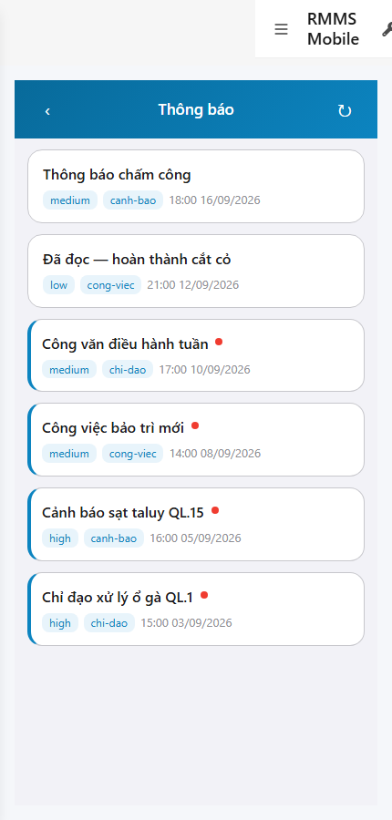
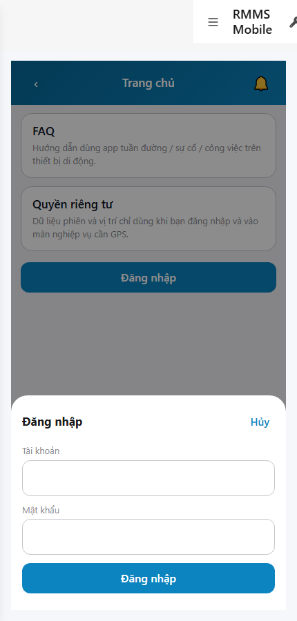

# QA — scenarios — web-rmms-ops

| Field | Value |
|-------|-------|
| feature | `web-rmms-ops` |
| this role | `qa` · `/agent-qa` |
| status | `done` |
| changeScope | `new_page` |
| packKind | `list` (phone inbox ≠ Kind B) |
| mfeStdUrl | `http://localhost:9301/web-rmms-ops` |
| mfeStdRoute | `/web-rmms-ops` |
| backend | `D:/AI-QLBD/Linm.RMMS.WebService` · Mobile.Bff `:5202` · API `:5111` · **cấm ERP.*** |
| taskId | `task_8c3445e6` |
| prior Dev | implement **confirmed** · handoff `handoff/dev-compact.md` |
| autoApprove | ON |
| e2eQa | ON · runtime |
| method | `e2e runtime · yarn start:std :9301 (reuse · no kill) + docker + playwright` · cases `S0,S1,QA-20` · LoginSheet · viewport **430** · stock e2e-qa port-gate fail → junction + `_capture_ops.mjs` |
| updatedAt | `2026-09-25T12:53:00.000Z` |
| skillVersion | `2026.09.05.03` |
| contentHash | `sha256:6f74282b807da7f2cc1aa57ac64848cd1d75ff3383c0f432eaad7bea53fff80e` |

## Smoke — Final MFE (REQUIRED · e2e)

| # | Step | Expect | Result | Evidence |
|---|------|--------|--------|----------|
| S0 | Guest mở Ops inbox | OP-00 · OP-01 chrome · OP-06 guestGate · `#opsGuestLogin` · VI UTF-8 · **0** crash | **PASS** |  |
| S1 | Staff inbox sau LoginSheet | OP-00…04 · `#opsTitle`/`#opsRefresh` · list rows Live GET inbox · mark-read unread · **0** crash | **PASS** |  |
| QA-20 | Login overlay từ guest CTA | guest → Home → SH-02 · `#loginUser`/`#loginPass` · Hủy/Đăng nhập · **0** crash | **PASS** |  |

## Scenario / Expect / Actual (visual + DOM dump)

| Case | Expect (design/PO) | Actual (PNG + DOM dump) | Verdict |
|------|--------------------|-------------------------|---------|
| S0 | Guest gate + chrome | zones OP-00/01/02/06 · `#opsGuestGate`/`#opsGuestLogin` · «Đăng nhập để xem thông báo» | **Aligned** |
| S1 | Staff inbox list + unread badge | zones OP-00/01/02/03/04 · fields rowTitle/SentAt/Unread/Priority/Type · Live inbox rows | **Aligned** |
| QA-20 | Shell login sheet | SH-02 · «Tài khoản / Mật khẩu / Hủy / Đăng nhập» · `#loginUser`/`#loginPass`/`#loginSubmit` | **Aligned** |

## T-QA-*

| id | Scope | Result |
|----|-------|--------|
| T-QA-CRUD-01 | GET notification inbox · POST mark-read (unread tap) · guest no Live until login | **PASS** (S1 Live rows · S0 guestGate) |
| T-QA-OPS-01 | Guest gate · staff chrome+list/empty · phone 430 · no detail P1 · no filter UI | **PASS** (S0/S1/QA-20) |
| T-QA-FILTER-01/02 | LinErpListFilterBar | **WAIVE** (phone inbox · no list filter) |
| T-QA-VI-ENC-01 | Title/nav UTF-8 «Thông báo» | **PASS** |
| T-QA-FORM / Leave | SH-02 LoginSheet path | **PASS** (QA-20 overlay) · leave headed N/A |

## E2E runtime gate

| Check | Result |
|-------|--------|
| docker compose up -d | **PASS** (api healthy `:5111` · postgres · mediamtx) · Mobile.Bff `:5202` healthy |
| yarn start:std | **PASS** · port **9301** (already up · reuse · **cấm** kill worker) |
| yarn e2e-qa stock | **FAIL soft** — stock gate `API:5101 / BFF:5201` (repo uses `:5111` / Mobile.Bff `:5202`) |
| capture `_capture_ops.mjs` | **PASS** · S0/S1/QA-20 |
| PNG distinct | S0/S1/QA-20 **≠** hashes · **0** blank/crash/DUP |
| visual / DOM | **Aligned** · Must **0** |
| **cấm** phase=done | yes · next Review |
| **cấm** GAP-QA-E2E-KILL-01 | yes · no taskkill / Stop-Process node\|yarn |

## Gaps / debt (không P0)

| ID | Severity | Note |
|----|----------|------|
| GAP-QA-E2E-STOCK-PORT | soft | stock `yarn e2e-qa` expects `:5101/:5201` — workaround `_capture_ops.mjs` |
| GAP-QA-E2E-PLAYWRIGHT-RESOLVE | soft | junction playwright from AI-AutoCode |
| GAP-QA-E2E-WEB-BFF | soft | compose `linm-rmms-bff` restart loop — Ops uses Mobile.Bff `:5202` |
| LOOKUP_STATIC | soft | until OMS seed |
| Dev nav chrome | soft | standalone `showDevNav` in shots — OP-* zones still present |

**P0:** none — handoff Review.

## Handoff → Review

1. `review/findings.md` · roles sau = **pending**.
2. `autoApprove=ON` → Review tự confirm khi tới lượt.
3. STATUS `qa` = **done** · `phase=review` · **cấm** `phase=done`.

## Version meta

| skillId | skillVersion | schemaVersion |
|---------|--------------|---------------|
| agent-qa | 2026.09.05.03 | 1 |
