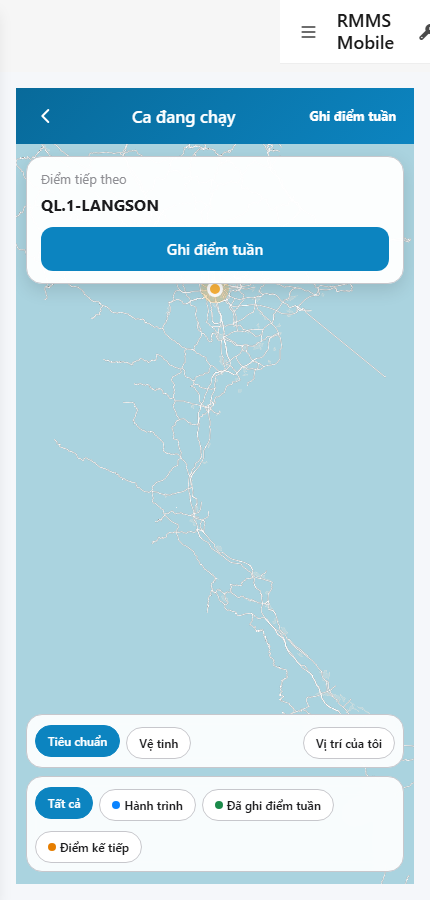
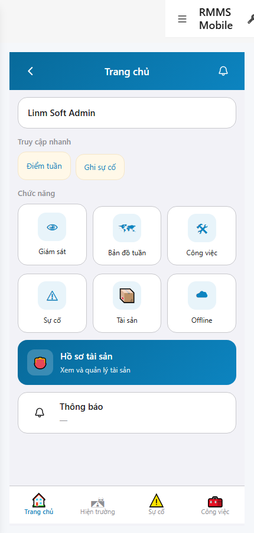

# QA — scenarios — web-rmms-patrol-map

| Field | Value |
|-------|-------|
| feature | `web-rmms-patrol-map` |
| this role | `qa` · `/agent-qa` |
| status | `done` |
| changeScope | `new_page` |
| packKind | `list` (phone Map · DES-GRID / filter **WAIVE**) |
| mfeStdUrl | `http://localhost:9301/web-rmms-patrol-map` |
| mfeStdRoute | `/web-rmms-patrol-map` · product `/patrol-map` · alias `/field/map` |
| backend | `D:/AI-QLBD/Linm.RMMS.WebService` · Mobile.Bff `:5202` · API `:5111` · **cấm ERP.*** |
| taskId | `task_0ea11a1b` |
| prior Dev | implement **confirmed** · handoff `handoff/dev-compact.md` |
| autoApprove | ON |
| e2eQa | ON · runtime |
| method | `e2e runtime · yarn start:std :9301 (reuse · no kill) + docker compose up -d + _capture_patrol_map.mjs` · cases `S0,S1,QA-20` · MFE `/login` JWT · viewport **430** · geo grant · deep-link fulfill |
| updatedAt | `2026-09-26T03:50:00.000Z` |
| skillVersion | `2026.09.05.03` |
| contentHash | `sha256:6f74282b807da7f2cc1aa57ac64848cd1d75ff3383c0f432eaad7bea53fff80e` |

## Smoke — Final MFE (REQUIRED · e2e)

| # | Step | Expect | Result | Evidence |
|---|------|--------|--------|----------|
| S0 | Staff mở Bản đồ tuần | PM-00…08 · mapHost canvas · basemap/locate · legend · next-card Route Live · GPS me-dot · **0** crash | **PASS** |  |
| S1 | Peer Home · entry Bản đồ tuần | Home · `#gridPatrolMap` · CTA vào Patrol Map | **PASS** |  |
| QA-20 | Click gridPatrolMap → Patrol Map (JWT kept) | Cùng surface Map · PM zones · **0** login bounce | **PASS** |  |

## Scenario / Expect / Actual (DOM dump · PNG)

| Case | Expect (design/PO) | Actual (PNG/dump) | Verdict |
|------|--------------------|-------------------|--------|
| S0 | PM-* phone Map · tiles Live · legend · next Route · GPS | «Ca đang chạy» · next «QL.1-LANGSON» · MapLibre canvas · PM-00/01/02/03/04/05/06/08 · Tiêu chuẩn/Vệ tinh/locate · legend×4 · check-in toast btn | **Aligned** |
| S1 | Peer Home entry | «Trang chủ» · `#gridPatrolMap` «Bản đồ tuần» · HM/SH zones | **Aligned** |
| QA-20 | Home CTA → Patrol Map | PM after click · canvas · JWT kept · same Map surface | **Aligned** |

## T-QA-*

| id | Scope | Result |
|----|-------|--------|
| T-QA-MAP-01 | MapLibre canvas + PM-00/02 · Live sessions/tiles | **PASS** (S0 · route Live QL.1-LANGSON · canvas) |
| T-QA-LEGEND-01 | legend chips all/track/done/next · basemap×2+locate | **PASS** |
| T-QA-NEXT-01 | next-card Route text · no invent tracks | **PASS** (Route Live · empty geom OK) |
| T-QA-PEER-01 | Home `#gridPatrolMap` → `/web-rmms-patrol-map` | **PASS** (S1/QA-20) |
| T-QA-GPS-01 | geolocation me-dot · deny hide | **PASS** (PM-06 present · grant) |
| T-QA-CHECKIN-01 | trailing check-in toast only · no POST | **PASS** (PM-08 present · code Dev) |
| T-QA-FILTER-01/02 | LinErpListFilterBar | **WAIVE** (phone Map · DES-GRID N/A) |
| T-QA-VI-ENC-01 | Title/nav UTF-8 | **PASS** |
| T-QA-HIST / Leave | LeaveConfirmModal | **WAIVE** (Map RO · Leave N/A) |

## E2E runtime gate

| Check | Result |
|-------|--------|
| docker compose up -d | **PASS** · api healthy `:5111` · Mobile.Bff `:5202` healthy · **cấm** kill |
| yarn start:std | **PASS** · port **9301** (already up · reuse · **cấm** kill worker · GAP-QA-E2E-KILL-01) |
| yarn e2e-qa stock | **FAIL soft** — gate `API:5101 / BFF:5201` (repo uses `:5111` / Mobile.Bff `:5202`) |
| capture `_capture_patrol_map.mjs` | **PASS** · S0/S1/QA-20 · Login · deep-link fulfill · geo grant · playwright junction |
| PNG evidence | S0/QA-20=`89071` · S1=`59335` · 430×900 · S1 ≠ S0 · **0** blank/crash |
| DOM dump | **Aligned** · Must **0** · zones PM-* + Home `#gridPatrolMap` |
| Live | next Route `QL.1-LANGSON` · GET sessions implied |
| **cấm** phase=done | yes · next Review |
| **cấm** GAP-QA-E2E-KILL-01 | yes · no taskkill / Stop-Process node\|yarn |

## Gaps / debt (không P0)

| ID | Severity | Note |
|----|----------|------|
| GAP-QA-E2E-STOCK-PORT | soft | stock `yarn e2e-qa` expects `:5101/:5201` — workaround `_capture_patrol_map.mjs` |
| GAP-QA-E2E-HISTORY-FALLBACK | soft | WDS deep-link HTTP 404 · capture fulfills document with `/` index |
| GAP-QA-E2E-PLAYWRIGHT-RESOLVE | soft | junction playwright from AI-AutoCode |
| GAP-QA-E2E-S0-QA20-DUP | soft | S0.md5 === QA-20.md5 (same Map surface after Home click · expected) |
| Dev nav chrome | soft | standalone `showDevNav` in shots · PM-* zones still present |
| P2 tracks/next-pin/check-in POST | deferred | peer OUT (Dev debt) |

**P0:** none — handoff Review.

## Handoff → Review

1. `review/findings.md` · roles sau = **pending**.
2. `autoApprove=ON` → Review tự confirm khi tới lượt.
3. STATUS `qa` = **done** · `phase=review` · **cấm** `phase=done`.

## Version meta

| skillId | skillVersion | schemaVersion |
|---------|--------------|---------------|
| agent-qa | 2026.09.05.03 | 1 |
