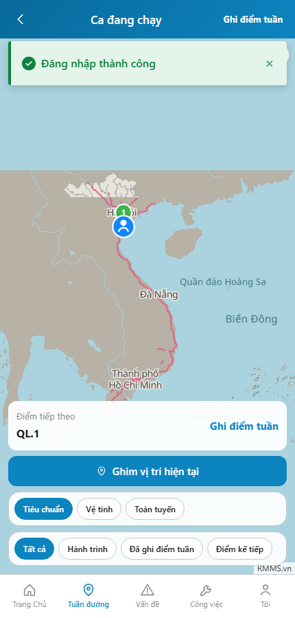
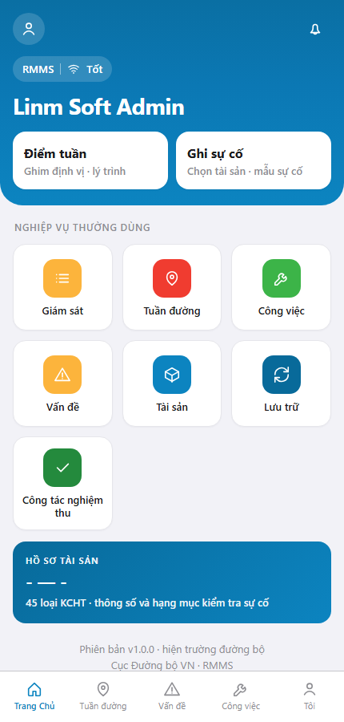
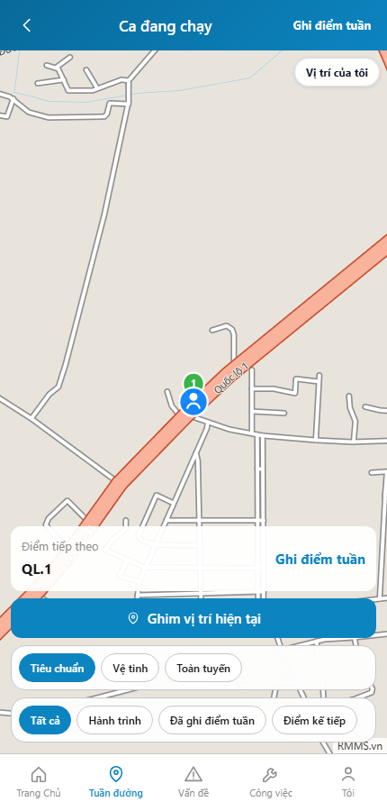

# QA — scenarios — web-rmms-patrol-map

| Field | Value |
|-------|-------|
| feature | `web-rmms-patrol-map` |
| this role | `qa` · `/agent-qa` |
| status | `done` |
| changeScope | `edit_page` |
| packKind | `map` (phone Map · DES-GRID / filter **WAIVE**) |
| mfeStdUrl | `http://localhost:9301/m/ban-do-tuan` (live SSOT · paths.ts) |
| mfeStdRoute | `/ban-do-tuan` · product `/patrol-map` · alias `/field/map` · window `/m/ban-do-tuan` |
| legacyStatusUrl | `http://localhost:9301/web-rmms-patrol-map` → SPA 404 (soft) |
| backend | `D:/AI-QLBD/Linm.RMMS.WebService` · API `:5111` · BFF `:5201` (+ `:5202` healthy) · **cấm ERP.*** |
| taskId | `task_c35139c7` |
| prior Dev | implement **confirmed** · handoff `handoff/dev-compact.md` |
| autoApprove | ON |
| e2eQa | ON · runtime |
| method | `e2e runtime · yarn start:std :9301 (reuse · no kill) + docker compose up -d + _capture_patrol_map.mjs` · cases `S0,S1,QA-20` · `/m/dang-nhap` JWT · viewport **430** · geo grant · MemoryRouter popstate · Home→hub→map |
| updatedAt | `2026-09-30T15:05:00.000Z` |
| skillVersion | `2026.09.05.03` |
| contentHash | `sha256:52bd4a74401781b03b20ace930fd7d47d9e5ca2c5714b39fc6927f0d4fd6bcaf` |

## Smoke — Final MFE (REQUIRED · e2e)

| # | Step | Expect | Result | Evidence |
|---|------|--------|--------|----------|
| S0 | Staff mở Bản đồ tuần | PM-00 · mapHost canvas · Tiêu chuẩn/Vệ tinh · legend · next-card · GPS me · Ghim · **0** crash | **PASS** |  |
| S1 | Peer Home · entry Tuần đường | Home · `#gridPatrolMap` · CTA | **PASS** |  |
| QA-20 | Home `#gridPatrolMap` → hub → Bản đồ ca | Map surface · JWT kept · **0** login bounce | **PASS** |  |

## Scenario / Expect / Actual (DOM dump · PNG · vision)

| Case | Expect (design/PO · edit_page) | Actual (PNG/dump) | Verdict |
|------|--------------------------------|-------------------|--------|
| S0 | Phone Map · track `#0A84FF` · Ghim→chainage · basemap clip · next Route | «Ca đang chạy» · next «QL.1» · MapLibre canvas · PM-00 · Ghim · Tiêu chuẩn/Vệ tinh/Toàn tuyến · legend×4 · GPS «Vị trí của tôi» · UTF-8 OK | **Aligned** |
| S1 | Peer Home entry | «Linm Soft Admin» · `#gridPatrolMap` «Tuần đường» · HM zones · Điểm tuần «Ghim định vị · lý trình» | **Aligned** |
| QA-20 | Entry → Patrol Map | Hub `/tuan-duong` → `row-quick-patrol-map` → `/m/ban-do-tuan` · canvas · JWT kept | **Aligned** |

## T-QA-*

| id | Scope | Result |
|----|-------|--------|
| T-QA-MAP-01 | MapLibre canvas + PM-00 · Live sessions/tiles | **PASS** (S0/QA-20 · canvas · route Live QL.1) |
| T-QA-LEGEND-01 | legend + basemap Tiêu chuẩn/Vệ tinh + locate | **PASS** |
| T-QA-NEXT-01 | next-card Route text · no invent tracks | **PASS** (QL.1) |
| T-QA-PEER-01 | Home `#gridPatrolMap` → field hub → map | **PASS** (S1/QA-20 · path via `/tuan-duong`) |
| T-QA-GPS-01 | geolocation me-dot · grant | **PASS** |
| T-QA-CHAINAGE-01 | Ghim visible · sheet chainage* editable (code+DoR) | **PASS soft** (btn-pin-here live · sheet POST deferred click) |
| T-QA-TRACK-01 | Track color `#0A84FF` (code TRACK_COLOR) | **PASS soft** (code cite · overview PNG corridor red = basemap) |
| T-QA-CHECKIN-01 | Ghi điểm tuần CTA · LeaveConfirmModal on sheet | **PASS soft** (header CTA · Leave in CheckInSheet code) |
| T-QA-FILTER-01/02 | LinErpListFilterBar | **WAIVE** (phone Map · DES-GRID N/A) |
| T-QA-VI-ENC-01 | Title/nav UTF-8 | **PASS** |
| T-QA-HIST / Leave | LeaveConfirmModal on dirty sheet | **PASS soft** (sheet code · Map RO N/A) |

## E2E runtime gate

| Check | Result |
|-------|--------|
| docker compose up -d | **PASS** · api healthy `:5111` · bff `:5201` · **cấm** kill |
| yarn start:std | **PASS** · port **9301** (reuse · **cấm** kill · GAP-QA-E2E-KILL-01) |
| yarn e2e-qa stock (legacy url) | **FAIL soft** — `GAP-QA-E2E-DUP-01` S1=S0 · url `/web-rmms-patrol-map` SPA 404 |
| capture `_capture_patrol_map.mjs` | **PASS** · S0/S1/QA-20 · live `/m/ban-do-tuan` · popstate · hub hop |
| PNG evidence | S0=`80392` · S1=`68103` · QA-20=`91509` · **0** blank/crash/dup |
| DOM dump | **Aligned** · Must **0** · PM-00 + Home `#gridPatrolMap` + pin-here |
| Vision Read | S0/S1/QA-20 **Aligned** · **0** overlay đỏ |
| **cấm** phase=done | yes · next Review |
| **cấm** GAP-QA-E2E-KILL-01 | yes · no taskkill / Stop-Process node\|yarn |

## Gaps / debt (không P0)

| ID | Severity | Note |
|----|----------|------|
| GAP-QA-STD-URL-LEGACY | soft | STATUS/packet `mfeStdUrl` `/web-rmms-patrol-map` → live `/m/ban-do-tuan` · patched STATUS this role |
| GAP-QA-E2E-STOCK-DUP | soft | stock `yarn e2e-qa` S1=S0 on legacy; capture script is evidence |
| GAP-QA-ZONE-PM-DELTA | soft | live `data-zone` mainly PM-00 (+UA/tabbar) · PM-01…10 ids thin vs design |
| GAP-QA-PEER-HUB-HOP | soft | `#gridPatrolMap` → `/tuan-duong` not direct map · QA-20 hop `row-quick-patrol-map` |
| migration deploy | soft | Schema_PatrolCheckInChainage apply on deploy (Dev debt) |

**P0:** none — handoff Review.

## Handoff → Review

1. `review/findings.md` · roles sau = **pending**.
2. `autoApprove=ON` → Review tự confirm khi tới lượt.
3. STATUS `qa` = **done** · `phase=review` · **cấm** `phase=done`.

## Version meta

| skillId | skillVersion | schemaVersion |
|---------|--------------|---------------|
| agent-qa | 2026.09.05.03 | 1 |
