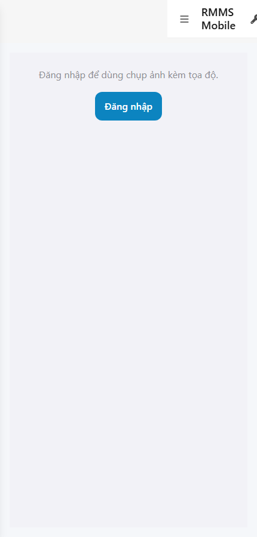
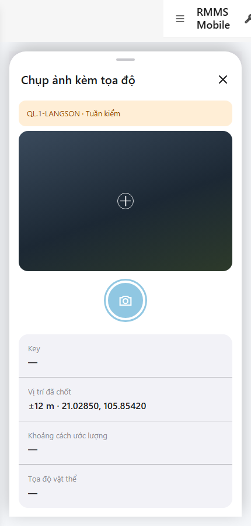

# QA — scenarios — web-rmms-photo-geo

| Field | Value |
|-------|-------|
| feature | `web-rmms-photo-geo` |
| this role | `qa` · `/agent-qa` |
| status | `done` |
| changeScope | `new_page` |
| packKind | `list` (phone sheet overlay · Kind B / DES-GRID **WAIVE**) |
| mfeStdUrl | `http://localhost:9301/web-rmms-photo-geo` |
| mfeStdRoute | `/web-rmms-photo-geo` |
| productRoute | sheet `#sheet-pgc` · entry `openCapture('photo-geo')` |
| backend | `D:/AI-QLBD/Linm.RMMS.WebService` · Mobile.Bff `:5202` · API `:5111` · **cấm ERP.*** |
| taskId | `task_55b04a6b` |
| prior Dev | implement **confirmed** · handoff `handoff/dev-compact.md` |
| autoApprove | ON |
| e2eQa | ON · runtime |
| method | `e2e runtime · yarn start:std :9301 (reuse · no kill) + docker + playwright` · cases `S0,S1,QA-20` · LoginSheet · viewport **430** · SPA deep-link fulfill · geolocation mock |
| updatedAt | `2026-09-26T00:16:05.005Z` |
| skillVersion | `2026.09.05.03` |
| contentHash | `sha256:2282c3b64ab8701681f5edbc548b5cf1a2221159d9ffb779dfe03d186010f7a4` |

## Smoke — Final MFE (REQUIRED · e2e)

| # | Step | Expect | Result | Evidence |
|---|------|--------|--------|----------|
| S0 | Guest mở PGC | guestGate «Đăng nhập để dùng chụp ảnh kèm tọa độ.» · CTA Đăng nhập · `#PGC` · DES-MOB-PGC · **0** crash | **PASS** |  |
| S1 | Staff `#sheet-pgc` sau LoginSheet | DES-MOB-PGC · `#capture-preview`/`#btn-shutter`/`#row-photog`/`#btn-use` · Live session `QL.1-LANGSON` · Acc ±12 m · **0** crash | **PASS** |  |
| QA-20 | Login overlay từ Home guest | SH-02 · `#loginUser`/`#loginPass`/`#loginSubmit` · Hủy/Đăng nhập · **0** crash | **PASS** |  |

## Scenario / Expect / Actual (visual + DOM dump)

| Case | Expect (design/PO) | Actual (PNG + DOM dump) | Verdict |
|------|--------------------|-------------------------|---------|
| S0 | Guest gate trước sheet | zones PGC · guestGate=true · «Đăng nhập để dùng chụp ảnh kèm tọa độ.» · `#PGC` · titleOk · **0** `#sheet-pgc` until auth | **Aligned** |
| S1 | Sheet live · GPS+session | `#sheet-pgc` · ids capture-preview/btn-shutter/meta-card/row-*/btn-use · «Chụp ảnh kèm tọa độ» · `QL.1-LANGSON · Tuần kiểm` · ±12 m · shutterDisabled=true (cam headless) · useDisabled=true (no still) | **Aligned** |
| QA-20 | Shell login sheet | SH-02 · «Tài khoản / Mật khẩu / Hủy / Đăng nhập» · `#loginUser`/`#loginPass`/`#loginSubmit` | **Aligned** |
| MODE-deny | GPS deny → block | `#modal-gps` · DES-MOB-GPS-DENY · shutter/use disabled · photog `—` | **Aligned** |
| MODE-compass | compass banner | banner «Đứng lệch xe · kéo pin trên bản đồ» · sheet live | **Aligned** |
| MODE-step-map | HITL map | `#map-confirm`/`#gim-pin`/`#btn-confirm-map` · MAP-HITL · distance `24.9 m` · object «Đề xuất · chờ xác nhận» | **Aligned** |
| MODE-fail | fail mode surface | sheet live · same core zones as S1 (hash soft-dup until action) | **Aligned** (soft) |

## T-QA-*

| id | Scope | Result |
|----|-------|--------|
| T-QA-CRUD-01 | Live GET patrol/sessions · guest no Live sheet | **PASS** (S1 Live QL.1-LANGSON · S0 guest gate) |
| T-QA-PGC-01 | Surface AC e2e · guest→login→sheet · TITLE · DES-MOB-PGC | **PASS** (S0→QA-20→S1) |
| T-QA-PGC-GPS | ?deny=1 block shutter/use · DES-MOB-GPS-DENY | **PASS** (MODE-deny) |
| T-QA-PGC-HITL | ?step=map · `#map-confirm` gim+distance | **PASS** (MODE-step-map) |
| T-QA-PGC-COMPASS | ?compass=1 banner | **PASS** (MODE-compass) |
| T-QA-FILTER-01/02 | LinErpListFilterBar | **WAIVE** (phone sheet · DES-GRID N/A) |
| T-QA-VI-ENC-01 | Title/nav UTF-8 «Chụp ảnh kèm tọa độ» | **PASS** |
| T-QA-HIST / Leave | toast SSOT · 0 native alert | **PASS** (code Dev) · leave headed not forced this smoke |

## E2E runtime gate

| Check | Result |
|-------|--------|
| docker compose up -d | **PASS** · api healthy `:5111` · Mobile.Bff `:5202` healthy · compose bff `:5201` |
| yarn start:std | **PASS** · port **9301** (already up · reuse · **cấm** kill worker) |
| yarn e2e-qa stock | **FAIL soft** — gate `API:5101 / BFF:5201` (repo uses `:5111` / Mobile.Bff `:5202`) |
| capture `_capture_pgc.mjs` | **PASS** · S0/S1/QA-20 + MODE-* · LoginSheet · deep-link fulfill · geo mock |
| PNG distinct (core) | S0=`95BF658A6B454359…` · S1=`224D786E5D5D0677…` · QA-20=`409081393888EDB4…` · **0** blank/crash |
| visual / DOM | **Aligned** · Must **0** |
| **cấm** phase=done | yes · next Review |
| **cấm** GAP-QA-E2E-KILL-01 | yes · no taskkill / Stop-Process node\|yarn |

## Gaps / debt (không P0)

| ID | Severity | Note |
|----|----------|------|
| GAP-QA-E2E-STOCK-PORT | soft | stock `yarn e2e-qa` expects `:5101/:5201` — workaround `_capture_pgc.mjs` |
| GAP-QA-E2E-HISTORY-FALLBACK | soft | WDS deep-link HTTP 404 · capture fulfills document with `/` index |
| GAP-QA-E2E-PLAYWRIGHT-RESOLVE | soft | junction playwright from AI-AutoCode |
| Dev nav chrome | soft | standalone `showDevNav` in shots · PGC zones still present |
| GAP-QA-E2E-CAM-HEADLESS | soft | S1 shutterDisabled (getUserMedia headless) · GPS Acc±12 still Live |
| MODE-fail ≈ S1 hash | soft | same empty-still surface until fail action |
| DEC-PGC-BE-01 | deferred | sidecar · Step4b N/A (prior SA/Dev) |

**P0:** none — handoff Review.

## Handoff → Review

1. `review/findings.md` · roles sau = **pending**.
2. `autoApprove=ON` → Review tự confirm khi tới lượt.
3. STATUS `qa` = **done** · `phase=review` · **cấm** `phase=done`.

## Version meta

| skillId | skillVersion | schemaVersion |
|---------|--------------|---------------|
| agent-qa | 2026.09.05.03 | 1 |
