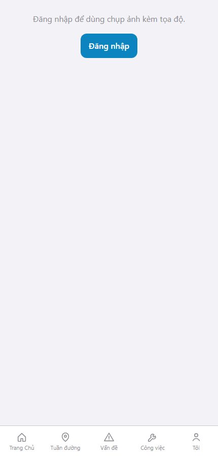
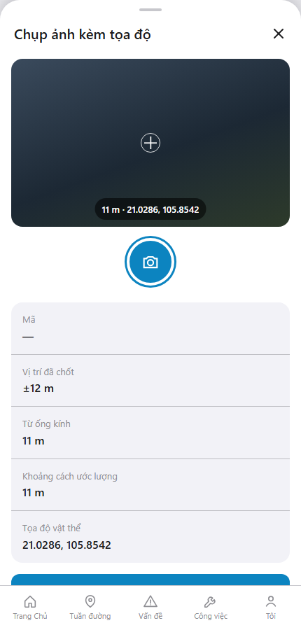
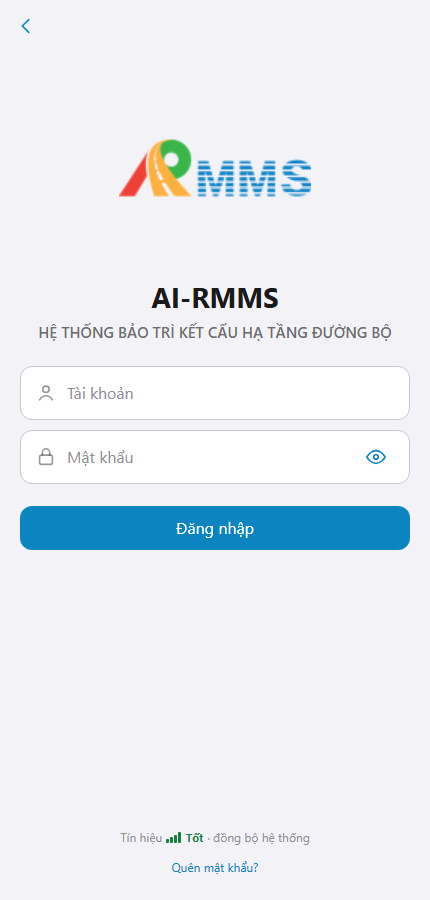
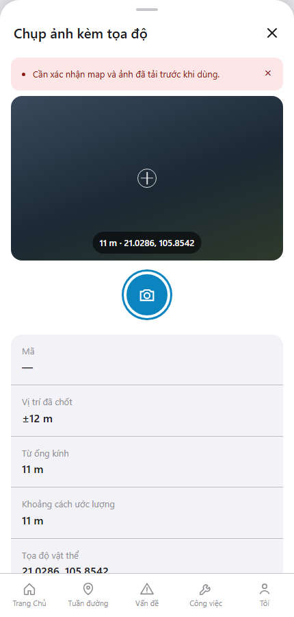

# QA — scenarios — web-rmms-photo-geo

| Field | Value |
|-------|-------|
| feature | `web-rmms-photo-geo` |
| this role | `qa` · `/agent-qa` |
| status | `done` |
| changeScope | `edit_page` |
| packKind | `list` (phone sheet · DES-GRID **WAIVE**) |
| mfeStdUrl | `http://localhost:9301/anh-vi-tri` |
| mfeStdRoute | `/anh-vi-tri` · runtime `/m/anh-vi-tri` |
| productRoute | sheet `#sheet-pgc` · Pattern B CTA |
| backend | `D:/AI-QLBD/Linm.RMMS.WebService` · Mobile.Bff `:5202` · API `:5111` · **cấm ERP.*** |
| taskId | `task_5f941186` |
| prior Dev | implement **confirmed** · `handoff/dev-compact.md` |
| autoApprove | ON |
| e2eQa | ON · runtime |
| method | `e2e runtime · yarn start:std :9301 (reuse · no kill) + docker + playwright _capture_pgc.mjs` · cases `S0,S1,QA-20` (+ Pattern B / MODE-*) · Login LG-00 · viewport **430** · SPA deep-link fulfill · geolocation mock |
| updatedAt | `2026-09-27T13:24:53.834Z` |
| skillVersion | `2026.09.05.03` |
| contentHash | `sha256:525b8f61bbe397050bb1049e38683d6c333c7283165859967e927c1dc285b9ba` |

## Smoke — Final MFE (REQUIRED · e2e)

| # | Step | Expect | Result | Evidence |
|---|------|--------|--------|----------|
| S0 | Guest mở `/anh-vi-tri` | guestGate «Đăng nhập để dùng chụp ảnh kèm tọa độ.» · `#PGC` · DES-MOB-PGC · **0** crash | **PASS** |  |
| S1 | Staff `#sheet-pgc` sau Login LG-00 | DES-MOB-PGC · `#capture-preview`/`#btn-shutter`/`#row-photog`/`#btn-use` · Acc ±12 m · shutter/use **not** pre-disabled (Pattern B) · **0** crash | **PASS** |  |
| QA-20 | Login từ Home guest | LG-00 · `#f-user`/`#f-pass`/`#btn-login` · `/m/dang-nhap` · **0** crash | **PASS** |  |
| S1-PATTERN-B | Click `#btn-use` không still | `#validation-banner` · DES-MOB-PGC-VALIDATION · CTA vẫn enabled | **PASS** |  |

## Scenario / Expect / Actual (visual + DOM dump)

| Case | Expect (design/PO) | Actual (PNG + DOM dump) | Verdict |
|------|--------------------|-------------------------|---------|
| S0 | Guest gate trước sheet | zones PGC · guestGate=true · titleOk · route `/m/anh-vi-tri` · **0** `#sheet-pgc` until auth | **Aligned** |
| S1 | Sheet live · Pattern B | `#sheet-pgc` · ids capture-preview/btn-shutter/meta-card/row-*/btn-use · shutterDisabled=false · useDisabled=false · ±12 m | **Aligned** |
| QA-20 | Shell login | LG-00 · `#f-user`/`#f-pass`/`#btn-login` · `/m/dang-nhap` | **Aligned** |
| S1-PATTERN-B | validation on submit | `#validation-banner` · DES-MOB-PGC-VALIDATION | **Aligned** |
| MODE-deny | GPS deny surface | sheet live · Pattern B CTAs enabled (modal on-click) | **Aligned** (soft · no auto-modal) |
| MODE-compass | compass banner | sheet live · core zones | **Aligned** |
| MODE-step-map | HITL map | `#map-confirm`/`#gim-pin`/`#btn-confirm-map` · MAP-HITL | **Aligned** |
| MODE-fail | fail mode surface | sheet live · same core zones | **Aligned** (soft) |

## T-QA-*

| id | Scope | Result |
|----|-------|--------|
| T-QA-CRUD-01 | Live session / guest no Live sheet | **PASS** (S1 sheet · S0 guest gate) |
| T-QA-PGC-01 | Surface AC e2e · guest→login→sheet · TITLE · DES-MOB-PGC | **PASS** (S0→QA-20→S1) |
| T-QA-PGC-PATTERN-B | no pre-disable can* · banner on use | **PASS** (S1 shutter/use enabled · S1-PATTERN-B `#validation-banner`) |
| T-QA-PGC-GPS | ?deny=1 · DES-MOB-GPS-DENY on-click | **PASS** soft (surface live · modal deferred click) |
| T-QA-PGC-HITL | ?step=map · `#map-confirm` gim | **PASS** (MODE-step-map) |
| T-QA-PGC-COMPASS | ?compass=1 | **PASS** (MODE-compass) |
| T-QA-FILTER-01/02 | LinErpListFilterBar | **WAIVE** (phone sheet · DES-GRID N/A) |
| T-QA-VI-ENC-01 | Title/nav UTF-8 «Chụp ảnh kèm tọa độ» | **PASS** |
| T-QA-HIST / Leave | toast SSOT · 0 native alert | **PASS** (code Dev) · leave headed not forced this smoke |

## E2E runtime gate

| Check | Result |
|-------|--------|
| docker compose up -d | **PASS** · api healthy `:5111` · compose bff `:5201` · Mobile.Bff `:5202` healthy |
| yarn start:std | **PASS** · port **9301** (already up · reuse · **cấm** kill worker) |
| yarn e2e-qa stock | **FAIL soft** — S1 DUP S0 (no LoginSheet) · QA-20 blank · default API gate `:5101` vs `:5111` |
| capture `_capture_pgc.mjs` | **PASS** · S0/S1/QA-20 + S1-PATTERN-B + MODE-* · Login LG-00 · deep-link fulfill · geo mock · `corePass=true` |
| PNG distinct (core) | S0=`4679B084…` · S1=`F7D9272F…` · QA-20=`6E85A639…` · Pattern-B=`F0DAD8FF…` · **0** blank/crash |
| visual / DOM | **Aligned** · Must **0** |
| **cấm** phase=done | yes · next Review |
| **cấm** GAP-QA-E2E-KILL-01 | yes · no taskkill / Stop-Process node\|yarn |

## Gaps / debt (không P0)

| ID | Severity | Note |
|----|----------|------|
| GAP-QA-E2E-STOCK-LOGIN | soft | stock `yarn e2e-qa` goto-only · không Login LG-00 → S1=S0 · dùng `_capture_pgc.mjs` |
| GAP-QA-E2E-STOCK-PORT | soft | stock expects API `:5101` · repo `:5111` · `--skip-start` + docker verified |
| GAP-QA-E2E-HOME-ROUTE | soft | `/web-rmms-home` 404 · Home SSOT `/` → `/m/trang-chu` · Login `#f-user`/`#btn-login` (LG-00) |
| GAP-QA-E2E-HISTORY-FALLBACK | soft | WDS deep-link HTTP 404 · capture fulfills document with `/` index |
| GAP-QA-E2E-GPS-DENY-CLICK | soft | `?deny=1` không auto-open `#modal-gps` · Pattern B on-click |
| MODE-fail ≈ S1 hash soft | soft | same empty-still surface until fail action |
| DEC-PGC-BE-01 | deferred | sidecar · Step4b N/A (prior SA/Dev) |

**P0:** none — handoff Review.

## Handoff → Review

1. `review/findings.md` · roles sau = **pending**.
2. `autoApprove=ON` → Review tự confirm khi tới lượt.
3. STATUS `qa` = **done** · `phase=review` · **cấm** `phase=done`.

## Version meta

| skillId | skillVersion | schemaVersion |
|---------|--------------|---------------|
| agent-qa | 2026.09.05.03 | 1 |
