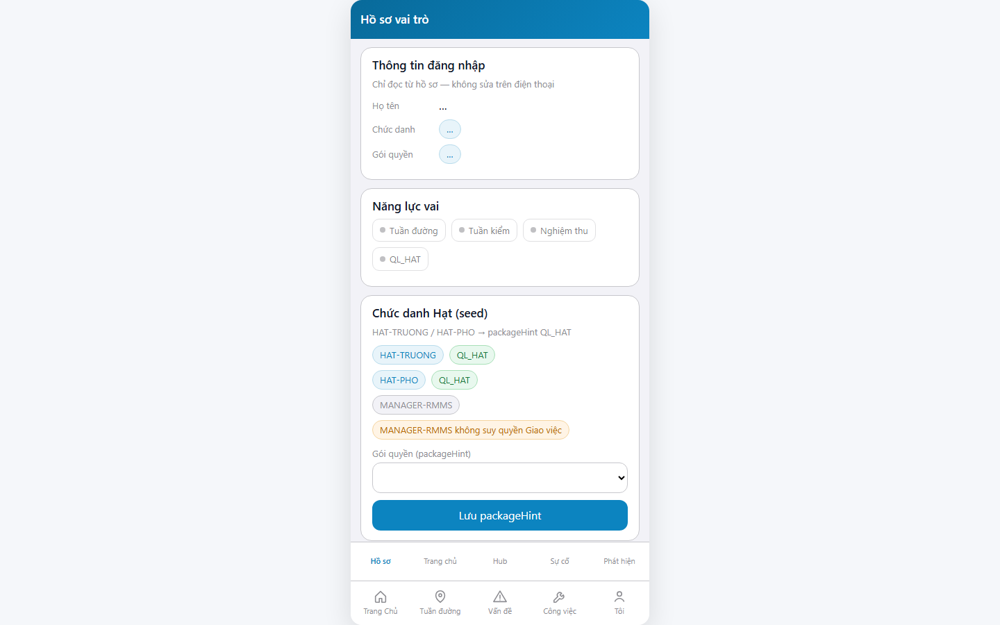
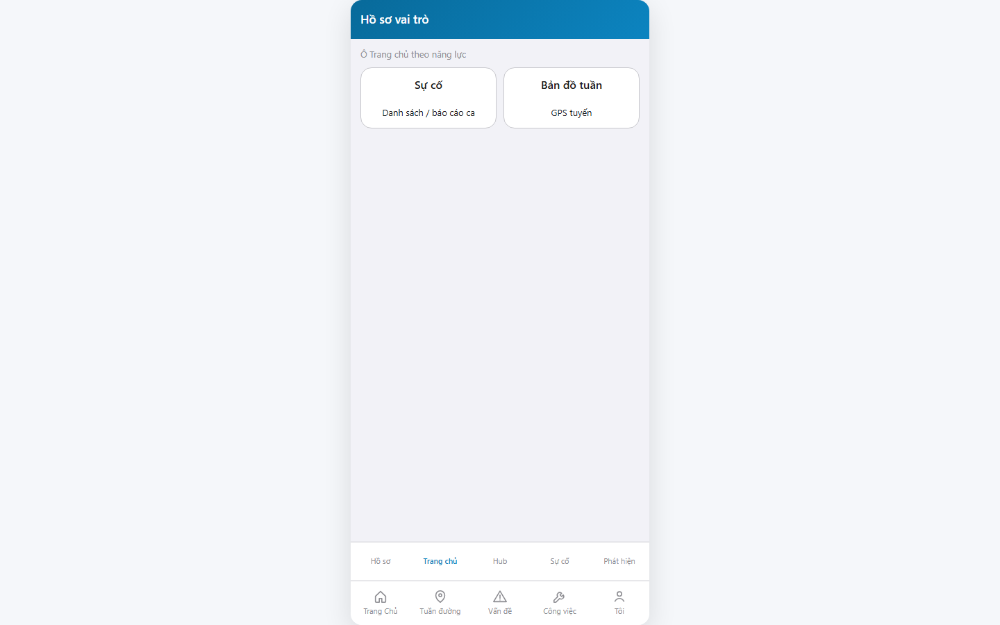
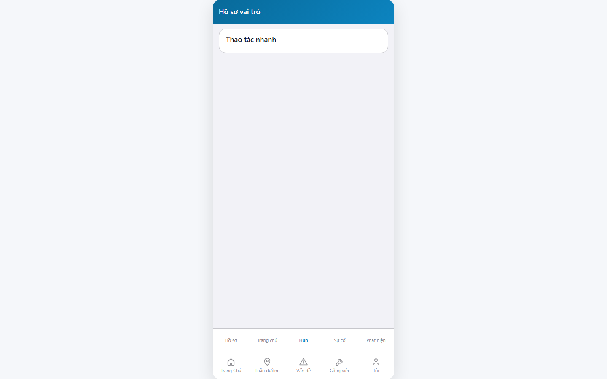

# QA — Scenarios — web-rmms-role-gate

> Status: **PASS** · e2eQa=ON · task `task_e509788f` · 2026-09-30T17:10:00.000Z  
> Role: `qa` · packKind=`list` (phone gate) · changeScope=`edit_page`  
> runtimeUrl=`http://localhost:9301/web-rmms-role-gate` · live alias keep  
> Screens: `specs/web-rmms-role-gate/qa/screens/{S0,S1,QA-20}.png` · `manifest.json` ok=true

| | |
|--|--|
| Feature | `web-rmms-role-gate` |
| Title | Hồ sơ vai trò — QL_HAT / roleCaps gate |
| Role | `qa` |
| Runtime | docker compose (WebService) + Mobile `yarn start:std` :9301 · Playwright |

## Environment

| Item | Value |
|------|-------|
| Docker | `D:/AI-QLBD/Linm.RMMS.WebService` · `docker compose up -d` · api `:5111` · Mobile.Bff `:5202` healthy |
| MFE | `D:/AI-QLBD/MFE-Source/Linm.Web.RMMS.Mobile` · existing `start:std` PID · **cấm** kill worker |
| Compile fix | `roleGate.ts` searchJobTitles querystring (apiClient.get 1-arg) · overlay TS2554 cleared |
| E2E CLI | `yarn e2e-qa --url=http://localhost:9301/web-rmms-role-gate --feature=web-rmms-role-gate --product-root=D:/AI-QLBD/Linm.RMMS.Data --cases=S0,S1,QA-20 --docker-dir=D:/AI-QLBD/Linm.RMMS.WebService --mfe-root=D:/AI-QLBD/MFE-Source/Linm.Web.RMMS.Mobile --skip-start --testid=rmms-role-gate-page` |
| AutoCode | phoneGate steps · S1=`rg-tab-home` · QA-20 tab peer (Hub) |

## Cases (T-QA-RG-01)

| Id | Zone | Steps | Expect | Result | Shot |
|----|------|-------|--------|--------|------|
| S0 | RG-00 · RG-01 · RG-02 | Goto runtimeUrl · wait `data-testid=rmms-role-gate-page` | Title Hồ sơ vai trò · profile RO · caps · seed HAT→QL_HAT · 0 overlay | **PASS** |  |
| S1 | RG-03a | Click `rg-tab-home` | Tab Trang chủ · tiles Sự cố / Bản đồ tuần · PNG ≠ S0 | **PASS** |  |
| QA-20 | RG-03b | Click peer tab (Hub) | Hub · Thao tác nhanh · PNG ≠ S0/S1 | **PASS** |  |

## Observations

- Seed card: HAT-TRUONG / HAT-PHO → QL_HAT · MANAGER-RMMS không suy quyền Giao việc (AC-RG seed hint).
- Profile Họ tên / chức danh hiển thị `…` lúc capture (API enrich chậm / empty) — soft · không blank/crash.
- Home tiles gated theo caps (không hiện Giao việc khi không qlHat).
- SHA PNG distinct · không GAP-QA-E2E-DUP-01 / BLANK / CRASH.
- DES-GRID / filter Kind B: **WAIVE** phone.

## T-QA-* checklist

| Task | Status |
|------|--------|
| T-QA-RG-01 | **PASS** · S0/S1/QA-20 + PNG · yarn build PASS |
| T-QA-FILTER-01/02 | **WAIVE** phone · Kind B N/A |
| T-QA-VI-ENC-01 | **PASS** · title/nav UTF-8 |

## Gate

| Gate | Status |
|------|--------|
| e2eQa runtime (not static-only) | **PASS** |
| Screens per case | **PASS** |
| yarn build | **PASS** |
| phase≠done | kept · **cấm** phase=done |
| next | review pending (roleOnly HARD — không start review) |

## Notes

- Soft: profile chips `…` tại S0 · Hub quick-actions trống khi thiếu caps tuanDuong/nghiemThu.
- Fix compile: `searchJobTitles` dùng querystring (GAP overlay TS2554).

## E2E screenshots

Viewer: `/api/qldb/artifact?id=&rel=qa/scenarios.md` rewrite `screens/{caseId}.png`.

CLI **PASS** = Playwright + PNG không đen + không overlay đỏ + ảnh không trùng case. **Không** = khớp design. QA **Read** PNG vs prototype · title · tính năng · việc cán bộ (`enduser-mismatch.md`).

| Case | Scenario | Expect | Actual | Result | Evidence |
|------|----------|--------|--------|--------|----------|
| S0 | Cán bộ mở Hồ sơ vai trò | Profile RO + seed + caps · title đúng · không overlay | PNG có nội dung · HAT→QL_HAT · 0 overlay | **PASS** |  |
| S1 | Cán bộ mở tab Trang chủ theo năng lực | Tiles theo caps · không crash | Tab Trang chủ · Sự cố / Bản đồ tuần | **PASS** |  |
| QA-20 | Cán bộ đổi zone Hub | Hub surface · không crash | Thao tác nhanh · tab Hub | **PASS** |  |

## Version meta

| skillId | skillVersion | schemaVersion |
|---------|--------------|---------------|
| agent-qa | 2026.09.05.03 | 1 |
