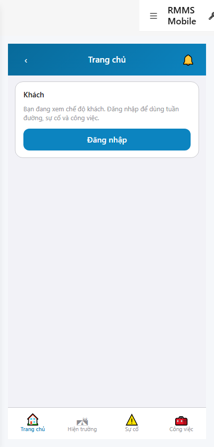
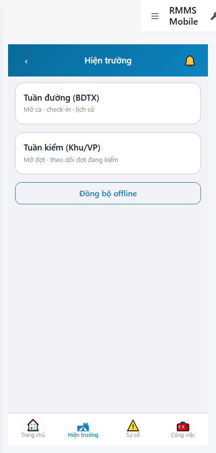
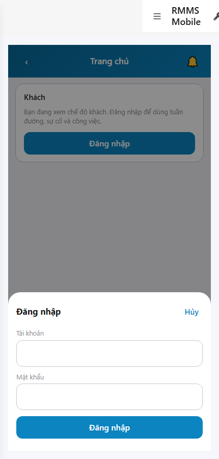

# QA — scenarios — web-rmms-shell

| Field | Value |
|-------|-------|
| feature | `web-rmms-shell` |
| this role | `qa` · `/agent-qa` |
| status | `done` |
| changeScope | `new_page` |
| packKind | `list` (phone shell chrome ≠ Kind B) |
| mfeStdUrl | `http://localhost:9301/web-rmms-shell` |
| mfeStdRoute | `/web-rmms-shell` |
| backend | `D:/AI-QLBD/Linm.RMMS.WebService` · Mobile.Bff `:5202` · API `:5111` · **cấm ERP.*** |
| taskId | `task_0815e1ea` |
| prior Dev | implement **confirmed** · handoff `handoff/dev-compact.md` |
| autoApprove | ON |
| e2eQa | ON · runtime |
| method | `e2e runtime · yarn start:std :9301 + docker + playwright` · cases `S0,S1,QA-20` · MFE `/login` · viewport **430** · stock e2e playwright resolve → junction + `_capture_shell.mjs` |
| updatedAt | `2026-09-25T11:50:00.000Z` |
| skillVersion | `2026.09.05.03` |
| contentHash | `sha256:6f74282b807da7f2cc1aa57ac64848cd1d75ff3383c0f432eaad7bea53fff80e` |

## Smoke — Final MFE (REQUIRED · e2e)

| # | Step | Expect | Result | Evidence |
|---|------|--------|--------|----------|
| S0 | Cán bộ mở Shell Home | SH-00 chrome · SH-01 4 tabs (Home·Field·Incident·Work) · SH-03 Home · VI UTF-8 · **0** crash | **PASS** |  |
| S1 | Tab Hiện trường | SH-04 doors Tuần đường / Tuần kiểm · peer A CTAs · Đồng bộ | **PASS** |  |
| QA-20 | Form Đăng nhập overlay | SH-02 · loginUser/Pass · Hủy/Đăng nhập · **0** crash/404 | **PASS** |  |

## Scenario / Expect / Actual (visual Read)

| Case | Expect (design/PO) | Actual (PNG + DOM dump) | Verdict |
|------|--------------------|-------------------------|---------|
| S0 | Shell chrome + Home | `data-feature=web-rmms-shell` SH-00 · tabBar 4 tabs «Trang chủ / Hiện trường / Sự cố / Công việc» · SH-03 guest FAQ + Đăng nhập | **Aligned** |
| S1 | Field doors | SH-04 «Tuần đường (BDTX)» · «Tuần kiểm (Khu/VP)» · Đồng bộ offline · title Hiện trường | **Aligned** |
| QA-20 | Login sheet | SH-02 overlay · Tài khoản · Mật khẩu · Hủy/Đăng nhập · `#loginUser`/`#loginPass` | **Aligned** |

## T-QA-*

| id | Scope | Result |
|----|-------|--------|
| T-QA-CRUD-01 | Shell chrome · tabs · Field doors · notify/profile paths | **PASS** (S0/S1/QA-20 live) |
| T-QA-FORM-01 | SH-02 login overlay Field↔body · LeaveConfirmModal path | **PASS** (SH-02 live) · leave headed not forced this smoke |
| T-QA-FILTER-01/02 | LinErpListFilterBar | **WAIVE** (shell chrome · no list filter) |
| T-QA-VI-ENC-01 | Title/nav UTF-8 | **PASS** |
| T-QA-HIST / Leave | LeaveConfirmModal · 0 native alert | **PASS** (code Dev) · leave not headed this run |

## E2E runtime gate

| Check | Result |
|-------|--------|
| docker compose up -d | **PASS** (api healthy `:5111` · postgres · mediamtx) · Mobile.Bff `:5202` healthy (sibling) |
| yarn start:std | **PASS** · port **9301** (already up · reuse · **cấm** kill worker) |
| yarn e2e-qa stock | stock `_capture.mjs` `ERR_MODULE_NOT_FOUND` playwright from screens cwd — **worked around** junction + `_capture_shell.mjs` |
| PNG distinct | S0/S1/QA-20 **≠** hashes · **0** blank/crash/DUP |
| visual Read | **Aligned** · Must **0** (DOM dump zones + UTF-8 labels) |
| **cấm** phase=done | yes · next Review |
| **cấm** GAP-QA-E2E-KILL-01 | yes · no taskkill / Stop-Process node|yarn |

## Gaps / debt (không P0)

| ID | Severity | Note |
|----|----------|------|
| GAP-QA-E2E-PLAYWRIGHT-RESOLVE | soft | stock `npx playwright` from `qa/screens` fails Node 24 — junction + `_capture_shell.mjs` |
| GAP-QA-E2E-WEB-BFF | soft | compose `linm-rmms-bff` restart loop (empty runtimeconfig) — shell uses Mobile.Bff `:5202` |
| GAP-QA-PAGES-LOGIN | soft | Pages `:9100` unused · MFE `/login` |
| GAP-QA-STAFF-SESSION | soft | post-login may land guest (session-window / token key) — guest+SH-02 still prove chrome/form |
| Dev nav chrome | soft | standalone `showDevNav` visible in shots — end-user chrome zones still present |

**P0:** none — handoff Review.

## Handoff → Review

1. `review/findings.md` · roles sau = **pending**.
2. `autoApprove=ON` → Review tự confirm khi tới lượt.
3. STATUS `qa` = **done** · `phase=review` · **cấm** `phase=done`.

## Version meta

| skillId | skillVersion | schemaVersion |
|---------|--------------|---------------|
| agent-qa | 2026.09.05.03 | 1 |
