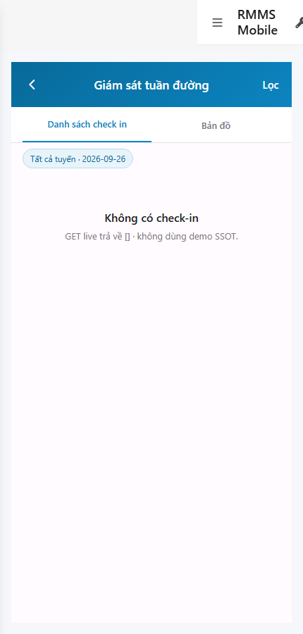
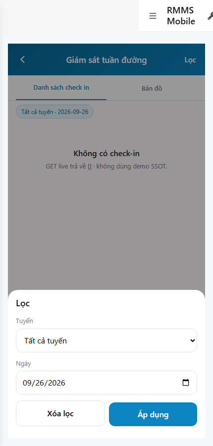
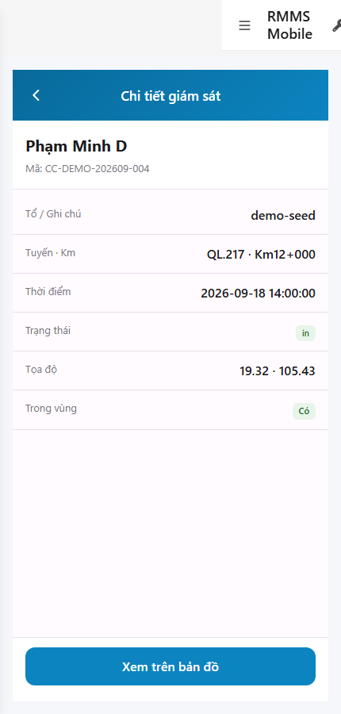

# QA — scenarios — web-rmms-supervise

| Field | Value |
|-------|-------|
| feature | `web-rmms-supervise` |
| this role | `qa` · `/agent-qa` |
| status | `done` |
| changeScope | `new_page` |
| packKind | `list` (phone list+RO detail · Kind B **WAIVE**) |
| mfeStdUrl | `http://localhost:9301/web-rmms-supervise` |
| mfeStdRoute | `/web-rmms-supervise` |
| productRoute | `/supervise*` · alias `/field/supervise*` |
| backend | `D:/AI-QLBD/Linm.RMMS.WebService` · Mobile.Bff `:5202` · API `:5111` · **cấm ERP.*** |
| taskId | `task_ee050f9b` |
| prior Dev | implement **confirmed** · handoff `handoff/dev-compact.md` |
| autoApprove | ON |
| e2eQa | ON · runtime |
| method | `e2e runtime · yarn start:std :9301 (reuse · no kill) + docker + playwright` · cases `S0,S1,QA-20` · LoginSheet · viewport **430** · SPA deep-link fulfill · `_capture_sup.mjs` |
| updatedAt | `2026-09-26T03:00:00.000Z` |
| skillVersion | `2026.09.05.03` |
| contentHash | `sha256:bd4aedbcdb3686ca817a32c3f563270adc1d35b1f7bca526be023528a1840d2b` |

## Smoke — Final MFE (REQUIRED · e2e)

| # | Step | Expect | Result | Evidence |
|---|------|--------|--------|----------|
| S0 | Staff list Giám sát | SUP-00/01/03/04 · DES-MOB-SUPERVISE · title «Giám sát tuần đường» · segment list/map · day chip · empty [] OK · **0** crash | **PASS** |  |
| S1 | Filter sheet | DES-MOB-SUP-FILTER · Tuyến/Ngày · Xóa lọc/Áp dụng · routes live (QL.*) · **0** crash | **PASS** |  |
| QA-20 | Detail RO + map CTA | SUP-05/06 · DES-MOB-SUP-DETAIL · GET/{id} · Lat/Lng RO · «Xem trên bản đồ» · **0** POST · **0** crash | **PASS** |  |

## Scenario / Expect / Actual (visual + DOM dump)

| Case | Expect (design/PO) | Actual (PNG + DOM dump) | Verdict |
|------|--------------------|-------------------------|---------|
| S0 | List shell · empty/[] live | zones SUP-00/01/03/04/07 · «Giám sát tuần đường» · «Không có check-in» · chip `Tất cả tuyến · 2026-09-26` · **0** demoDays page | **Aligned** |
| S1 | Filter sheet route+day | sheet «Lọc» · `#supFilterRoute` options QL.1/15/217/46 · Ngày · Xóa lọc/Áp dụng · DES-MOB-SUP-FILTER | **Aligned** |
| QA-20 | Detail RO · GPS RO · map CTA | «Chi tiết giám sát» · Phạm Minh D · `19.32 · 105.43` · Trong vùng Có · «Xem trên bản đồ» · SUP-05/06 · id `4455eea0-…` | **Aligned** |

## T-QA-*

| id | Scope | Result |
|----|-------|--------|
| T-QA-01 | E2E S0 list · GET attendance-logs | **PASS** (empty day-filter · live []) |
| T-QA-02 | E2E S1 filter sheet · cấm fromDate invent | **PASS** |
| T-QA-03 | E2E QA-20 detail RO · Lat/Lng · map CTA | **PASS** (clear filter → card → GET/{id}) |
| T-QA-CRUD-01 | GET list + GET/{id} · no POST P1 | **PASS** |
| T-QA-FILTER-01/02 | LinErpListFilterBar | **WAIVE** (phone · Kind B) |
| T-QA-VI-ENC-01 | Title/nav UTF-8 | **PASS** |
| T-QA-GPS-01 | RO stored Lat/Lng only · cấm capture/fake | **PASS** (detail geo RO) |

## E2E runtime gate

| Check | Result |
|-------|--------|
| docker compose up -d | **PASS** · api healthy `:5111` · Mobile.Bff `:5202` healthy |
| yarn start:std | **PASS** · port **9301** (already up · reuse · **cấm** kill worker) |
| yarn e2e-qa stock | **FAIL soft** — S1=`GAP-QA-E2E-DUP-01` same URL as S0 · QA-20 stock appends `/new` (N/A RO detail) |
| capture `_capture_sup.mjs` | **PASS** · S0/S1/QA-20 · LoginSheet · viewport 430 · deep-link fulfill |
| PNG distinct | S0=`64D655B0DBF76546…` · S1=`67A424DCDD2D567A…` · QA-20=`2C12A31B163C70BB…` · **0** blank/crash/DUP |
| visual / DOM | **Aligned** · Must **0** |
| **cấm** phase=done | yes · next Review |
| **cấm** GAP-QA-E2E-KILL-01 | yes · no taskkill / Stop-Process node\|yarn |

## Gaps / debt (không P0)

| ID | Severity | Note |
|----|----------|------|
| GAP-QA-E2E-STOCK-DUP | soft | stock S0=S1 URL · capture distinguishes filter sheet |
| GAP-QA-E2E-STOCK-NEW | soft | stock QA-20 `/new` N/A · capture uses GET/{id} after clear day filter |
| UNCLEAR-EMPTY-COPY | soft | empty hint still «GET live trả về [] · không dùng demo SSOT.» — live day-empty OK · copy polish Review |
| Default day filter | soft | default `appliedDay=today` → empty until clear · PO OK client day |
| Dev nav chrome | soft | standalone `showDevNav` in shots · SUP zones still present |

**P0:** none — handoff Review.

## Handoff → Review

1. `review/findings.md` · roles sau = **pending**.
2. `autoApprove=ON` → Review tự confirm khi tới lượt.
3. STATUS `qa` = **done** · `phase=review` · **cấm** `phase=done`.

## Version meta

| skillId | skillVersion | schemaVersion |
|---------|--------------|---------------|
| agent-qa | 2026.09.05.03 | 1 |
