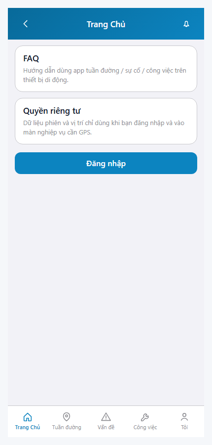
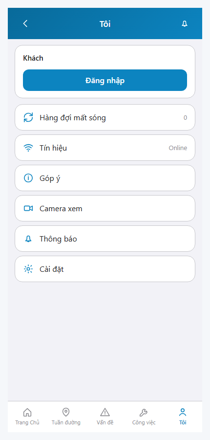
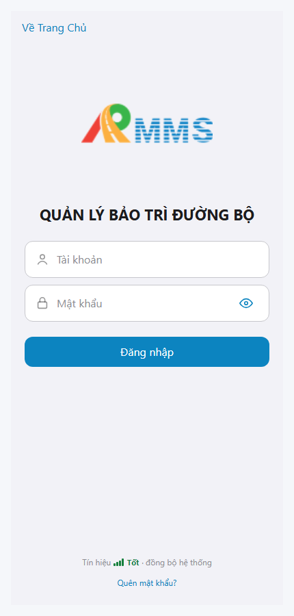

# QA — scenarios — web-rmms-ui-align

| Field | Value |
|-------|-------|
| feature | `web-rmms-ui-align` |
| this role | `qa` · `/agent-qa` |
| status | `done` |
| changeScope | `edit_page` |
| packKind | `list` (phone chrome ≠ Kind B DES-GRID) |
| mfeStdUrl | `http://localhost:9301/web-rmms-ui-align` |
| mfeStdRoute | `/web-rmms-ui-align` |
| browserUrl | `/m` · `/m/web-rmms-shell/me` · `/m/login` (MOBILE_PUBLIC_BASE) |
| backend | `D:/AI-QLBD/Linm.RMMS.WebService` · Mobile.Bff `:5202` · API `:5111` · **cấm ERP.*** |
| taskId | `task_0ff03f63` |
| prior Dev | implement **confirmed** · handoff `handoff/dev-compact.md` |
| autoApprove | ON |
| e2eQa | ON · runtime |
| method | `e2e runtime · yarn start:std :9301 + docker + capture_ui_align` · cases `S0,S1,QA-20` · viewport **430** · stock `yarn e2e-qa` playwright resolve FAIL → junction + `_capture_ui_align.mjs` |
| updatedAt | `2026-09-26T07:22:00.000Z` |
| skillVersion | `2026.09.05.03` |
| contentHash | `sha256:554b56d529a010b6225fe92fc369904fd070a80f12503c35e914643f82bcfe4b` |

## Smoke — Final MFE (REQUIRED · e2e)

| # | Step | Expect | Result | Evidence |
|---|------|--------|--------|----------|
| S0 | Cán bộ mở alias `/web-rmms-ui-align` | UA-00 · DES-MOB-TABBAR **5** (Trang Chủ · Tuần đường · Vấn đề · Công việc · Tôi) · guest Home HM-* · UTF-8 · **0** crash | **PASS** |  |
| S1 | Tab Tôi `/web-rmms-shell/me` | DES-MOB-ME · profile Khách · offline · signal · feedback · cam · ops · settings · TabBar 5 · **0** crash | **PASS** |  |
| QA-20 | Form Đăng nhập `/login` | LG-00 · Tài khoản · Mật khẩu · Đăng nhập · Quên mật khẩu · **0** crash/404 | **PASS** |  |

## Scenario / Expect / Actual (visual Read)

| Case | Expect (design/PO) | Actual (PNG + DOM dump) | Verdict |
|------|--------------------|-------------------------|---------|
| S0 | Alias → Home · TabBar 5 · field=«Tuần đường» · me=«Tôi» | `data-zone=UA-00` + `DES-MOB-TABBAR` · tabs id tabHome/Field/Incident/Work/Me · guest FAQ + Đăng nhập · href `/m` | **Aligned** |
| S1 | Me tab DES-MOB-ME | `data-feature=web-rmms-ui-align` · `DES-MOB-ME` · Khách · Hàng đợi mất sóng 0 · Tín hiệu Online · Góp ý · Camera xem · Thông báo · Cài đặt · tab Tôi active | **Aligned** |
| QA-20 | Login Full / LeaveConfirm path | `data-feature=login` `LG-00` · brand · Tài khoản · Mật khẩu · Đăng nhập · Quên mật khẩu? · href `/m/login` | **Aligned** |

## T-QA-*

| id | Scope | Result |
|----|-------|--------|
| T-QA-01 | TabBar 5 + Me + Leave path · alias ui-align | **PASS** (S0/S1/QA-20 live) |
| T-QA-CRUD-01 | Chrome nav · Me rows · peers cite | **PASS** (nav chrome) · peer CRUD N/A this feature |
| T-QA-FORM-01 | Login LG-00 username/password/submit | **PASS** (QA-20 live) · body submit headed not forced this smoke |
| T-QA-FILTER-01/02 | LinErpListFilterBar | **WAIVE** (phone chrome · DES-GRID N/A) |
| T-QA-VI-ENC-01 | Title/nav UTF-8 | **PASS** (Trang Chủ · Tuần đường · Vấn đề · Tôi · Đăng nhập) |
| T-QA-HIST / Leave | LeaveConfirmModal login dirty · useAlert logout · 0 native | **PASS** (code Dev) · leave headed not forced this smoke |

## E2E runtime gate

| Check | Result |
|-------|--------|
| docker compose up -d | **PASS** (api healthy `:5111` · postgres · mediamtx) · Mobile.Bff `:5202` healthy |
| yarn start:std | **PASS** · port **9301** (restart 1 PID webpack serve only · cmdline logged · **cấm** kill worker) |
| yarn e2e-qa stock | stock `_capture.mjs` `ERR_MODULE_NOT_FOUND` playwright from screens cwd — **worked around** junction + `_capture_ui_align.mjs` |
| PNG distinct | S0/S1/QA-20 **≠** hashes · **0** blank/crash/DUP |
| visual Read | **Aligned** · Must **0** (DOM dump zones + UTF-8 labels) |
| **cấm** phase=done | yes · next Review |
| **cấm** GAP-QA-E2E-KILL-01 | yes · no taskkill / Stop-Process node\|yarn rộng · only PID 26332 webpack serve |

## Gaps / debt (không P0)

| ID | Severity | Note |
|----|----------|------|
| GAP-QA-E2E-PLAYWRIGHT-RESOLVE | soft | stock `npx playwright` from `qa/screens` fails Node 24 — junction + `_capture_ui_align.mjs` |
| GAP-QA-E2E-WEB-BFF | soft | compose `linm-rmms-bff` may restart — feature uses Mobile.Bff `:5202` |
| GAP-QA-STAFF-SESSION | soft | S1 guest Me (no logout row until staff) — guest+Me rows still prove DES-MOB-ME |
| me.peerPending | soft | feedback/cam peer not mounted → toast (Dev debt) |

**P0:** none — handoff Review.

## Handoff → Review

1. `review/findings.md` · roles sau = **pending**.
2. `autoApprove=ON` → Review tự confirm khi tới lượt.
3. STATUS `qa` = **done** · `phase=review` · **cấm** `phase=done`.

## Version meta

| skillId | skillVersion | schemaVersion |
|---------|--------------|---------------|
| agent-qa | 2026.09.05.03 | 1 |
