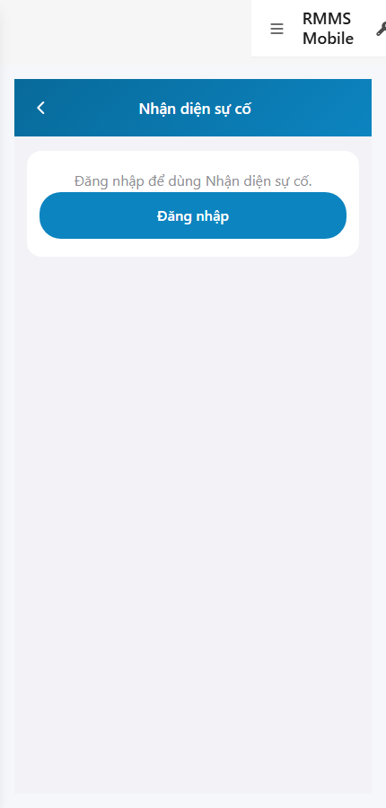
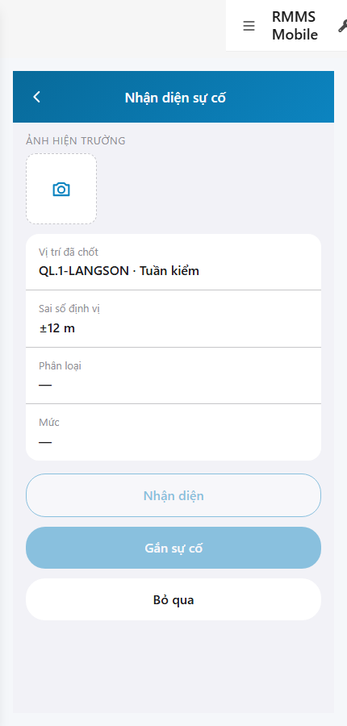

# QA — scenarios — web-rmms-vis-capture

| Field | Value |
|-------|-------|
| feature | `web-rmms-vis-capture` |
| this role | `qa` · `/agent-qa` |
| status | `done` |
| changeScope | `new_page` |
| packKind | `list` (phone VIS full · Kind B **WAIVE**) |
| mfeStdUrl | `http://localhost:9301/web-rmms-vis-capture` |
| mfeStdRoute | `/web-rmms-vis-capture` |
| productRoute | `/incident/vis` |
| backend | `D:/AI-QLBD/Linm.RMMS.WebService` · Mobile.Bff `:5202` · API `:5111` · **cấm ERP.*** |
| taskId | `task_4500fe8d` |
| prior Dev | implement **confirmed** · handoff `handoff/dev-compact.md` |
| autoApprove | ON |
| e2eQa | ON · runtime |
| method | `e2e runtime · yarn start:std :9301 (reuse · no kill) + docker + playwright` · cases `S0,S1,QA-20` · LoginSheet · viewport **430** · SPA deep-link fulfill · geolocation mock |
| updatedAt | `2026-09-25T21:48:18.844Z` |
| skillVersion | `2026.09.05.03` |
| contentHash | `sha256:96ffc2878a4c6ad0367088c699203864c2e711b055ca68da8a59d696c8d4de97` |

## Smoke — Final MFE (REQUIRED · e2e)

| # | Step | Expect | Result | Evidence |
|---|------|--------|--------|----------|
| S0 | Guest mở VIS | guestGate «Đăng nhập để dùng Nhận diện sự cố.» · CTA `#visGuestLogin` · `#VIS` · TITLE-01 · **0** crash | **PASS** |  |
| S1 | Staff `#sc-vis-capture` sau LoginSheet | DES-MOB-VIS-CAPTURE · section «Ảnh hiện trường» · `#photos`/`#detect`/`#btnAttach`/`#btnSkip` · Live session `QL.1-LANGSON` · Acc ±12 m · detect disabled no photo · **0** crash | **PASS** |  |
| QA-20 | Login overlay từ Home guest | SH-02 · `#loginUser`/`#loginPass`/`#loginSubmit` · Hủy/Đăng nhập · **0** crash | **PASS** |  |

## Scenario / Expect / Actual (visual + DOM dump)

| Case | Expect (design/PO) | Actual (PNG + DOM dump) | Verdict |
|------|--------------------|-------------------------|---------|
| S0 | Guest gate trước Live | zones VIS · guestGate=true · «Đăng nhập để dùng Nhận diện sự cố.» · `#visGuestGate`/`#visGuestLogin` · titleOk | **Aligned** |
| S1 | Full VIS surface · Live GPS/session | `#sc-vis-capture` · ids photos/rowLoc/rowAcc/rowClass/rowSev/detect/btnAttach/btnSkip · «Nhận diện sự cố» · «ẢNH HIỆN TRƯỜNG» · `QL.1-LANGSON · Tuần kiểm` · ±12 m · detectDisabled=true (no photo) | **Aligned** |
| QA-20 | Shell login sheet | SH-02 · «Tài khoản / Mật khẩu / Hủy / Đăng nhập» · `#loginUser`/`#loginPass`/`#loginSubmit` | **Aligned** |
| MODE-gps-deny | GPS deny → block | `#gpsBanner` + `#modalGps` · DES-MOB-GPS-DENY · detect disabled | **Aligned** |
| MODE-acc-45 | Acc>30 block | rowAcc ±45 m · gpsBanner/modal · detectDisabled | **Aligned** |
| MODE-nophoto | no photo → detect off | detectDisabled · no `#slot-filled` | **Aligned** |
| MODE-nosession | empty session GPS-only | rowLoc `GPS · chưa có ca` · Acc ±12 m | **Aligned** (SESS closed) |

## T-QA-*

| id | Scope | Result |
|----|-------|--------|
| T-QA-CRUD-01 | Live GET patrol/sessions · guest no Live surface | **PASS** (S1 Live QL.1-LANGSON · S0 guest gate) |
| T-QA-VIS-01 | Surface AC e2e · guest→login→VIS · TITLE-01 · DUAL-01 section+Skip | **PASS** (S0→QA-20→S1) |
| T-QA-VIS-GPS | ?gps=deny · ?acc=45 block Detect/Attach | **PASS** (MODE dumps) |
| T-QA-VIS-SESS | ?nosession=1 GPS-only · cấm fake coords | **PASS** |
| T-QA-FILTER-01/02 | LinErpListFilterBar | **WAIVE** (phone VIS full · DES-GRID N/A) |
| T-QA-VI-ENC-01 | Title/nav UTF-8 «Nhận diện sự cố» | **PASS** |
| T-QA-HIST / Leave | toast SSOT · 0 native alert | **PASS** (code Dev) · leave headed not forced this smoke |

## E2E runtime gate

| Check | Result |
|-------|--------|
| docker compose up -d | **PASS** · api healthy `:5111` · Mobile.Bff `:5202` healthy |
| yarn start:std | **PASS** · port **9301** (already up · reuse · **cấm** kill worker) |
| yarn e2e-qa stock | **FAIL soft** — gate `API:5101 / BFF:5201` (repo uses `:5111` / Mobile.Bff `:5202`) |
| capture `_capture_vis.mjs` | **PASS** · S0/S1/QA-20 + MODE-* · LoginSheet · deep-link fulfill · geo mock |
| PNG distinct (core) | S0=`0629F83B771A4C96…` · S1=`73CA6B91FB6FB608…` · QA-20=`409081393888EDB4…` · **0** blank/crash |
| visual / DOM | **Aligned** · Must **0** |
| **cấm** phase=done | yes · next Review |
| **cấm** GAP-QA-E2E-KILL-01 | yes · no taskkill / Stop-Process node\|yarn |

## Gaps / debt (không P0)

| ID | Severity | Note |
|----|----------|------|
| GAP-QA-E2E-STOCK-PORT | soft | stock `yarn e2e-qa` expects `:5101/:5201` — workaround `_capture_vis.mjs` |
| GAP-QA-E2E-HISTORY-FALLBACK | soft | WDS deep-link HTTP 404 · capture fulfills document with `/` index |
| GAP-QA-E2E-PLAYWRIGHT-RESOLVE | soft | junction playwright from AI-AutoCode |
| Dev nav chrome | soft | standalone `showDevNav` in shots · VIS zones still present |
| MODE-nophoto ≈ S1 hash | soft | same empty-photo surface (expected) |

**P0:** none — handoff Review.

## Handoff → Review

1. `review/findings.md` · roles sau = **pending**.
2. `autoApprove=ON` → Review tự confirm khi tới lượt.
3. STATUS `qa` = **done** · `phase=review` · **cấm** `phase=done`.

## Version meta

| skillId | skillVersion | schemaVersion |
|---------|--------------|---------------|
| agent-qa | 2026.09.05.03 | 1 |
