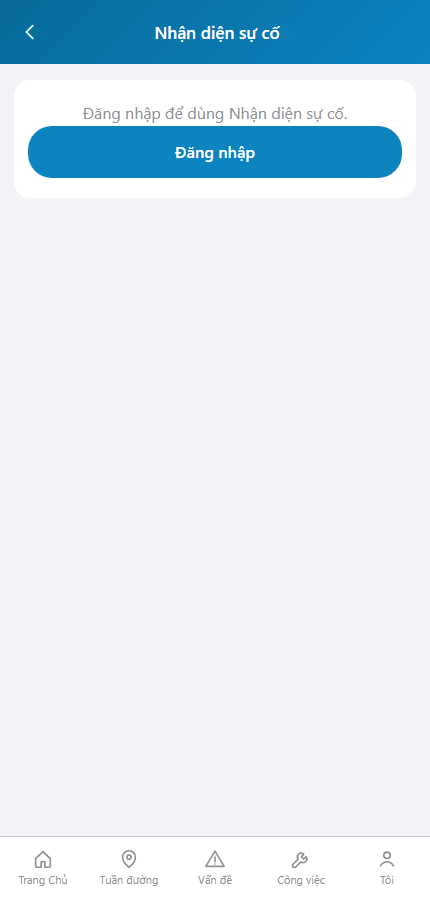
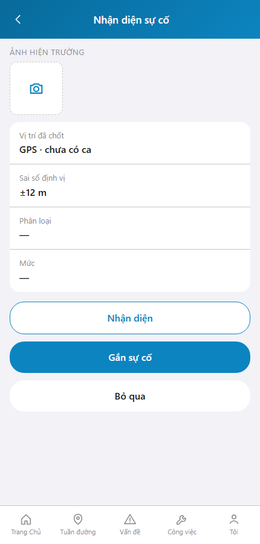

# QA — scenarios — web-rmms-vis-capture

| Field | Value |
|-------|-------|
| feature | `web-rmms-vis-capture` |
| this role | `qa` · `/agent-qa` |
| status | `done` |
| changeScope | `edit_page` · Pattern B |
| packKind | `list` (phone VIS full · Kind B **WAIVE**) |
| mfeStdUrl | `http://localhost:9301/chup-hien-truong` |
| mfeStdRoute | `/chup-hien-truong` · live `/m/chup-hien-truong` |
| productRoute | `/incident/vis` |
| backend | `D:/AI-QLBD/Linm.RMMS.WebService` · Mobile.Bff `:5202` · API `:5111` · **cấm ERP.*** |
| taskId | `task_d083b2c0` |
| prior Dev | implement **confirmed** · `handoff/dev-compact.md` |
| autoApprove | ON |
| e2eQa | ON · runtime |
| method | `e2e runtime · yarn start:std :9301 (reuse · no kill) + docker + playwright _capture_vis.mjs` · cases `S0,S1,QA-20` + MODE-* · viewport **430** · LoginPage LG-00 · SPA deep-link fulfill · geolocation mock |
| updatedAt | `2026-09-27T11:35:34.921Z` |
| skillVersion | `2026.09.05.03` |
| contentHash | `sha256:f749bc65f84b7bde51beeebaa85e5db22dacc8e8a040a53de30af834fa55c8cd` |

## Smoke — Final MFE (REQUIRED · e2e)

| # | Step | Expect | Result | Evidence |
|---|------|--------|--------|----------|
| S0 | Guest mở VIS `/chup-hien-truong` | guestGate «Đăng nhập để dùng Nhận diện sự cố.» · `#visGuestLogin` · `#VIS` · TITLE-01 · **0** crash | **PASS** |  |
| S1 | Staff `#sc-vis-capture` sau LoginPage | DES-MOB-VIS-CAPTURE · «ẢNH HIỆN TRƯỜNG» · `#photos`/`#detect`/`#btnAttach`/`#btnSkip` · Pattern B **idle-on** (`detectDisabled=false`) · Acc ±12 m · GPS-only `chưa có ca` · **0** crash | **PASS** |  |
| QA-20 | Guest CTA → LoginPage | LG-00 · `#f-user`/`#f-pass`/`#btn-login` · `/m/dang-nhap` · **0** crash | **PASS** |  |

## Scenario / Expect / Actual (visual + DOM dump)

| Case | Expect (design/PO Pattern B) | Actual (PNG + DOM dump) | Verdict |
|------|------------------------------|-------------------------|---------|
| S0 | Guest gate trước Live | zones VIS · guestGate=true · `#visGuestGate`/`#visGuestLogin` · titleOk · href `/m/chup-hien-truong` | **Aligned** |
| S1 | Full VIS · Pattern B idle-on | `#sc-vis-capture` · ids photos/rowLoc/rowAcc/rowClass/rowSev/detect/btnAttach/btnSkip · detectDisabled=**false** · attachDisabled=**false** · `GPS · chưa có ca` · ±12 m | **Aligned** |
| QA-20 | Login surface (LG-00 supersedes SH-02 sheet) | `#f-user`/`#f-pass`/`#btn-login` · zone LG-00 · «Đăng nhập» | **Aligned** |
| MODE-banner | `?banner=1` → `#validationBanner` | hasValidationBanner=true · DES-MOB-VIS-VALIDATION · «Cần ảnh hiện trường…» · detect still idle-on | **Aligned** |
| MODE-gps-deny | GPS deny → block UI | `#gpsBanner` + `#modalGps` · DES-MOB-GPS-DENY · detect idle-on | **Aligned** |
| MODE-acc-45 | Acc>30 handler (no POST) | rowAcc ±45 m · gpsBanner «Sai số > 30 m» · detect idle-on | **Aligned** |
| MODE-nophoto | no photo · Pattern B | detectDisabled=false (idle-on) · banner on click / `?banner=1` | **Aligned** |
| MODE-nosession | empty session GPS-only | rowLoc `GPS · chưa có ca` · Acc ±12 m · **UNCLEAR-SESS closed** | **Aligned** |

## T-QA-*

| id | Scope | Result |
|----|-------|--------|
| T-QA-CRUD-01 | Live staff VIS surface · guest no Live | **PASS** (S1 Live · S0 guest gate) |
| T-QA-VIS-01 | Surface AC e2e · guest→login→VIS · TITLE-01 · DUAL-01 section+Skip | **PASS** (S0→QA-20→S1) |
| T-QA-VIS-PATTERN-B | Idle-on Detect/Attach · banner on `?banner=1` · Acc>30 handler | **PASS** (S1 + MODE-banner + MODE-acc-45) |
| T-QA-VIS-GPS | `?gps=deny` · `?acc=45` | **PASS** |
| T-QA-VIS-SESS | `?nosession=1` GPS-only · cấm fake coords | **PASS** · UNCLEAR-SESS **closed** |
| T-QA-FILTER-01/02 | LinErpListFilterBar | **WAIVE** (phone VIS full · DES-GRID N/A) |
| T-QA-VI-ENC-01 | Title/nav UTF-8 «Nhận diện sự cố» | **PASS** |
| T-QA-HIST / Leave | toast SSOT · 0 native alert | **PASS** (code Dev) · leave headed not forced this smoke |

## E2E runtime gate

| Check | Result |
|-------|--------|
| docker compose up -d | **PASS** · api healthy `:5111` · Mobile.Bff `:5202` healthy · web-bff `:5201` |
| yarn start:std | **PASS** · port **9301** (already up · reuse · **cấm** kill worker) |
| yarn e2e-qa stock | **FAIL soft** — gate `API:5101 / BFF:5201` (repo `:5111` / Mobile.Bff `:5202`) |
| capture `_capture_vis.mjs` | **PASS** · S0/S1/QA-20 + MODE-* · LoginPage LG-00 · deep-link fulfill · geo mock · `corePass=true` |
| PNG distinct (core) | S0=`E2F041F8…` · S1=`422BA259…` · QA-20=`6E85A639…` · **0** blank/crash |
| visual / DOM | **Aligned** · Must **0** |
| **cấm** phase=done | yes · next Review |
| **cấm** GAP-QA-E2E-KILL-01 | yes · no taskkill / Stop-Process node\|yarn |

## Gaps / debt (không P0)

| ID | Severity | Note |
|----|----------|------|
| GAP-QA-E2E-STOCK-PORT | soft | stock `yarn e2e-qa` expects `:5101/:5201` — workaround `_capture_vis.mjs` |
| GAP-QA-E2E-HISTORY-FALLBACK | soft | WDS deep-link HTTP 404 · capture fulfills document with `/` index |
| GAP-QA-LOGIN-LG00 | soft | Guest CTA → `/m/dang-nhap` LG-00 (`#f-user`) supersedes SH-02 LoginSheet for smoke |
| GAP-QA-HOME-ALIAS | soft | `/web-rmms-home` 404 · home = `/` → `/m/trang-chu` |

**P0:** none — handoff Review.

## Handoff → Review

1. `review/findings.md` · roles sau = **pending**.
2. `autoApprove=ON` → Review tự confirm khi tới lượt.
3. STATUS `qa` = **done** · `phase=review` · **cấm** `phase=done`.

## Version meta

| skillId | skillVersion | schemaVersion |
|---------|--------------|---------------|
| agent-qa | 2026.09.05.03 | 1 |
