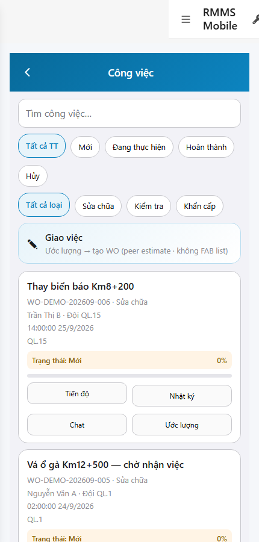
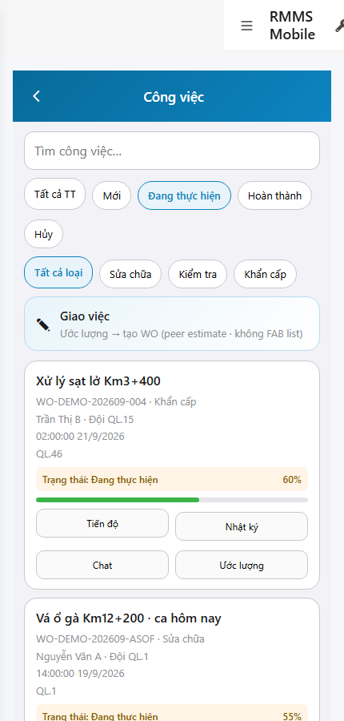

# QA — scenarios — web-rmms-work

| Field | Value |
|-------|-------|
| feature | `web-rmms-work` |
| this role | `qa` · `/agent-qa` |
| status | `done` |
| changeScope | `new_page` |
| packKind | `list` (phone WORK-L · Kind B **WAIVE**) |
| mfeStdUrl | `http://localhost:9301/web-rmms-work` |
| mfeStdRoute | `/web-rmms-work` |
| productRoute | `/work` · peers `/work/progress|log|chat?id=` · `/work/estimate/:id` |
| backend | `D:/AI-QLBD/Linm.RMMS.WebService` · Mobile.Bff `:5202` · API `:5111` · **cấm ERP.*** |
| taskId | `task_317d09e8` |
| prior Dev | implement **confirmed** · handoff `handoff/dev-compact.md` |
| autoApprove | ON |
| e2eQa | ON · runtime |
| method | `e2e runtime · yarn start:std :9301 (reuse · no kill) + docker + playwright` · cases `S0,S1,QA-20` · LoginSheet · viewport **430** · SPA deep-link fulfill · chip filter S1 |
| updatedAt | `2026-09-26T05:20:00.000Z` |
| skillVersion | `2026.09.05.03` |
| contentHash | `sha256:56146b96759461d425413e7e27e31fc1a5a4ed0a5f376f6a526959f62eb62770` |

## Smoke — Final MFE (REQUIRED · e2e)

| # | Step | Expect | Result | Evidence |
|---|------|--------|--------|----------|
| S0 | Guest mở WORK-L | WORK-L · `#WORK-ROOT` · search/chips/hub · Live CardList · **0** FAB · **0** crash | **PASS** |  |
| S1 | Staff WORK-L + chip «Đang thực hiện» | FILTER-P1 live · cards filtered · hub estimate · actions progress/log/chat/estimate · **0** FAB · **0** crash | **PASS** |  |
| QA-20 | Login overlay từ Home guest | SH-02 · `#loginUser`/`#loginPass`/`#loginSubmit` · Hủy/Đăng nhập · **0** crash | **PASS** |  |

## Scenario / Expect / Actual (visual + DOM dump)

| Case | Expect (design/PO) | Actual (PNG + DOM dump) | Verdict |
|------|--------------------|-------------------------|---------|
| S0 | WORK-L shell · live or empty · no FAB | zones WORK-L · des sc-mnt-list · fields search/filter.*/hub.estimate/list.card/action.* · chips live (Mới/Đang thực hiện/…) · cardCount=7 WO-DEMO-* · hasFab=false | **Aligned** |
| S1 | Staff Live + FILTER-P1 chip | same zones · chip «Đang thực hiện» · cardCount=3 · all status Đang thực hiện · hasFab=false | **Aligned** |
| QA-20 | Shell login sheet | SH-02 · «Tài khoản / Mật khẩu / Hủy / Đăng nhập» · `#loginUser`/`#loginPass`/`#loginSubmit` | **Aligned** |

## T-QA-*

| id | Scope | Result |
|----|-------|--------|
| T-QA-CRUD-01 | Live GET work-orders · GET init-data chips | **PASS** (S0 7 cards · S1 filter 3 · chips live) |
| T-QA-GRID-01 | Search+Chip+CardList+hub · no FAB | **PASS** (fields search/filter/hub/list.card · hasFab=false) |
| T-QA-PEER-01 | action.progress/log/chat/estimate present · nav-only peers | **PASS** (DOM fields · Dev nav-only) |
| T-QA-FILTER-01/02 | LinErpListFilterBar | **WAIVE** (phone list · DES-GRID N/A · Chip FILTER-P1) |
| T-QA-VI-ENC-01 | Title/nav UTF-8 «Công việc» | **PASS** |
| T-QA-HIST / Leave | toast SSOT · 0 native alert | **PASS** (code Dev) · leave headed not forced this smoke |

## E2E runtime gate

| Check | Result |
|-------|--------|
| docker compose up -d | **PASS** · api healthy `:5111` · Mobile.Bff `:5202` healthy |
| yarn start:std | **PASS** · port **9301** (already up · reuse · **cấm** kill worker) |
| yarn e2e-qa stock | **FAIL soft** — gate `API:5101 / BFF:5201` (repo uses `:5111` / Mobile.Bff `:5202`) |
| capture `_capture_work.mjs` | **PASS** · S0/S1/QA-20 · LoginSheet · deep-link fulfill · S1 chip force+dismiss overlay |
| PNG distinct | S0=`66E9EA3EC5610C52…` · S1=`26A1FC17B5918AF8…` · QA-20=`409081393888EDB4…` · **0** blank/crash/DUP |
| visual / DOM | **Aligned** · Must **0** |
| **cấm** phase=done | yes · next Review |
| **cấm** GAP-QA-E2E-KILL-01 | yes · no taskkill / Stop-Process node\|yarn |

## Gaps / debt (không P0)

| ID | Severity | Note |
|----|----------|------|
| GAP-QA-E2E-STOCK-PORT | soft | stock `yarn e2e-qa` expects `:5101/:5201` — workaround `_capture_work.mjs` |
| GAP-QA-E2E-HISTORY-FALLBACK | soft | WDS deep-link HTTP 404 · capture fulfills document with `/` index |
| GAP-QA-E2E-PLAYWRIGHT-RESOLVE | soft | junction playwright from AI-AutoCode |
| Dev nav chrome | soft | standalone `showDevNav` in shots · WORK-L zones still present |
| Guest list open | soft | no guestGate on WORK-L · Live GET works guest (API open) · PO OK list-first |
| GAP-MOB-MNT-PROG-GPS-01 | carry | peer progress GPS · OOS this smoke |

**P0:** none — handoff Review.

## Handoff → Review

1. `review/findings.md` · roles sau = **pending**.
2. `autoApprove=ON` → Review tự confirm khi tới lượt.
3. STATUS `qa` = **done** · `phase=review` · **cấm** `phase=done`.

## Version meta

| skillId | skillVersion | schemaVersion |
|---------|--------------|---------------|
| agent-qa | 2026.09.05.03 | 1 |
